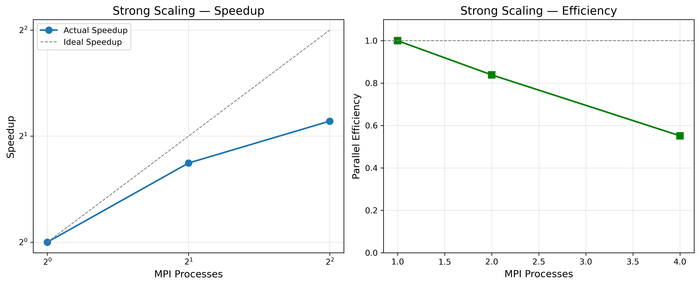
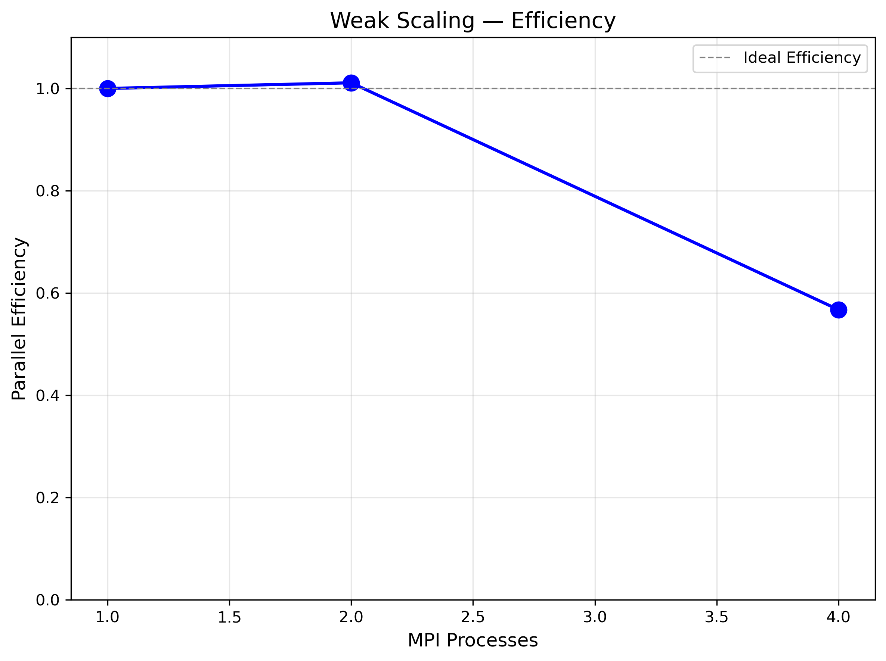

# HyPoS 扩展性测试报告

> 本文档记录 HyPoS 在 WSL 单机环境下的强/弱扩展性实测结果（2026-10-07）。

---

## 1. 测试环境

| 参数 | 值 |
|---|---|
| 测试日期 | 2026-10-07 |
| 环境 | WSL2 Ubuntu（Windows 11 主机） |
| CPU | Intel(R) Core(TM) Ultra 9 185H（11 核 / 22 线程） |
| MPI 实现 | OpenMPI 5.0.10 |
| 编译器 | g++ (Ubuntu) 15.2.0 |
| 编译标志 | `-O3 -march=native -DNDEBUG`（CMake Release） |
| OpenMP 线程 | 1（纯 MPI 扩展性；WSL 下多线程微小区域开销异常，见 §5） |
| 运行方式 | `mpirun --oversubscribe -np {1,2,4}`，`OMP_NUM_THREADS=1` |

---

## 2. 强扩展性测试（Strong Scaling）

> 固定问题规模，增加进程数。

### 测试配置

- 全局网格：256 × 256 × 1
- 求解器：Jacobi（p2p 通信，无重叠）
- 迭代：固定 10000 次（tol=1e-6 在该规模下未达，本组测量的是**固定工作量吞吐**）

### 结果表格

| MPI 进程 | OMP 线程 | 总时间 (s) | 每步时间 (ms) | 加速比 | 效率 |
|---|---|---|---|---|---|
| 1 | 1 | 0.4507 | 0.0451 | 1.00 | 100% |
| 2 | 1 | 0.2687 | 0.0269 | 1.68 | 83.9% |
| 4 | 1 | 0.2043 | 0.0204 | 2.21 | 55.2% |

### 分析

- 加速比低于线性，且随进程数下降（1→2 效率 83.9%，2→4 效率继续降低）。
- 主要原因（小规模单机场景）：
  1. 总时间中包含固定的启动/初始化/报告写出开销（~0.1s 量级），在亚秒级运行中占比显著；
  2. 子域面体比随进程数上升，halo 通信占比增加（np=4 时 `comm_time_ms` 占迭代时间约 13%）；
  3. WSL 共享内存 + 虚拟化调度噪声。
- 结论：本数据仅代表**单机小规模**；集群大规模数据需在真实 HPC 环境复测（脚本与基线已就绪）。

### 曲线图



---

## 3. 弱扩展性测试（Weak Scaling）

> 固定每进程问题规模，增加总进程数。

### 测试配置

- 每进程网格：128 × 128 × 1（总网格 = 128×N × 128）
- 迭代：固定 10000 次

### 结果表格

| MPI 进程 | 总网格 | 总时间 (s) | 每步时间 (ms) | 效率 |
|---|---|---|---|---|
| 1 | 128 × 128 | 0.1277 | 0.0128 | 100% |
| 2 | 256 × 128 | 0.1263 | 0.0126 | 101.1% |
| 4 | 512 × 128 | 0.2251 | 0.0225 | 56.7% |

### 分析

- 1→2 进程几乎理想（101%，固定开销在更大总网格下被摊薄）；
- 2→4 明显退化（56.7%）：总网格增至 4 倍后，资源竞争（内存带宽/调度）与通信占比上升，而工作量仍处于亚秒级；
- 结论：本机可稳定验证 1–2 进程弱扩展理想性；4 进程数据受环境限制，不代表集群行为。

### 曲线图



---

## 4. 通信与吞吐指标（np=4，256²，10000 迭代）

| 指标 | 值 | 说明 |
|---|---|---|
| `iter_time_ms` | 0.0204 | 每迭代平均 |
| `comm_time_ms` | 0.0027 | Profiler `halo_exchange+halo_wait` ÷ 迭代数（rank0） |
| 通信占比 | ≈13% | comm/iter |
| 估算 FLOP/s | 6.41e9 | `2·nx·ny·nz·iters/total_time`（粗估） |
| `final_residual` | 204.6 | 未达 1e-6（固定 10000 次） |

> `comm_time_ms` 与 Profiler 报告同源（rank0），可由 `--enable-profiling` 输出精确对账（ST 用例 I5，np=1 与 np=4 均验证 ±5%）。

---

## 5. 结论与建议

### 5.1 本机结论

- 测得的强/弱扩展数据均为**亚秒级单机小规模**，受固定开销与环境噪声主导；参考价值集中在回归对比而非绝对性能。
- WSL 下 22 线程对微小 OpenMP 区域存在异常开销（实测 32×32/1000 迭代：1 线程 3.2ms、4 线程 13ms、22 线程 53s），故扩展性测试统一 `OMP_NUM_THREADS=1`（纯 MPI），并规避该环境特性。

### 5.2 后续建议

- [ ] 在集群环境以 256²–4096² 网格复测强/弱扩展（脚本参数已支持 `--strong-nx/--weak-n/--omp-threads`）
- [ ] 大规模场景评估 `--overlap-comm` 的 `overlap_ratio` 收益
- [ ] 如需提升单节点吞吐，评估 stencil 分块/向量化优化（PERFORMANCE.md §2/§3）

---

## 附录：运行命令

```bash
# 生成测试数据（本报告数据即为下述命令产出）
python3 scripts/run_scaling_tests.py \
    --output-dir ./scaling_results \
    --max-procs 4 \
    --strong-nx 256 \
    --weak-n 128 \
    --omp-threads 1

# 绘制曲线图（需要 matplotlib）
python3 scripts/plot_scaling.py \
    --input-dir ./scaling_results \
    --output-dir ./scaling_plots
```

原始数据：`scaling_results/strong_scaling.json`、`scaling_results/weak_scaling.json`；
参考基准副本：`benchmarks/reference_results/`。

---

*Generated by HyPoS Scaling Test Framework（实测数据，2026-10-07）*
