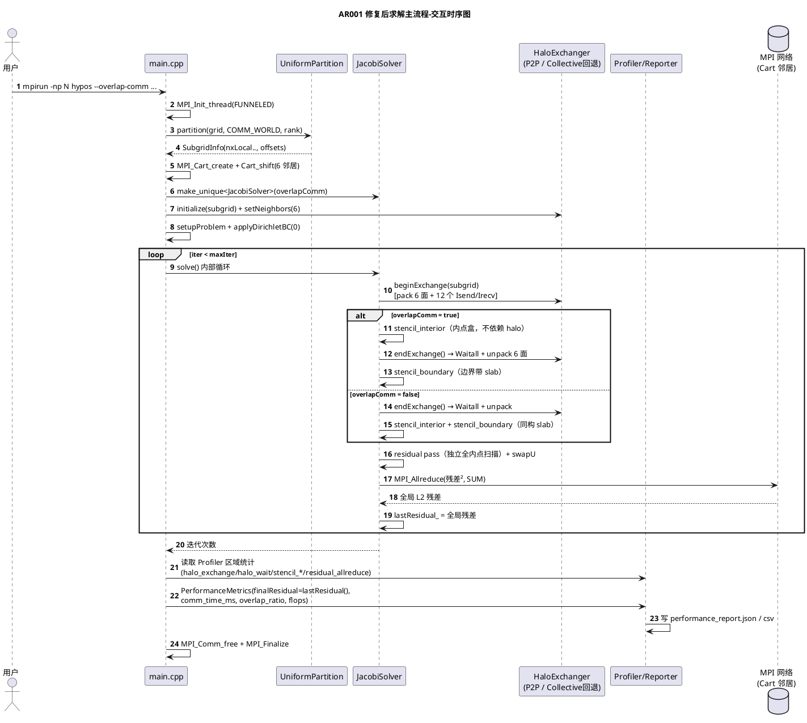
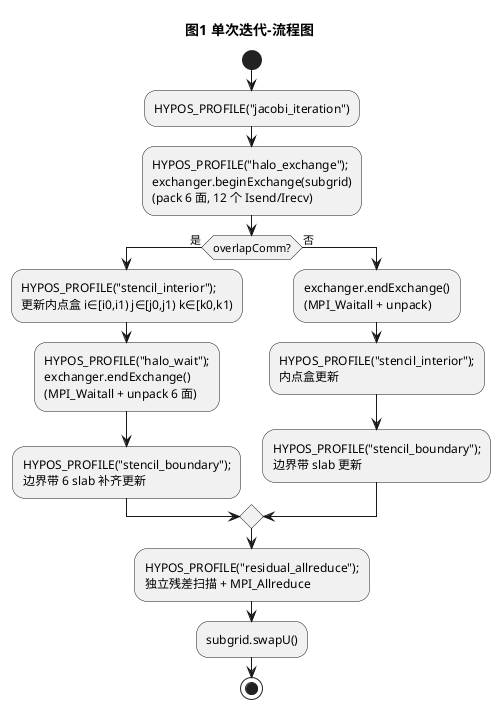
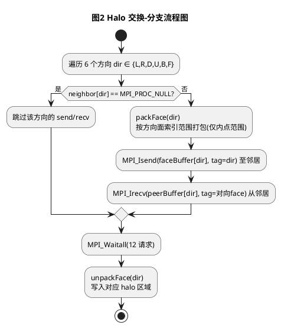
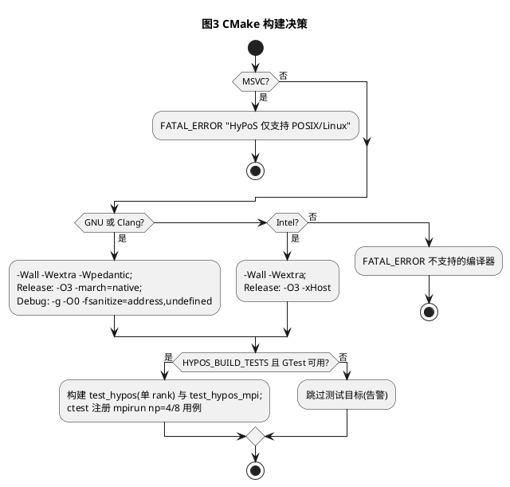

# 1 AR概述

| 组件名称 | HyPoS — Hybrid Poisson Solver（MPI + OpenMP 分布式泊松求解器） |
| --- | --- |
| AR系统流水号 | AR001 |
| AR描述 | 修复 6 类实质缺陷：构建失败、Halo 交换越界读写与面-邻居语义倒置、3D 通信缺失、overlap/可观测性/收敛残差未落地、测试违反 MPI 规则、平台与文档占位失真。目标：使 HyPoS 可构建、通信正确、内存安全、测试合规、文档与实现一致。 |

关联 srs：`./srs.md`；关联 tasks：`./tasks.md`。合并方案选择与设计驱动分析见 §4.1。

# 2 动态行为

## 2.1 交互时序图



# 3 功能点分解

| **序号** | **功能点名称** | **功能点描述** | 映射 |
| --- | --- | --- | --- |
| 1 | 构建修复 | VTK 后端拆分至 `src/io/vtk_io.cpp`；CMake 源清单与仓库一致；Debug/Release 双构建通过 | F1 |
| 2 | Halo 缓冲尺寸与范围安全 | 6 方向缓冲尺寸=打包计数（仅内点面范围）；ASan/UBSan 零报告 | F2 |
| 3 | 面-邻居语义修正 | 发送面与目标邻居物理对应；tag 按"被发送的面"统一编号 0-5；非均匀场可精确断言 | F3 |
| 4 | 3D back/front 通信 | 3D 六方向 12 非阻塞请求；z 不分解时保持物理边界 | F4.1 |
| 5 | 通信-计算重叠 | begin→内点盒→end→边界带+独立残差 pass；on/off 迭代数与解一致 | F4.2 |
| 6 | 性能可观测性补全 | Profiler 区域（halo_exchange/halo_wait/stencil_interior/stencil_boundary/residual_allreduce）；Reporter 真实 `comm_time_ms`/`overlap_ratio` | F4.3 |
| 7 | 收敛残差回传 | `PoissonSolver::lastResidual()`；main 回填 `finalResidual` 并写入报告 | F4.4 |
| 8 | 测试体系合规 | 单次 MPI 初始化；ctest + MPIEXEC 多进程注册（np=4/8）；非均匀场/一致性/串并行用例；CI 更新 | F5 |
| 9 | 平台适配与文档对齐 | CMake 编译器分支 + Linux-only 显式提示；空目录处理；README/DESIGN/PERFORMANCE 与实现一致；SCALING_REPORT 实测回填 | F6 |

# 4 实现设计

## 4.1 功能实现思路

### 4.1.1 Halo 交换修复方案对比（核心决策）

**方案 A（采用）：就地修正现有 Exchanger**
- 思路：修正 pack/unpack 循环范围（仅内点面）、缓冲尺寸、发送面-邻居对应关系与 tag 约定；在同一类内扩展 back/front 两方向至 12 请求。
- 优点：接口零变化（`HaloExchanger` 抽象不动）；改动集中在单一文件；可验证性最强（逐方向可断言）；工作量可控。
- 缺点：每个方向仍有独立手工循环（重复代码）；未利用 MPI 派生类型零拷贝。
- 符合 NFR：内存安全（尺寸=计数）、语义正确（非均匀场断言）均可直接达成。

**方案 B：面描述符表驱动重写**
- 思路：抽象 `Face{固定轴, 索引范围, tag}` 描述符数组，通用 pack/unpack 循环。
- 优点：消除重复代码；新增方向只需加描述符。
- 缺点：对本 AR 而言重构面大、回归风险高；收益主要在可维护性而非正确性。

**方案 C：MPI 派生类型零拷贝交换**
- 思路：`MPI_Type_vector`/`MPI_Type_create_subarray` 直接发送内存切片，免打包。
- 优点：免 pack/unpack 开销，性能上限最高。
- 缺点：halo 与内点在单一连续数组中、步长不规则，派生类型构造与调试复杂；且当前性能瓶颈并非打包。

**推荐理由：** 方案 A 在满足全部 srs 验收（F2/F3/F4.1）前提下改动最小、验证路径最直接；B/C 列入路线图（如需性能优化再评估）。方案选择记录见 §5。

### 4.1.2 Overlap 实现方案（决策）

**方案 A（采用）：Jacob迭代内两段计算 + 独立残差 pass**
- begin 下令通信；内点盒（不依赖 halo）先行计算；end 等待并解包；边界带补齐；残差用**独立的、与 overlap 无关的全内点扫描**计算。
- 关键理由：srs F4.2 要求 on/off **迭代数相同且解差 ≤1e-12**。若残差在拆分循环中顺带累加，浮点求和顺序随分段变化，可能在收敛阈值边界产生迭代数差异；独立残差 pass 使两种模式走完全相同的代码路径，保证 bit 级一致。

**方案 B（弃用）：MPI_Test 轮询细粒度重叠**
- 无效复杂度；对 Jacobi 单步迭代无收益。

### 4.1.3 其余设计驱动

| 类别 | 内容 |
|------|------|
| 功能点清单 | §3 功能点 1-9（F1-F6） |
| 性能约束 | 修复优先正确性；residual 独立 pass 引入额外一遍内存读取（接受，作为一致性代价记录于 PERFORMANCE §5.2）；基准数据落盘供回归 |
| 接口约束 | 除新增 `lastResidual()` 与 `JacobiSolver` 构造参数外，公开接口保持不变 |
| 架构约束 | 保持策略模式分层（solver/comm/grid/io 解耦）、RAII、AGENT_SPEC.md 类型约定（Real=double、行主序、SoA） |
| 技术栈约束 | C++17、MPI-3、OpenMP、CMake ≥3.16、Linux/POSIX（不做 MSVC） |

## 4.2 功能实现设计

### 4.2.1 流程图

**图 1：单次 Jacobi 迭代（含 overlap 分支）**



> 图1 补充规则：overlap off 分支中 `endExchange` 紧接着 `beginExchange` 执行，两者统一记录在 `halo_exchange` 区域内（不产生 `halo_wait`）；on 分支中 `halo_wait` 单独记录。区域记录规则详见 §4.2.2-(3)。

**图 2：Halo 打包/解包方向决策（P2P Exchanger）**



**图 3：构建与测试矩阵（CMake）**



### 4.2.2 流程说明

#### （1）Halo 交换重写（F2/F3/F4.1）

**缓冲尺寸（= 打包计数，紧密无越界）：**

| 面 | 缓冲布局 | 尺寸 |
|----|---------|------|
| L/R | `[h][j][k]`，j∈[jBegin,jEnd) k∈[kBegin,kEnd) h∈[0,hw) | `hw*nyLocal*nzLocal` |
| D/U | `[h][i][k]`，i∈[iBegin,iEnd) k∈[kBegin,kEnd) | `hw*nxLocal*nzLocal` |
| B/F | `[h][i][j]`，i∈[iBegin,iEnd) j∈[jBegin,jEnd) | `hw*nxLocal*nyLocal` |

**发送面 ↔ 目标邻居 ↔ tag ↔ 解包目标：**

| 方向 | 发送面索引范围 | 目标邻居 | tag | 对应接收（来自反向邻居） | 解包目标 |
|------|---------------|---------|-----|------------------------|---------|
| L | i∈[iBegin, iBegin+hw) | neighborLeft | 0 | recv from Right (tag 0) | 右 halo i∈[iEnd, iEnd+hw) |
| R | i∈[iEnd-hw, iEnd) | neighborRight | 1 | recv from Left (tag 1) | 左 halo i∈[0, hw) |
| D | j∈[jBegin, jBegin+hw) | neighborDown | 2 | recv from Up (tag 2) | 上 halo j∈[jEnd, jEnd+hw) |
| U | j∈[jEnd-hw, jEnd) | neighborUp | 3 | recv from Down (tag 3) | 下 halo j∈[0, hw) |
| B | k∈[kBegin, kBegin+hw) | neighborBack | 4 | recv from Front (tag 4) | 前 halo k∈[kEnd, kEnd+hw) |
| F | k∈[kEnd-hw, kEnd) | neighborFront | 5 | recv from Back (tag 5) | 后 halo k∈[0, hw) |

> tag 统一按"发送方所打包的面"编号（L=0…F=5），任意两 rank 的配对自然自洽：我发给左邻居的面为 L(tag0)，左邻居从右邻居收的正是 tag0 的 L 面。
>
> 平面范围注记（开发中确认的现状约定）：Subgrid/solver 的 2D 数据位于 **k=0 平面**（`index(i,j)` 默认 k=0、2D Jacobi 使用 k=0、2D 无 z 向 halo 语义）。因此 L/R、D/U 面的交换平面范围为：`nzLocal==1` 时取 `k∈[0,1)`；`nzLocal>1`（3D）时取 `k∈[kBegin,kEnd)`。缓冲尺寸公式（乘 `nzLocal`）在两种情形下均成立。

**自洽断言：** `packFace`/`unpackFace` 末尾加 `HYPOS_ASSERT(idx == buf.size())`（Debug），同时保证 Release 下尺寸在构造期由同一公式生成。

**物理边界：** 邻居为 `MPI_PROC_NULL` 时跳过收发；Dirichlet 值由 setup 写入物理边界 halo，交换只覆盖内部边界 halo。

#### （2）Overlap 与残差一致性（F4.2）

- 内点盒：`i0=iBegin+hw, i1=iEnd-hw; j0,j1,k0,k1` 同理（2D 时 k 退化为单层，z-slab 为空）。
- 边界带 = 内点域减内点盒，精确划分为 6 个 slab（x 左/右全跨、y 下/上限于 i∈[i0,i1)、z 后/前限于 i、j 内盒范围），每 slab 独立 `omp parallel for`。
- 残差 pass：独立全内点扫描累加 `(uNew-uOld)²`，与 overlap 无关 → 两种模式 residuals bit 级一致、迭代数一致。
- 结果一致性保证：stencil 每个单元计算相互独立，拆分不改变任何单元的计算值 → 整场 bit 级一致。

#### （3）可观测性（F4.3）

| 指标 | 定义 | 计算位置 |
|------|------|---------|
| `comm_time_ms` | rank0 的 (halo_exchange + halo_wait 总秒) ÷ iterations × 1000；与 Profiler 打印同源（同一进程），ST 在 np=1 与 np=4 下均可对账（±5%） | main（读 rank0 Profiler 统计） |
| `overlap_ratio` | overlap on：`clamp(1 - wait/(post+wait), 0, 1)`；off：0 | main（rank0 stats） |
| `final_residual` | `solver->lastResidual()` | main |
| Profiler 区域 | `solver_total`、`jacobi_iteration`、`halo_exchange`、`stencil_interior`、`stencil_boundary`、`residual_allreduce`；overlap on 时另有 `halo_wait` | solver/iterate |

> 区域记录规则：overlap off 时 `endExchange` 紧随 `beginExchange`，两者合并在 `halo_exchange` 区域内记录（等待时间包含其中），**不产生 `halo_wait` 区域**；overlap on 时 `halo_exchange` 仅包裹打包+下令，`halo_wait` 单独包裹 `endExchange`（等待+解包）。`halo_wait` 是 F4.3 `overlap_ratio` 分母/分子语义所需的等待段区域（srs §3.6 的 overlap_ratio 定义），属"增加命名区域"的允许扩展。
> 数据来源说明：报告由 rank0 写出，为使 `comm_time_ms` 与 rank0 打印的 Profiler 报告可精确对账，本指标取 rank0 自身统计（不再跨 rank 聚合；4-rank 下即 rank0 视角的交换耗时）。

#### （4）接口与 main 接线（F4.4）

- `JacobiSolver(bool overlapComm = false)` 构造参数；`main.cpp` 由 `--overlap-comm` 传入。
- `solve()` 每轮更新 `lastResidual_`（收敛与未收敛都更新；未迭代保持 0）。
- main 指标组装：`metrics.finalResidual = solver->lastResidual()`；移除原恒 0 赋值。

#### （5）测试体系（F5 实现要点）

| 二进制 | 入口 | 内容 | ctest 注册 |
|--------|------|------|-----------|
| `test_hypos` | `tests/gtest_main_mpi.cpp`（一次 MPI_Init/Finalize） | grid/内存/计时/Profiler、单 rank 方向语义（自环邻居）、单 rank 收敛 | 直接运行（1 rank） |
| `test_hypos_mpi` | 同上 | halo 2D np=4 非均匀场、halo 3D np=8（2×2×2 强制）、solver np=4 收敛+解析解误差、overlap 一致性 np=4 | `mpirun -np {4,8} ... --gtest_filter=...` |

- 自环邻居技巧：单 rank 下将所有邻居设为本 rank，`Isend`/`Irecv` 自匹配（tag 区分方向），可无损验证 6 方向打包/解包语义。
- 非均匀场：`u = 1000·gI + 100·gJ + gK`（全局索引，测试端由 `MPI_Cart_coords` 计算偏移），逐幽灵单元断言精确相等。
- Debug+ASan/UBSan 下全量执行；MPI 用例设 `ASAN_OPTIONS=detect_leaks=0`（避免 MPI 库误报）。

#### （6）平台适配与文档（F6 实现要点）

- CMake：新增 `cmake/CompilerWarnings.cmake`（编译器分支 + 警告 + sanitizer 条件）；移除 PAPI 引用（无实现代码，README 标注路线图）；`MSVC → FATAL_ERROR`。
- `CollectiveExchanger`：删除死代码（打包后未使用的 sendBuf_/计数数组），改为持有 `PointToPointExchanger` 成员并全权委托，注释与文档标注"P2P 回退"。
- 文档修改清单：README（亮点表 collective 表述、comm-mode 参数说明、新增"路线图/未实现"节）；DESIGN §2.4/§4.2（Collective 回退、迭代流程与 residual pass 一致化）；PERFORMANCE §5.2（示意表标注或实测替换）；SCALING_REPORT（实测数据+环境表）。
- `benchmarks/reference_results/`：放修复后基准 JSON + README 说明测量环境。

## 4.3 接口描述

> 原则：除下表新增/修改项外，`HaloExchanger`、`Subgrid`、`GridPartition`、`IOBackend`、`Reporter`、`Profiler`、`CommandLineParser` 的公开接口保持不变（向后兼容）。

### 4.3.1 新增接口

**I-1 `PoissonSolver::lastResidual()`**

| 项 | 内容 |
|----|------|
| 签名 | `virtual Real lastResidual() const noexcept;`（基类默认实现 `return 0.0;`） |
| 参数 | 无 |
| 返回值 | 最近一次迭代后的全局 L2 残差；未执行迭代返回 0 |
| 异常 | 不抛出（`noexcept`） |
| 覆盖 | `JacobiSolver::lastResidual() override` 返回成员 `lastResidual_` |

### 4.3.2 修改接口

**I-2 `JacobiSolver` 构造函数**

| 项 | 内容 |
|----|------|
| 签名 | `explicit JacobiSolver(bool overlapComm = false);` |
| 参数 | `overlapComm`：是否启用通信-计算重叠流水线；默认 false（行为与旧版一致） |
| 返回值 | —（构造） |
| 异常 | 不抛出 |
| 兼容性 | 原无参默认构造等价于 `JacobiSolver(false)`；`PoissonSolver` 基类接口不变 |

**I-3 `JacobiSolver::overlapEnabled()`（测试可观测）**

| 项 | 内容 |
|----|------|
| 签名 | `bool overlapEnabled() const noexcept;` |
| 参数 | 无 |
| 返回值 | 当前重叠配置 |
| 异常 | 不抛出 |

**I-4 `PointToPointExchanger` 内部私有函数（非公开接口，备案）**

| 项 | 内容 |
|----|------|
| 签名 | `void packFace(Subgrid&, int dir, std::vector<Real>&) const;` / `void unpackFace(Subgrid&, int dir, const std::vector<Real>&) const;` |
| 参数 | `dir ∈ {0..5}` 对应 §4.2.2 方向表；缓冲由调用方保证尺寸 |
| 返回值 | 无（写入缓冲/子域） |
| 异常 | Debug 下 `HYPOS_ASSERT(idx == buf.size())`；Release 依赖构造期尺寸公式一致（无异常路径） |

### 4.3.3 接口/参数边界与错误码（供 §6.2 用例映射）

| 接口 | 边界/异常输入 | 预期行为 |
|------|--------------|---------|
| `JacobiSolver(bool)` | `true` / `false` / 缺省 | 流水线开启/关闭/关闭 |
| `lastResidual()` | 未 solve / 收敛后 / maxIter=0 | 0 / >0 且 ≤tol / 0 |
| `solve(maxIter=0)` | 0 次迭代 | 返回 0，`lastResidual()=0` |
| `solve(tol=+inf)` | 首轮即收敛 | 返回 1，残差有限 |
| pack/unpack | `hw=1` / `hw=2` | 尺寸与计数一致，断言通过 |
| pack/unpack | 邻居 `MPI_PROC_NULL` | 跳过收发，不动缓冲 |
| `--solver` 非法值 | `--solver foo` | 打印错误，退出码 1 |
| `--comm-mode` 非法值 | `--comm-mode foo` | 打印错误，退出码 1 |

> `solve()` 返回值语义（本次统一定义）：**实际执行的迭代次数**。收敛于第 k 轮检出（k≥1，在完成该轮更新与残差计算后判定）时返回 k。此前实现对首轮收敛返回 0（off-by-one），本 AR 一并修正并在 T004 落地。

## 4.4 代码设计

```plantuml
@startuml
title AR001 修改范围-包图（仓库相对路径）
package "HyPoS" {
  package "src/io" {
    [io_backend.hpp (不变)] as ioh
    [binary_io.cpp (仅 Binary)] as bio
    [vtk_io.cpp (新增,VTK 后端)] as vtk
  }
  package "src/comm" {
    [halo_exchanger.hpp (新增 B/F 缓冲成员)] as heh
    [p2p_exchanger.cpp (重写 pack/unpack/6向)] as p2p
    [collective_exchanger.cpp (委托 P2P,清死代码)] as coll
  }
  package "src/solver" {
    [solver.hpp (lastResidual/构造参数)] as sh
    [jacobi_solver.cpp (overlap/区域/残差)] as js
  }
  package "src/perf" {
    [profiler/timer/reporter (reporter 精度微调)] as perf
  }
  [main.cpp (接线/指标)] as main
  package "cmake" {
    [CompilerWarnings.cmake (新增)] as cw
  }
  [CMakeLists.txt] as cm
  package "tests" {
    [gtest_main_mpi.cpp (新增)] as tm
    [test_grid/test_solver/test_performance.cpp (改造)] as tu
    [test_halo_exchange.cpp (2D/3D 非均匀)] as th
    [test_solver_mpi.cpp (新增)] as ts
    [test_overlap.cpp (新增)] as to
  }
  package "docs" {
    [README / DESIGN / PERFORMANCE / SCALING_REPORT] as docs
  }
  package "benchmarks/reference_results" {
    [README + 基准 JSON] as bench
  }
}
main --> sh
main --> heh
js --> heh
cm --> cw
cm --> tm
cm --> th
cm --> ts
cm --> to
@enduml
```

**文件级改动清单（与 §6 追溯对应）：**

| 文件 | 动作 | 内容 |
|------|------|------|
| `src/io/vtk_io.cpp` | 新增 | 从 `binary_io.cpp` 迁出 `VTKIOBackend` 实现（含 `VTKIOBackend` 构造） |
| `src/io/binary_io.cpp` | 修改 | 仅保留 `BinaryIOBackend` |
| `src/comm/halo_exchanger.hpp` | 修改 | 新增 B/F 收发缓冲各 2、请求数 12；`CollectiveExchanger` 成员改为 `PointToPointExchanger delegate_` |
| `src/comm/p2p_exchanger.cpp` | 重写+迁出 | `packFace/unpackFace` 方向表实现；`beginExchange/endExchange` 12 请求；删除旧 `packSend/unpackRecv`；**移除文件内的 CollectiveExchanger 旧实现段（现 L202-330，避免与新委托实现重复定义）** |
| `src/comm/collective_exchanger.cpp` | 修改（替换占位） | 承载委托实现：`CollectiveExchanger` 持有 `PointToPointExchanger` 并全权转发（删除未使用的打包/计数死代码） |
| `src/solver/solver.hpp` | 修改 | `lastResidual()` 虚接口；`JacobiSolver(bool)`、`overlapEnabled()`、成员 `lastResidual_`/`overlapComm_` |
| `src/solver/jacobi_solver.cpp` | 修改 | 两段计算、6 slab 边界带、独立残差 pass、Profiler 区域、`lastResidual_` 更新、`solve()` 返回值统一为"实际执行迭代次数"（首轮收敛返回 1） |
| `src/main.cpp` | 修改 | solver 构造接线、指标组装（comm_time_ms/overlap_ratio/finalResidual）、输出目录创建 |
| `src/perf/reporter.cpp` | 修改 | JSON 输出精度：`iter_time_ms`/`comm_time_ms` 恢复默认 6 位有效数字（原 `std::fixed(4)` 状态延续会截断亚毫秒值，破坏 I5 对账） |
| `CMakeLists.txt` | 修改 | 引入 `cmake/CompilerWarnings.cmake`；测试目标拆分与 ctest/MPIEXEC 注册；移除 PAPI |
| `cmake/CompilerWarnings.cmake` | 新增 | 编译器分支/警告/sanitizer 逻辑 |
| `tests/*` | 重构/新增 | 见 §6；统一 MPI 入口 |
| `.github/workflows/ci.yml` | 修改 | 安装 GTest、ctest、ASan 环境变量 |
| `README.md`/`docs/*` | 修改 | 与实现对齐（§4.2.2-(6) 清单） |
| `benchmarks/reference_results/` | 新增 | README + 基准 JSON |

# 5 重构设计（可选）

| 重构项 | 动作 | 影响 |
|--------|------|------|
| VTK/Binary I/O 拆分 | 两类后端分文件，与 README 目录结构及 CMake 清单一致 | 无行为变化，纯组织调整 |
| CollectiveExchanger 死代码清理 | 删除未使用的 send/recv 缓冲与计数数组，改为 P2P 委托 | 行为不变（此前已回退），可读性提升；文档标注回退语义 |
| CMake 编译选项模块化 | 选项逻辑收敛至 `cmake/CompilerWarnings.cmake` | 构建行为按编译器正确分支；`cmake/` 目录不再为空 |
| 测试基础设施重构 | 每二进制单一 MPI 生命周期 + ctest MPIEXEC 注册 | 修复 MPI 规则违规；多进程用例真正执行 |
| 方案 B/C（描述符表/派生类型） | **不做**，列入路线图 | 见 §4.1.1 |

# 6 测试设计

**总策略：** 分层验证——单元（1 rank，含自环方向语义）→ MPI 集成（4/8 ranks，非均匀场+一致性）→ 端到端（ctest 全绿 + 报告数据交叉对账 + 文档核对）。**覆盖率目标：** 本次修改涉及模块（`p2p_exchanger.cpp`、`jacobi_solver.cpp`、`main.cpp` 接线）行覆盖 ≥ 80%（`--coverage` 手工统计，不作为 CI 门禁）；流程图中所有新增分支至少 1 个用例（见 §6.6）。

## 6.1 单元测试（UT）

单二进制 `test_hypos`（1 rank，`gtest_main_mpi` 入口）：

| 用例 ID | 覆盖功能点 | 前置 | 步骤 | 预期（判据） |
|---------|-----------|------|------|-------------|
| U1 | F2 面尺寸 | 2D 8×8 子域 hw=1 | 构造 exchanger 并 `initialize`，触发 4 方向包/解包（自环邻居） | Debug 断言 `idx==buf.size()` 通过；无 ASan 报告 |
| U2 | F2 多层 halo | 3D 6×6×6 子域 hw=2 | 同上（6 方向） | 断言通过；缓冲尺寸 = 公式值 |
| U3 | F3 2D 方向语义 | 2D 4×4，邻居=自己 | 填充 `u=1000i+j`（全域），`exchange` | 右 halo(i=iEnd)=最左内点列值；左 halo=最右列；上 halo=最下行；下=最上行（逐单元精确） |
| U4 | F3 3D 方向语义 | 3D 2×2×2（退化单 rank），邻居=自己 | 填充 `u=10000i+100j+k`，`exchange` | 6 方向 halo 逐单元精确匹配对应面 |
| U5 | F3 PROC_NULL | 2D，邻居全 PROC_NULL | `exchange` | 不崩溃、halo 保持 Dirichlet 初值 |
| U6 | F4.4 lastResidual 默认值 | 新建 `JacobiSolver` | 调 `lastResidual()` | 返回 0 |
| U7 | F4.4 maxIter=0 | 32×32 单 rank | `solve(..., maxIter=0)` | 返回 0 且 `lastResidual()==0` |
| U8 | F4.2 单 rank 收敛 | 32×32，f=1，tol=1e-5 | `solve` | 收敛（0<iters<max），场内点均 >0（沿用原 test_solver 语义） |
| U9 | F4.3 Profiler 区域（off 模式） | 单 rank 小网格（默认 overlap off） | `solve` 后读 `Profiler::stats` | 5 个求解器区域存在且总耗时 >0：`jacobi_iteration`、`halo_exchange`、`stencil_interior`、`stencil_boundary`、`residual_allreduce`；不出现 `halo_wait`（on 模式区域由 I2 覆盖）；`solver_total` 属 main 层，由 I1 e2e 日志覆盖 |
| U11 | F4.4 lastResidual 基类默认路径 | 测试内定义最小 `PoissonSolver` 子类（不 override `lastResidual()`） | 调用 `lastResidual()` | 返回 0，不崩溃（覆盖 srs 3.7 第 2 条） |
| U10 | F1 Grid/内存回归 | — | 沿用网格/内存/计时/Profiler 原用例 | 全 PASS（单次 MPI 生命周期内） |

## 6.2 接口测试

覆盖 §4.3.3 全部分界：

| 用例 ID | 接口 | 输入 | 预期 |
|---------|------|------|------|
| IF1 | `JacobiSolver(bool)` 缺省 | `JacobiSolver()` | `overlapEnabled()==false` |
| IF2 | `JacobiSolver(bool)` true | `JacobiSolver(true)` | `overlapEnabled()==true` |
| IF3 | `lastResidual()` 收敛后 | U8 跑完 | `>0` 且 `<= tol` |
| IF4 | `solve(tol=+inf)` | 首轮收敛 | 返回 1；`lastResidual()` 有限 |
| IF5 | pack/unpack hw=1/2 | U1/U2 | 尺寸一致断言通过 |
| IF6 | `--solver foo` | 端到端 | 退出码 1 + 错误日志（I6） |
| IF7 | `--comm-mode foo` | 端到端 | 退出码 1 + 错误日志（I7） |
| IF8 | `--solver collective` 回退 | 4 ranks 运行 | 正常完成（委托路径），报告 comm_mode=collective |

## 6.3 业务场景测试

| 用例 ID | 场景 | 命令/步骤 | 预期 |
|---------|------|----------|------|
| I1 | 2D 求解端到端 | `mpirun -np 4 hypos --nx 128 --ny 128 --max-iter 1000 --tol 1e-6 --enable-profiling --output-dir out` | 退出码 0；JSON 报告：`iterations>0`、`final_residual>0`、`comm_time_ms>0`、`overlap_ratio==0`（off 模式） |
| I2 | overlap 端到端 | 同 I1 加 `--overlap-comm` | 退出码 0；`overlap_ratio ∈ [0,1]`；stdout Profiler 报告含 `halo_wait`/`stencil_interior`/`stencil_boundary` 区域 |
| I3 | 3D 求解端到端 | `mpirun -np 4 hypos --nx 64 --ny 64 --nz 16 --max-iter 500` | 退出码 0；收敛或正常达 maxIter；无通信错误 |
| I4 | ctest 全量 | `ctest --output-on-failure` | 全部用例 PASS（含 np=4/8），无 skip |
| I5 | 指标对账（np=1 与 np=4） | `mpirun -np {1,4} hypos --nx {64,128} --ny {64,128} --max-iter 2000 --enable-profiling` | 两种规模下 `comm_time_ms×iterations/1000` 与 stdout Profiler 的报告进程总秒（halo_exchange+halo_wait）偏差 ≤5% |
| I6 | 非法参数 | `hypos --solver foo` / `hypos --comm-mode foo` | 退出码 1；错误信息含非法值 |
| I7 | Collective 回退 | `mpirun -np 4 hypos --comm-mode collective --nx 64 --ny 64` | 退出码 0；与 p2p 模式 2D 小网格结果一致（≤1e-12） |
| B1 | Release 构建验收 | `cmake -B build -DCMAKE_BUILD_TYPE=Release && cmake --build build` | 退出码 0；编译日志与修复前基线日志比对：`-Wall -Wextra -Wpedantic` 零新增警告（基线日志留存于 AR 目录） |
| B2 | Debug+ASan 构建验收 | `cmake -B build-debug -DCMAKE_BUILD_TYPE=Debug && cmake --build build-debug` | 退出码 0；同 B1 零新增警告；sanitizer 正常链接 |

## 6.4 异常场景测试

| 用例 ID | 异常 | 触发方式 | 预期 |
|---------|------|---------|------|
| E1 | 内存越界/泄漏（通信路径） | Debug+ASan/UBSan 跑 U1-U5、M1-M4 | 零 ASan/UBSan 报告（MPI 用例 `detect_leaks=0`） |
| E2 | 未收敛 | `--max-iter 1 --tol 1e-12` 单 rank（自动化覆盖：`SolverApiTest.NonConvergenceAfterMaxIterations`） | 正常退出；`lastResidual() > tol` 且 `>0` |
| E3 | 进程数不足/超出 | 手动以 np=2 运行 np=4 注册的测试 | 测试自我保护 SKIP（自动 ctest 路径不触发） |
| E4 | 不支持的编译器 | CMake 配置阶段检测 MSVC | `FATAL_ERROR` 明确提示 POSIX-only（代码检视确认，Linux 下不可自动执行） |
| E5 | 小规模分解退化 | 全局 4×4 + np=4（每 rank 2×2）及退化情形 2×2 + np=4（每 rank 1×1）；自动化覆盖：`SolverMpiTest.TinyDecompositionSmoke` | 不崩溃；迭代正常完成；解有限；无越界（ASan） |
| E6 | 复数 rank 自环死锁检查 | unit 测试设置 `TIMEOUT 120`（ctest 属性），自环用例随 unit 执行 | 用例完成不超时（tag 配对无死锁） |
| E7 | 构建系统分支检视（无法在 GNU 环境自动执行） | 代码检视 `cmake/CompilerWarnings.cmake` | 检查项全部通过：① Intel 分支传 `-xHost` 且不与 sanitizer 组合冲突；② 不支持编译器 else 分支以 `message(FATAL_ERROR)` 终止；③ GTest 不可用分支给出显式告警且不构建测试目标 |

## 6.5 MPI 集成测试（单二进制 test_hypos，ctest 过滤器注册）

| 用例 ID | 排名 | 场景 | 断言 |
|---------|------|------|------|
| M1 | np=4 | 2D halo 非均匀场：全局 8×8，内点 `u=1000·gI+gJ`、halo 填哨兵 | 交换后 4 方向 halo（另轴内点范围）== 邻居内点值；PROC_NULL 侧保持哨兵 |
| M2 | np=8 | 3D halo：强制 2×2×2 拓扑，全局 4×4×4，内点 `u=10000·gI+100·gJ+gK`、halo 填哨兵 | 6 方向 halo（另两轴内点范围）精确匹配；PROC_NULL 侧保持哨兵 |
| M3a | np=4 | 制造解收敛：全局 64×64，`u*=sin(π(gI+1)/65)·sin(π(gJ+1)/65)`，内点 rhs = u* 的离散拉普拉斯（u* 为该离散方程精确解）；tol=1e-7，maxIter=30000 | 收敛（iters<maxIter；实测 10996）；`lastResidual ∈ (0,1e-7]`；全局 L2 误差 vs u* < 1e-3（实测 1.3e-6） |
| M3b | np=4 | 串并行一致性：128×128 固定 200 次迭代（tol=0 关闭提前收敛）；每 rank 冗余运行全域名串行参考（`MPI_COMM_SELF` 子域），按全局坐标映射后逐点比较 | max diff ≤ 1e-12（实测 bit 级一致；满足 srs ≤1e-10 要求） |
| M4 | np=4 | overlap 一致性（另含 np=1 自环变体 O1）：同一问题分别 `JacobiSolver(true)`/`(false)` 全量求解至收敛 | 两场逐点差 ≤1e-12；迭代次数相同 |
| M5 | np=4 | 3D 2×2×1（z 不分解）：全局 64×64×8；断言 `neighborBack/Front == MPI_PROC_NULL`；随后跑 100 次迭代 | PROC_NULL 断言全通过（无非物理 z 向通信）；解有限；无异常 |

> 落地结构：不再拆分独立 `test_hypos_mpi` 二进制；全部用例由单二进制 `test_hypos` 承载，ctest 按过滤器注册：`unit`(np=1)、`halo_2d_mpi`(np=4)、`halo_3d_mpi`(np=8)、`solver_mpi`(np=4)、`overlap_consistency`(np=4)。

## 6.6 追溯矩阵（srs 验收 → 用例）

| srs 验收标准 | 对应用例 |
|-------------|---------|
| 3.1 双模式构建成功 + 零新增警告 | B1（Release）、B2（Debug+ASan），均含基线比对 |
| 3.2 ASan 零报告 + 尺寸断言 | E1、U1、U2 |
| 3.3 2D/3D 非均匀场幽灵层精确匹配 | M1、M2（+U3/U4 单 rank 补充） |
| 3.4 3D 8 ranks 精确匹配 / z 不分解 | M2；M5（PROC_NULL 断言） |
| 3.5 overlap on/off 一致 + 区域记录 | M4、I2（on 模式区域）、U9（off 模式区域） |
| 3.6 comm_time 真实（±5% 对账）+ overlap_ratio 边界（on ∈[0,1]、off=0） | I1、I5、I2 |
| 3.7 final_residual ≤ tol 或 >0（含基类默认 0 路径） | IF3、E2、I1、U11 |
| 3.8 ctest 全绿无 skip（含串并行 ≤1e-10 追溯） | I4、M3b |
| 3.9 文档无失实 + SCALING 实测 | D1（文档核对清单：README 路线图节存在、RMA/HDF5/PAPI 不声称已实现、Collective 标注回退）、I4、ST-1（scaling 实测回填） |

**分支覆盖矩阵（设计流程图 → 用例）：**

| 分支 | 用例 |
|------|------|
| overlap on / off（图1） | M4、I2、U8 |
| halo_wait 记录（off 不记录 / on 记录） | U9（off）/ I2（on） |
| PROC_NULL 是/否（图2） | U5 / U3、M1、M2 |
| 6 方向遍历（图2） | U3、U4、M1、M2 |
| MSVC / GNU / Intel（图3） | E4（MSVC 检视）、E7（Intel 分支检视）、B1/B2（GNU 实跑） |
| else 不支持编译器（图3） | E7（检视） |
| GTest 可用/不可用（图3） | I4（可用路径实跑）/ E7（不可用路径检视） |

## 6.7 测试执行环境

- 构建：WSL Ubuntu，CMake + GTest；**Release 构建使用 OpenMPI 5**；**Debug+ASan/UBSan 构建使用 MPICH**（实测 OpenMPI 5.0.10 + ASan 存在环境级启动崩溃，最小 MPI 程序可复现，与本项目代码无关；MPICH 兼容）。
- OpenMP 线程数：WSL 环境下 22 线程对微小并行区域存在严重调度开销（实测 32×32/1000 次迭代：1 线程 3.2ms、4 线程 13ms、22 线程 53s），**测试统一以 `OMP_NUM_THREADS=4` 运行**（ctest ENVIRONMENT）；**scaling 基准以 `OMP_NUM_THREADS=1` 实测**（理由见 SCALING_REPORT §5；脚本支持 `--omp-threads`）。不改变产品默认行为。
- 运行：`ctest --output-on-failure`；MPI 用例经 `MPIEXEC_EXECUTABLE` 注册；CI 环境变量 `OMPI_ALLOW_RUN_AS_ROOT[_CONFIRM]=1`、`ASAN_OPTIONS=detect_leaks=0`（仅 MPI 用例）。
- 性能数据：`scripts/run_scaling_tests.py` 1/2/4 进程强/弱扩展（固定 `OMP_NUM_THREADS`）；结果写入 `benchmarks/reference_results/` 与 SCALING_REPORT。
