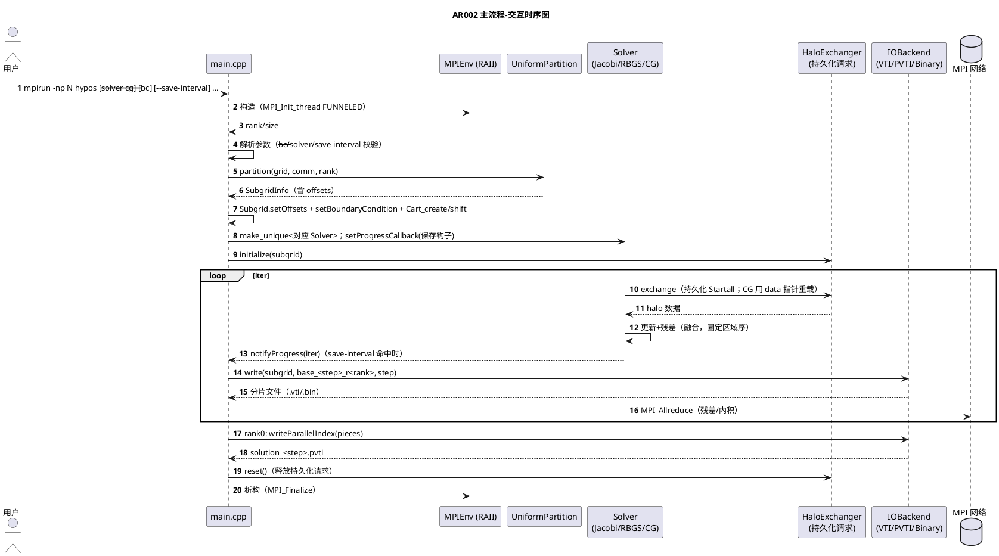
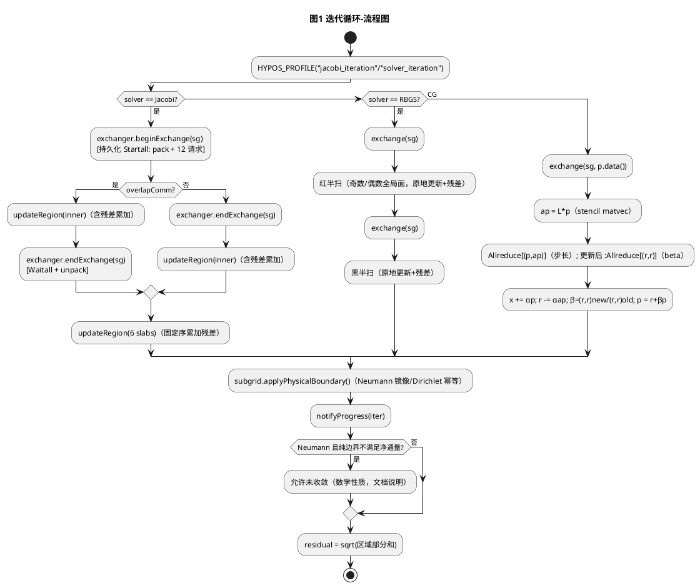
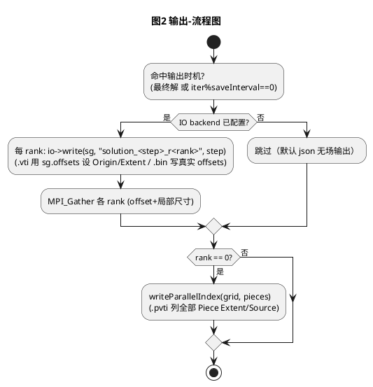
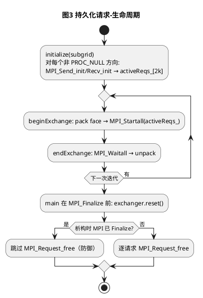

# 1 AR概述

| 组件名称 | HyPoS — Hybrid Poisson Solver（MPI + OpenMP 分布式泊松求解器） |
| --- | --- |
| AR系统流水号 | AR002 |
| AR描述 | 全项目深度优化：全局解输出（PVTI/Binary 分片）、save-interval、RAII/死代码收口、Neumann BC 接线、报告字段与 FLOPs 收口、通信与内核性能优化（残差融合/持久化通信/memcpy 打包/SIMD）、RBGS 与 CG 求解器、工程化收口与基准刷新。 |

关联 srs：`./srs.md`；关联 tasks：`./tasks.md`。方案选择与理由见 §4.1；组件详设 `specs/component-detail-design/` 缺失（延续 AR001 记录，Step 7 跳过）。

# 2 动态行为

## 2.1 交互时序图（主流程：初始化/求解/输出）

# 3 功能点分解

| **序号** | **功能点名称** | **功能点描述** | 映射 |
| --- | --- | --- | --- |
| 1 | 全局输出 | 每 rank `.vti`/`.bin` 分片（真实 Origin/offsets）+ rank0 `.pvti` 索引；Subgrid 携带 offsets | R1 / T001 |
| 2 | 中间解保存 | 进度回调 + `--save-interval`（命名 `solution_<step>_r<rank>`） | R2 / T002 |
| 3 | RAII/清理收口 | MPIEnv 接入 main；collective 告警限 rank0；Logger 注释更正；MemoryPool 移除 | R3 / T003 |
| 4 | Neumann BC | `--bc dirichlet\|neumann` + `Subgrid::applyPhysicalBoundary`（每迭代刷新物理边界） | R4 / T004 |
| 5 | 报告收口 | comm_overhead_ratio/compute_time_ms 回填；移除 bandwidth/scaling 假字段；FLOPs 修正 | R5 / T005 |
| 6 | 残差融合 | 固定区域序部分和（on/off bit 一致）；退化子域端点归一化 + Debug 自检 | R6a / T006 |
| 7 | 持久化通信 | Send_init/Recv_init + Startall/Waitall；析构释放（Finalize 前） | R6b / T007 |
| 8 | 打包与向量化 | memcpy 行拷贝（布局最内维连续）；`__restrict` + `omp simd`；`-fopt-info-vec` 证据 | R6c / T008 |
| 9 | 性能验收 | 256² np=1/4 优化前后对比（≥10%，3 次中位数）+ 基准存档 | R6 / T009 |
| 10 | RBGS 求解器 | 双色半扫 + 每半扫交换 + 融合残差；`--solver red_black_gs` | R7a / T010 |
| 11 | CG 求解器 | matvec 复用 stencil + data 指针交换 + 双标量归约；`--solver cg` | R7b / T011 |
| 12 | 工程化 | `.gitignore`；ctest 新用例；scaling 脚本参数化；plot 清理 | R8a / T012 |
| 13 | 文档同步 | README/DESIGN/PERFORMANCE 与新行为一致 | R8b / T013 |
| 14 | 总验收/基准刷新 | e2e 全套 + SCALING_REPORT 前后对比 + 弱扩展重测 | R8c / T014 |

# 4 实现设计

## 4.1 功能实现思路

### 4.1.1 全局输出方案（R1）

**方案 A（采用）：每 rank XML 分片 + rank0 索引**
- VTK 用 XML `ImageData`（`.vti`，结构化点场正确格式族）+ `PImageData`（`.pvti`）索引；Binary 每 rank 一文件、头部真实 offsets。
- 优点：无聚合内存爆炸、天然并行可扩展；ParaView 原生支持；实现局部（IO 层+main 汇总 pieces）。
- 缺点：多文件产物；需 gather 各 rank 的 extent（6 个 index，极小）。

**方案 B：rank0 MPI_Gatherv 聚合单文件**
- 优点：单文件直观；缺点：内存 O(全局)，不可扩展（与 HPC 主题相悖）。

**方案 C：MPI-IO 单文件自定义布局**
- 优点：最优雅的大规模方案；缺点：自研格式生态差、工作量大，对本项目收益有限（列 AR003 路线图）。

**推荐理由：** A 与项目"并行可扩展"主题一致、工作量可控、可被 ParaView 直接验证结构（extent 拼合/Origin）。

### 4.1.2 中间解保存机制（R2）

**方案 A（采用）：基类非虚回调 setter + protected notify**
- `setProgressCallback(std::function<void(Index)>)`（非虚，成员存储）+ 求解循环内 `notifyProgress(iter)`；`solve()` 签名不变，现有调用与测试零破坏。
- 优点：接口兼容成本最低；solver 不感知 IO（保持分层）；未设置时一次判空（≈0 开销）。
- 缺点：回调须自行保证线程安全（本实现仅在主线程调用，文档注明）。

**方案 B：`solve()` 增加回调参数** —— 破坏现有虚函数签名，所有派生类与测试需改；不取。

**方案 C：Observer 接口类** —— 对单一钩子过重；不取。

### 4.1.3 MemoryPool 处置（R3）

**方案 A（采用）：整体移除**
- 理由：全仓零引用（AR001 后审查确认）；求解器无热路径动态分配需求（CG 新增缓冲也由 `AlignedBuffer` 承担）；保留死代码违反"最小可用"原则。同步移除 CMake 条目与 README/DESIGN 中"内存池（Bump Allocator）"表述。

**方案 B：接入交换器 scratch** —— 12 个交换缓冲一次性分配，为"用而用"增加复杂度，收益≈0；不取（列路线图）。

### 4.1.4 残差融合（R6a）

**方案 A（采用）：按固定区域序的内联累积**
- 每个区域（内点盒、6 slab）在更新循环中以 OpenMP `reduction(+:)` 累计 `(new-old)²`，区域部分和按**固定顺序**（inner→L→R→D→U→B→F）在 iterate 内相加；overlap on/off 共用同一组区域与同一加和顺序 → 残差 bit 一致，可删除独立残差扫描（省一遍全数组读）。
- 优点：省 ~1/3 内存流量；一致性前提可证（每单元计算独立、加和顺序固定、同一线程划分）。
- 缺点：残差逻辑与更新耦合（用重命名区域函数+注释说明缓解）。

**方案 B：保留独立扫描** —— 简单但多一遍读；不取。

**退化子域**：区域端点归一化 `i0=min(iBegin+hw,iEnd); i1=max(iEnd-hw,i0)`（j/k 同理），保证 slab 恰好划分内点域；Debug 下断言"各区域体积之和=内点体积"。

### 4.1.5 CG 的 halo 交换（R7b）

**方案 A（采用）：HaloExchanger 增加 data 指针重载**
- 基类新增 `exchange/beginExchange/endExchange(Subgrid&, Real*)` 纯虚主接口；旧签名改为非虚兼容包装（转调 `subgrid.u().data()`）；Jacobi/测试零改动，CG 用自有 `p` 缓冲交换。
- 优点：最小且向后兼容的接口演进；交换语义对任意 padded 布局向量成立。

**方案 B：CG 挤占 u/uNext 双缓冲** —— CG 需 3+ 向量，不足且语义混乱；不取。

**方案 C：CG 专用交换器** —— 重复实现；不取。

### 4.1.6 其余决策

| 决策点 | 选择 | 理由 |
|--------|------|------|
| 物理边界刷新 | `Subgrid::applyPhysicalBoundary`（逐迭代、仅 PROC_NULL 面） | Dirichlet 幂等、Neumann 镜像需最新内点值；成本 O(周长) |
| 持久化请求生命周期 | initialize 注册、析构释放 + main 在 Finalize 前显式 reset | 规避 MPI_Finalize 后释放非法；析构内 `MPI_Finalized` 防御 |
| SIMD 对齐 | `__restrict` + `omp simd`（不用 `aligned` 断言） | 内点偏移使 64B 对齐不可保证，错误断言属 UB |
| RBGS 着色 | 全局奇偶 `(gi+gj+gk)`（用 Subgrid offsets） | 多进程下局部奇偶会错色 |
| CG 预条件 | 无（纯 CG） | 控制范围；Jacobi 预条件列路线图 |

## 4.2 功能实现设计

### 4.2.1 流程图

**图 1：迭代循环（三种求解器与持久化通信）**

**图 2：输出流程（R1/R2）**

**图 3：持久化请求生命周期**

### 4.2.2 流程说明

#### （1）输出（R1/R2）

- **命名约定**：`solution_<step>_r<rank>.vti|.bin`；索引 `solution_<step>.pvti`（仅 rank0）；最终解 step=实际迭代数；中间解 step=k×saveInterval。
- **VTI 分片结构**：`ImageData` → `WholeExtent` 取**该分片自身的全局 Extent**（`offsetX..offsetX+nxLocal-1` 等，符合 VTK 分片惯例；全局域由 `.pvti` 的 `WholeExtent=0..nxG-1...` 承载）、`Origin="offsetX*dx ..."`、`Spacing`；`Piece Extent` 同分片范围；`DataArray` ascii Float64 写内点值。
- **PVTI 索引**：`PImageData WholeExtent` 同全局；每个 Piece 一行 `Extent` + `Source="solution_<step>_r<i>.vti"`；pieces 由 main `MPI_Gather` 汇总（每 rank 6 个 Index）。
- **Binary**：头 7×Index（nx,ny,nz,hw,offsetX,Y,Z）——offset 改为真实值；其余同现状。
- **回调时机**：`notifyProgress(iter)` 在迭代号自增、残差与边界刷新完成后调用；回调内做 IO（捕获 outputDir/format/io 指针与 pieces 汇总逻辑，封装为 main 内 lambda）。
- **未配置 IO（默认 json）**：save-interval 不产生文件、零额外开销（回调不设置）。

#### （2）RAII 与环境（R3）

- main 用 `MPIEnv env(argc, argv, MPI_THREAD_FUNNELED)`；rank/size 取 `env.rank()/env.size()`；`--help` 路径由 parser 内 `std::exit` 处理（与 AR001 相同，不受 MPIEnv 影响——exit 前不触析构，MPI 未 Finalize 属可接受退出路径，文档注明）。
- **关闭顺序**：`solver.reset(); exchanger.reset(); io.reset(); MPI_Comm_free(&cartComm);` 然后 MPIEnv 析构（Finalize）。
- CollectiveExchanger 告警：`initialize` 内取 `MPI_Comm_rank(subgrid.comm())`，仅 rank0 打印。
- main 以顶层 try/catch 包裹运行体（`HyPoSException`/`std::exception` → `HYPOS_ERROR` + 退出码 1），覆盖参数转换异常（如 `--save-interval abc` 的 `std::invalid_argument`）与 IO 异常；MPIEnv 析构仍保证 Finalize。
- Logger：注释改为"单线程使用；非线程安全（当前无并发日志场景）"。
- MemoryPool：删除 `src/core/memory_pool.{hpp,cpp}`、CMake 条目；README 亮点表内存行改为"64B 对齐 RAII 内存（AlignedBuffer）"；DESIGN §2.1 同步。

#### （3）边界条件（R4）

- `Subgrid::BoundaryCondition{Dirichlet, Neumann}` + `setBoundaryCondition` + `applyPhysicalBoundary(dirichletValue=0)`。
- 对 6 面中邻居为 `MPI_PROC_NULL` 的面：Dirichlet → 整带宽（含角，横向覆盖 `[0,total)`）置值；Neumann → 镜像相邻内点，横向坐标越界时**夹取**到最近内点（`j=clamp(j, jBegin, jEnd-1)` 等）。2D（nzLocal==1）跳过 k 面（与既有 `applyDirichletBC` 一致）。
- 调用点：`iterate()` 末尾（残差计算前，swap 之后视求解器而定——Jacobi 在 swap 后作用于新解；RBGS/CG 原地更新后直接刷新）。
- 默认 Dirichlet 时行为与 AR001 逐位一致（幂等重放 0 值）。
- 既有 `applyNeumannBC`（全仓无引用）随本 AR **移除**（被 `applyPhysicalBoundary` 取代）；`applyDirichletBC` 保留（setup 初始填充与默认路径），避免"用新接口留旧死代码"与 R3 目标冲突。

#### （4）报告（R5）

| 字段 | 定义 |
|------|------|
| `comm_time_ms` | 同 AR001（rank0，halo_exchange+halo_wait ÷ 迭代数） |
| `compute_time_ms` | rank0（stencil_interior+stencil_boundary 总秒）÷ 迭代数 × 1000 |
| `comm_overhead_ratio` | comm_time_ms / iter_time_ms（iter_time_ms>0 保护） |
| `final_residual` | 同 AR001 |
| FLOPs | `flopsPerCell = 8 (2D) / 11 (3D)`（更新 5/8 + 残差 3）；`flops_per_sec = flopsPerCell × N_cells × iterations / total_time`，公式注释于代码与 README |
| 移除 | `memory_bandwidth_gbps`、`scaling` 块（Reporter 结构体与 JSON 同步删除，避免假数据） |

#### （5）性能实现（R6）

- **残差融合与归一化**：见 §4.1.4；Debug 自检：`solve()` 首次迭代前校验区域体积和==内点体积（失败抛 `HyPoSException`，Debug-only）。
- **持久化通信**：`activeDirs_`/`activeReqs_`（[send,recv]×活动方向）；`initialize` 建 `MPI_Send_init/Recv_init`；`beginExchange` 打包后 `MPI_Startall`；`endExchange` `MPI_Waitall` 后解包；析构 `MPI_Finalized` 防御 + `MPI_Request_free`。全部方向 PROC_NULL 时零请求（Startall 0 长度合法）。未 `initialize` 即调用交换入口（内部 `comm_ == MPI_COMM_NULL`）或 `data == nullptr`：`HYPOS_ERROR` 日志 + 安全空操作（防御设计，不抛出）。
- **memcpy 打包布局**：L/R 缓冲 `[k][j][h]`（h 最内，源列连续 → 每 (k,j) 一次 memcpy）；D/U `[h][k][i]`（i 连续，每 (h,k) 一行）；B/F `[h][j][i]`（每 (h,j) 一行）；unpack 镜像。面尺寸公式不变（仅元素顺序变，pack/unpack 成对修改）。
- **SIMD**：`updateRegion` 指针 `__restrict` + `#pragma omp simd`；证据：`cmake -B build-vec -DCMAKE_CXX_FLAGS="-fopt-info-vec"` 构建日志中 stencil 内层循环"loop vectorized"记录入 AR 日志。

#### （6）求解器（R7）

- **RBGS**：迭代 = 红扫（(gi+gj+gk) 偶）+ 交换 + 黑扫 + （下一迭代起始交换）；gi=i+offsetX-1+hw 等全局坐标；原地更新 + 旧值捕获残差；`solve()` 同 Jacobi 骨架（Allreduce 后置）。忽略 overlap（main 对非 Jacobi + `--overlap-comm` 打印一次告警）。
- **CG**：状态 `r,p,ap`（AlignedBuffer，solve 内分配一次）；matvec `L p = Σ邻居p − 4p/6p`（2D 4 点系数/3D 6）；每迭代 1 次 `exchange(sg, p.data())` 与 2 次标量 `MPI_Allreduce`（先 `(p,ap)` 求步长、更新后再 `(r,r)` 求 beta；无法合并因 alpha 需先于更新）；`lastResidual`=||r||₂；`x` 即 `subgrid.u()`；`iterate()` 基于成员状态（未初始化时告警返回 0）。
- CLI：`--solver jacobi|red_black_gs|cg`（别名 `rbgs` 可选，design 以 `red_black_gs` 为准）；非法值退出码 1。

#### （7）工程化（R8）

- `.gitignore`：`build*/`、`scaling_results/`、`scaling_plots/`、`output/`、`*.o`、`*.vti`、`*.pvti`、`*.bin`（输出样例目录除外）。
- ctest 新增：`collective_mpi`（np=4 hypos collective）、`ranks3_smoke`（np=3 hypos）、`solver_alt_mpi`（np=4 `SolverAltMpiTest.*`）。
- 脚本：`run_scaling_tests.py` 增 `--max-iter/--tol`；plot 移除 numpy。
- 基准：新增 `strong_scaling_optimized_wsl.json`/`weak_scaling_optimized_wsl.json`（保留 AR001 原文件作基线）；SCALING_REPORT 增加前后对比表。

## 4.3 接口描述

> 兼容原则：AR001 公开签名保持可用；变更项均在本 AR 授权。

### 4.3.1 新增接口

**I-1 `Subgrid` 偏移**
| 项 | 内容 |
|----|------|
| 签名 | `void setOffsets(Index offsetX, Index offsetY, Index offsetZ) noexcept;` / `Index offsetX() const noexcept;`（Y/Z 同理） |
| 参数 | 全局内点偏移（0 基） |
| 返回/异常 | 默认 0；不抛出 |
| 边界 | 默认 0；main 从 `SubgridInfo` 设置；只读访问 |

**I-2 `Subgrid` 边界条件**
| 项 | 内容 |
|----|------|
| 签名 | `enum class BoundaryCondition { Dirichlet, Neumann };` `void setBoundaryCondition(BoundaryCondition bc) noexcept;` `void applyPhysicalBoundary(Real dirichletValue = 0.0) noexcept;` |
| 行为 | 仅处理 `MPI_PROC_NULL` 面；Dirichlet 置值（整带）、Neumann 镜像（横向夹取）；2D 跳过 k 面 |
| 边界 | 全部邻居有效时为空操作；重复调用幂等（Dirichlet）/收敛一致（Neumann） |

**I-2b `Subgrid::applyPhysicalBoundary(Real* data, Real dirichletValue = 0)`**：对任意 padded 缓冲执行同样的物理边界刷新（CG 的 `p` 等辅助向量使用）；`applyPhysicalBoundary(Real)` 为 `u()` 上的便捷包装。

**I-3 `PoissonSolver` 进度回调**
| 项 | 内容 |
|----|------|
| 签名 | `using ProgressCallback = std::function<void(Index)>;` `void setProgressCallback(ProgressCallback cb);`（非虚） + `protected: void notifyProgress(Index) const;` |
| 参数 | 回调：完成第 k 次迭代后调用，k≥1 |
| 边界 | 未设置→空操作；重复设置→后者覆盖；回调不得抛出（文档约定） |

**I-4 `HaloExchanger` data 重载**
| 项 | 内容 |
|----|------|
| 签名 | `virtual void exchange(Subgrid&, Real* data) = 0;` `virtual void beginExchange(Subgrid&, Real* data) = 0;` `virtual void endExchange(Subgrid&, Real* data) = 0;`；旧签名改为非虚包装转调 `u().data()` |
| 参数 | data 指向与子域同布局的 padded 缓冲 |
| 边界 | `data==nullptr` 或未 `initialize`：`HYPOS_ERROR` 日志 + 安全空操作（防御设计，不抛出） |

**I-5 `IOBackend` 并行索引**
| 项 | 内容 |
|----|------|
| 签名 | `struct PieceExtent { Index offsetX, offsetY, offsetZ, nxLocal, nyLocal, nzLocal; };` `virtual void writeParallelIndex(const Grid& grid, const std::string& baseName, int step, const std::vector<PieceExtent>& pieces) {}` |
| 行为 | 默认空实现；VTK 后端写 `.pvti`（仅 rank0 调用） |
| 边界 | `pieces` 为空或与网格不符 → 告警跳过；非 rank0 调用不做写 |

### 4.3.2 修改接口

**I-6 `Reporter` 输出模式**：JSON 移除 `memory_bandwidth_gbps` 与 `scaling` 块；`PerformanceMetrics` 增 `commOverheadRatio` 语义（已存在，回填）、`computeTimeMs` 回填；删除 `ScalingMetrics` 与 `setScaling`。CSV 列维持现状（不含被删字段）。

**I-7 CLI**：新增 `--bc <dirichlet|neumann>`（默认 dirichlet）；`--solver` 接受 `jacobi|red_black_gs|cg`；`--save-interval` 生效（语义见 §3.2 需求）。帮助文本同步。

**I-8 `PointToPointExchanger` 生命周期**：新增 `~PointToPointExchanger() override`（释放持久化请求，`MPI_Finalized` 防御）；main 在 Finalize 前 `exchanger.reset()`；未 `initialize` 调用交换入口 → `HYPOS_ERROR` 日志 + 空操作（与 I-4 同一防御）。API 语义与 AR001 一致（initialize→use→destroy）。

### 4.3.3 接口/参数边界与错误行为（供 §6.2 用例）

| 接口 | 边界/异常输入 | 预期行为 |
|------|--------------|---------|
| `setProgressCallback` | 未设置/设置/重复设置 | 无回调；k=1..N 各一次；覆盖生效 |
| `applyPhysicalBoundary` | Dirichlet/Neumann × 全 PROC_NULL/部分/无 | 置值/镜像（夹取）/空操作；2D 跳过 k 面 |
| `exchange(data)` | 合法缓冲/`nullptr`/未 initialize | 与 u 版结果一致；`HYPOS_ERROR`+空操作；`HYPOS_ERROR`+空操作 |
| `writeParallelIndex` | pieces 空/不匹配/合法/非 rank0 调用 | 告警跳过/告警跳过/写出 `.pvti`；非 rank0 调用不写（主流程约束 + 代码走查） |
| `--bc` | dirichlet/neumann/非法 | 默认同 AR001/镜像/退出码 1 |
| `--solver` | jacobi/red_black_gs/cg/非法 | 原行为/RBGS/CG/退出码 1 |
| `--save-interval` | 0/N>0/无 IO | 零文件/按步输出/仅最终解 |
| `iterate()`（CG） | 未初始化状态 | 告警并返回 0，不崩溃 |
| `--overlap-comm` × 非 Jacobi | rbgs/cg | 告警恰 1 条；行为不变 |
| main 参数转换异常 | `--save-interval abc` | 错误日志 + 退出码 1（顶层 try/catch） |

## 4.4 代码设计

```plantuml
@startuml
title AR002 修改范围-包图
package "HyPoS" {
  package "src/core" {
    [memory_pool.* (移除)] as mp
  }
  package "src/grid" {
    [subgrid.hpp/.cpp (offsets + BC)] as sg
  }
  package "src/solver" {
    [solver.hpp (回调 + 导出新类)] as sh
    [jacobi_solver.cpp (融合/边界刷新/持久化适配)] as js
    [red_black_gs_solver.cpp (新增)] as rb
    [cg_solver.cpp (新增)] as cg
  }
  package "src/comm" {
    [halo_exchanger.hpp (data 重载 + 持久化成员)] as hh
    [p2p_exchanger.cpp (持久化/memcpy)] as p2p
    [collective_exchanger.cpp (委托 + rank0 告警)] as coll
  }
  package "src/io" {
    [io_backend.hpp (PieceExtent/索引接口)] as ib
    [vtk_io.cpp (vti/pvti)] as vtk
    [binary_io.cpp (真实 offsets)] as bin
  }
  package "src/perf" {
    [reporter.hpp/.cpp (字段收口)] as rep
  }
  [main.cpp (MPIEnv/BC/回调/输出编排)] as main
}
package "tests" {
    [test_alt_solvers.cpp (新增 RBGS/CG/BC/offsets/回调)] as ts
  [test_halo_exchange.cpp (data 重载)] as th
  [test_solver_mpi.cpp (alt solver np=4 / 退化断言)] as tm
  [test_performance.cpp (报告/区域)] as tp
}
package "工程" {
  [.gitignore (新增)] as gi
  [CMakeLists.txt (移除 memory_pool/新测试/新 ctest)] as cm
  [scripts/*.py] as sc
  [docs/* README] as doc
  [benchmarks/reference_results/*] as bench
}
main --> sh
main --> sg
main --> ib
js --> hh
rb --> hh
cg --> hh
ts --> sg
@enduml
```

**文件级改动清单：**

| 文件 | 动作 | 内容 |
|------|------|------|
| `src/core/memory_pool.hpp/.cpp` | 删除 | 死代码移除（CMake 同步） |
| `src/grid/subgrid.hpp/.cpp` | 修改 | offsets；BoundaryCondition + applyPhysicalBoundary |
| `src/solver/solver.hpp` | 修改 | ProgressCallback；声明 `RedBlackGSSolver`、`CGSolver` |
| `src/solver/jacobi_solver.cpp` | 修改 | 残差融合、端点归一化+自检、边界刷新、notifyProgress、SIMD/restrict |
| `src/solver/red_black_gs_solver.cpp` | 新增 | RBGS 实现 |
| `src/solver/cg_solver.cpp` | 新增 | CG 实现 |
| `src/comm/halo_exchanger.hpp` | 修改 | data 重载包装；持久化容器成员；析构 |
| `src/comm/p2p_exchanger.cpp` | 修改 | 持久化请求 + memcpy 打包（布局调整） |
| `src/comm/collective_exchanger.cpp` | 修改 | rank0 告警；data 重载转发 |
| `src/io/io_backend.hpp` | 修改 | PieceExtent、writeParallelIndex |
| `src/io/vtk_io.cpp` | 重写 | `.vti` 分片 + `.pvti` 索引 |
| `src/io/binary_io.cpp` | 修改 | 真实 offsets |
| `src/perf/reporter.hpp/.cpp` | 修改 | 字段收口（删 bandwidth/scaling、compute_time 保留回填） |
| `src/main.cpp` | 修改 | MPIEnv、BC/回调/输出编排/gather pieces/关闭顺序/告警 |
| `tests/test_alt_solvers.cpp` | 新增 | §6.1 用例（命名避免与既有 `test_solver.cpp` 混淆） |
| `tests/test_halo_exchange.cpp` | 修改 | data 重载一致性用例 |
| `tests/test_solver_mpi.cpp` | 修改 | np=4 RBGS/CG；退化用例断言增强 |
| `tests/test_performance.cpp` | 修改 | 报告字段/融合断言（如需） |
| `CMakeLists.txt` | 修改 | 源清单、测试、ctest 新用例、vector 报告构建选项记录 |
| `.gitignore` | 新增 | 生成物忽略 |
| `scripts/run_scaling_tests.py` | 修改 | `--max-iter/--tol` |
| `scripts/plot_scaling.py` | 修改 | 去 numpy |
| `README.md` / `docs/*` | 修改 | 与实现同步（输出格式/求解器/BC/save-interval/优化数据） |
| `benchmarks/reference_results/*` | 新增/更新 | 优化后基准 + README 说明 |

# 5 重构设计（可选）

| 重构项 | 动作 | 影响 |
|--------|------|------|
| MemoryPool 移除 | 删文件/条目/文档表述 | 消除死代码；无行为影响 |
| IO 层演进 | `write` 语义改为"每 rank 分片"，新增索引接口 | VTK 输出格式由 legacy `.vtk` 变为 XML `.vti`（破坏性，README 标注） |
| main 编排抽取 | 输出 lambda/片段收集辅助函数（文件内静态函数） | 可读性提升；无接口变化 |
| 求解器骨架复用 | RBGS/CG 各自实现 solve 循环（避免过度抽象） | 少量重复换低耦合 |

# 6 测试设计

**总策略：** UT（单 rank 语义与算法）→ np=3/4/8 MPI 集成 → e2e（输出/保存/报告/性能）→ 回归。**覆盖率目标：** 修改模块行覆盖 ≥80%（gcov 手工统计）；流程分支（图1-3）每分支 ≥1 用例（§6.7）。

## 6.1 单元测试（`tests/test_alt_solvers.cpp` 新增 + 既有补充）

| 用例 ID | 覆盖 | 步骤 | 预期 |
|---------|------|------|------|
| U-Offsets | I-1 | 默认 Subgrid 读 offsets；setOffsets(3,5,7) 后读 | 0/0/0；3/5/7 |
| U-BC-D | I-2 | 全 PROC_NULL 子域，填充 u=1000i+j，Dirichlet 刷新 | 4 面整带 halo=0；内点不变 |
| U-BC-N | I-2 | 同上，Neumann（夹取路径：横向越界点） | halo=对应相邻内点镜像值（含角夹取）；内点不变 |
| U-BC-Partial | I-2 | 仅左右 PROC_NULL，上下有邻居 | 仅物理面被刷新；有邻居面无变化 |
| U-CB | I-3 | 设置计数回调；solve 10 迭代 | 回调 10 次且序列 1..10；未设置时无副作用 |
| U-Fusion | R6a | 自环 np=1，`JacobiSolver(false)` 与 `(true)` 各以 tol=0 跑 400 迭代（同进程、同 OMP 配置） | `lastResidual()` 位级相等（EXPECT_EQ）；交换后全场 `memcmp` 相等 |
| U-Degen | R6a | TinyDecompositionSmoke（Debug）：区域体积自检 | 断言通过；无 ASan 报告 |
| U-PackStride | R6c | 3D 非对称子域（nxLocal≠nyLocal≠nzLocal，hw=2）自环六方向交换 | 六方向语义逐点断言通过（覆盖 [k][j][h]/[h][k][i]/[h][j][i] 各长度） |
| U-RBGS | R7a | 制造解 64² 单 rank：tol=1e-8 | 收敛；iters≤60%·Jacobi（同条件实测；理论比≈1/(1+ρ)≈0.5） ; L2 vs u*<1e-3；vs Jacobi(tol=1e-12) 逐点 ≤1e-8 |
| U-CG | R7b | 同上 | 收敛；iters≤10%·Jacobi；L2 vs u*<1e-3；vs Jacobi ≤1e-8 |
| U-CG-State | 接口边界 | 直接调用未初始化 CG.iterate() | 返回 0 + 告警不崩溃 |

## 6.2 接口测试

| 用例 ID | 接口 | 输入 | 预期 |
|---------|------|------|------|
| IF-BC-1/2/3 | `--bc` | dirichlet/neumann/foo（np=1/4，32²，max-iter 50） | 各正常/正常完成且镜像语义由 U-BC-N 断言/退出码 1（e2e 见 I16） |
| IF-Solver-1..3 | `--solver` | red_black_gs/cg/foo；cg+`--overlap-comm` | 正常收敛/正常/退出码 1；组合下告警恰 1 条且行为不变 |
| IF-ExchData | I-4 | np=1 自环：独立副本 buf（复制自 u）执行 `exchange(sg, buf.data())`；另对比 `exchange(sg)` 的 u 结果 | halo 语义正确且两路径结果一致 |
| IF-ExchData-null | I-4 | `exchange(sg, nullptr)` | 无崩溃；u 不变 |
| IF-ExchNoInit | I-8 | 未 initialize 实例调用 exchange | 无崩溃；无副作用 |
| IF-Index | I-5 | pieces 空/不匹配/合法（单测直接调 VTK 后端） | 告警跳过×2/`.pvti` 生成且含 N 个 Piece |
| IF-CB-Dup | I-3 | 连续设置两个回调 | 仅后者被调用 |
| IF-SI-Parse | I-7 | `--save-interval 0/50/abc` | 0 无文件（见 I9）/按步输出/`abc` → 错误日志 + 退出码 1（顶层 try/catch，E-Parse） |

## 6.3 业务场景测试

| 用例 ID | 场景 | 步骤 | 预期 |
|---------|------|------|------|
| I8 | PVTI 全局输出（np=4 与 np=1） | `hypos --nx 32 --ny 32 --max-iter 10 --output-format vtk --output-dir D` | np=4：4×`.vti`+1×`.pvti`；4 个 Piece；各 Extent 拼合=全局且 Origin 正确；np=1 单 Piece Origin 0 |
| I9 | save-interval | 三组：`50/120`、`50/30`、默认；`--output-format vtk` | 组1存在 `solution_50_r*`/`solution_100_r*`；组2无中间文件（未到 50 步）；默认组仅最终解 |
| I10 | 性能对比 | 256² 10000 迭代 np=1/4 OMP=1 ×3 次 | iter_time 中位数改善 ≥10%（对比 AR001 0.0451/0.0204ms）；证据入 `logs/` |
| I11 | alt 求解器 e2e | np=4 `--solver red_black_gs/cg --nx 64 --ny 64 --max-iter 2000` | 退出 0；报告 iterations 显著小于 Jacobi 同配置 |
| I12 | 3 进程任意分解 | np=3 `--nx 24 --ny 24 --max-iter 20` | 退出 0；输出分片 3 份 |
| I13 | collective 告警 | np=4 `--comm-mode collective` | 告警恰 1 条 |
| I14 | 报告字段 | np=4 `--enable-profiling`；np=1 计算 flops 对账 | comm_overhead_ratio>0 且与 comm/iter 一致（±5%）；compute_time_ms>0 且与 Profiler 一致（±5%）；JSON 无 scaling/bandwidth；flops 与公式一致（±5%） |
| I15 | Binary 输出 | np=4 `--output-format binary` | 4×`.bin`；头 offsets 实测真实值；np=1 全局 |
| I16 | Neumann 冒烟 | np=1 与 np=4 `--bc neumann --nx 32 --ny 32 --max-iter 50` | 退出 0；解有限（镜像语义由 U-BC-N 断言） |

## 6.4 异常场景测试

| 用例 ID | 异常 | 触发 | 预期 |
|---------|------|------|------|
| E-OutDir | 输出目录不可写 | `--output-dir /proc/1/xxx`（IO 开启） | 告警打印、进程正常退出、退出码 0 |
| E-BC | 非法 `--bc` | `--bc foo` | 退出码 1 + 错误信息 |
| E-Degen | 退化分解 | np=4 全局 2×2（1×1 子域） | 不崩溃；Debug 自检通过；解有限（复用 AR001 E5） |
| E-CGState | CG 未初始化 iterate | 单测直接调用 | 返回 0 + 告警；不崩溃 |
| E-PVTI | pieces 与网格不匹配 | 单测构造错误 pieces | 告警跳过；无部分写入崩溃 |
| E-Exch-NoInit | 未 initialize 调交换 | 单测直接调用 | 无崩溃；错误日志路径（防御） |
| E-Parse | 参数转换异常 | `--save-interval abc` | 错误日志 + 退出码 1（顶层 try/catch） |

## 6.5 MPI 集成测试（既有文件扩充）

| 用例 | 排名 | 场景 | 断言 |
|------|------|------|------|
| M-A1 | np=4 | RBGS 制造解 64²（tol=1e-8） | 收敛；iters≤60%·Jacobi；L2<1e-3 |
| M-A2 | np=4 | CG 制造解 64²（tol=1e-7） | 收敛；iters≤10%·Jacobi；L2<1e-3 |
| M-A3 | np=4 | RBGS/CG vs Jacobi(tol=1e-12) 逐点 | ≤1e-8（每 rank 局部比较 + 全局坐标映射） |
| M-Degen2 | np=4 | TinyDecompositionSmoke 增强：全局 4×4（2×2/rank）与 2×2（1×1/rank）均与串行参考逐点 ≤1e-12 | 通过 |
| M-A4 | np=4 | 3D RBGS/CG 冒烟：64×64×8，两 solver 各 max-iter=100 | 正常完成；解有限 |

## 6.6 追溯矩阵（srs 验收 → 用例）

| srs 验收 | 用例 |
|----------|------|
| 3.1 PVTI/二元分片+offsets | I8、I15、U-Offsets |
| 3.2 save-interval | I9、U-CB |
| 3.3 RAII/告警/死代码 | I13、代码走查（main 无裸 MPI_Init；grep MemoryPool 零引用）、I8（主流程无回归） |
| 3.4 Neumann | U-BC-D/U-BC-N/U-BC-Partial、IF-BC-*、I16（neumann 冒烟） |
| 3.5 报告收口 | I14 |
| 3.6 性能与一致性 | I10、U-Fusion（on/off 位级）、O1/O2（既有一致性）、U-Degen、E1（ASan 全量）、向量化日志 |
| 3.7 RBGS/CG | U-RBGS、U-CG、M-A1..A4（含 3D 冒烟）、I11 |
| 3.8 工程化 | I12、ctest 全绿（含 collective_mpi/solver_alt_mpi）、文档与 .gitignore 走查、基准前后对比 |

## 6.7 分支覆盖矩阵（流程图 → 用例）

| 分支 | 用例 |
|------|------|
| Jacobi/overlap on/off（图1） | O1/O2（既有）+ U-Fusion |
| RBGS/CG 分支（图1） | U-RBGS/U-CG/M-A* |
| IO 配置/未配置（图2） | I8/I9（配置）与 I9 默认组（未配置） |
| rank0 索引分支（图2） | I8（np=1 与 np=4 对比） |
| 持久化初始化/无活动方向/未初始化防御（图3） | IF-ExchData、IF-ExchNoInit、U5（全 PROC_NULL 既有）；正常关闭路径 I8；**析构时 MPI 已 Finalize 的防御分支为代码走查项**（进程内无法在 Finalize 后继续运行测试） |
| 非 Jacobi 求解器 + `--overlap-comm` 告警（图1） | IF-Solver-1/2 |
| main 顶层异常捕获（参数/IO，图2） | E-Parse、E-OutDir |
| Neumann 允许未收敛分支（图1） | U-BC-N（语义）+ I16（冒烟） |
| 求解器/BC/非法值（CLI） | IF-* / E-BC |

## 6.8 测试执行环境

- 同 AR001：WSL；Release=OpenMPI、Debug+ASan=MPICH；测试 OMP=4、性能基准 OMP=1；`ASAN_OPTIONS=detect_leaks=0`；`-fopt-info-vec` 一次性构建记录证据。
- 性能对比口径：256²、10000 迭代、OMP=1、3 次取中位数、同机同条件；AR001 基线取 `benchmarks/reference_results/strong_scaling_wsl.json`。
