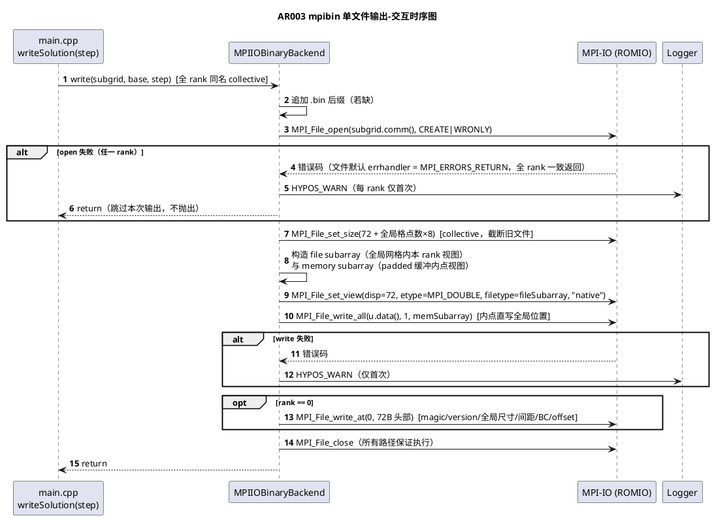
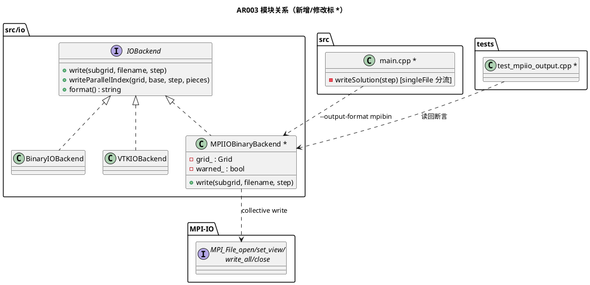

# 1 AR概述

| 组件名称 | HyPoS — Hybrid Poisson Solver（MPI + OpenMP 分布式泊松求解器） |
| --- | --- |
| AR系统流水号 | AR003 |
| AR描述 | MPI-IO 单文件二进制输出：新增 `MPIIOBinaryBackend : IOBackend` 与 `--output-format mpibin`，全 rank collective 写单一自描述文件（固定头 + 全局行主序数据区，subarray filetype 直写全局位置）；CLI/`--save-interval` 集成；失败告警跳过；读回测试与基准参考；文档全套同步。 |

关联 srs：`./srs.md`；关联 tasks：`./tasks.md`。方案选择与理由见 §4.1；组件详设 `specs/component-detail-design/` 缺失（延续 AR001/AR002 记录，Step 7 跳过）。

# 2 动态行为

## 2.1 交互时序图（mpibin 输出流程：最终解 / save-interval 快照）



# 3 功能点分解

| **序号** | **功能点名称** | **功能点描述** | 映射 |
| --- | --- | --- | --- |
| 1 | MPIIOBinaryBackend | 新增后端类：collective `write()`（双 subarray filetype 零拷贝直写全局位置）+ `writeParallelIndex()` no-op；RAII 式保证 `MPI_File_close` | R1 / T002 |
| 2 | 自描述文件布局 | 固定 72 字节头（magic/version/全局 nx·ny·nz/dx·dy·dz/bcType/dataOffset）+ 全局行主序 double 数据区（x 最快） | R1 / T002 |
| 3 | CLI 集成 | `--output-format mpibin` 实例化新后端；格式值白名单校验（json/csv/vtk/binary/mpibin，非法退出码 1，对齐 --solver/--bc 约定） | R2 / T005 |
| 4 | writeSolution 分流 | 单文件后端用无 `_r<rank>` 后缀共享名；跳过 piece gather 与并行索引；`--save-interval` 每 step 一个单文件 | R2 / T005 |
| 5 | 异常路径 | open/write 失败 → WARN（限每 rank 一次）+ 跳过；文件 errhandler 默认 MPI_ERRORS_RETURN 保证全 rank 一致返回，无 collective 挂死 | R3 / T004 |
| 6 | io_write 剖面 | `writeSolution` 内加 `HYPOS_PROFILE("io_write")`，供基准对比取数 | R5 / T005/T007 |
| 7 | 读回测试 | np=1 头部+数据逐位断言；np=4 全局拼接逐位断言（2D 64² 与 3D 32×32×8）；失败路径测试 | R4 / T001/T003/T004 |
| 8 | ctest 注册与回归 | 新测试文件入 test_hypos；ctest 新增 `mpiio_np1`/`mpiio_np4`/`mpiio_e2e`；全量 Debug/Release+ASan | R4 / T006 |
| 9 | 基准参考 | 256² np=1/4（OMP=1，3 次中位数）mpibin vs binary 的 io_write 耗时对比 | R5 / T007 |
| 10 | 文档同步 | README（格式表、帮助文本）、DESIGN（IO 层）、PERFORMANCE（基准）；无失实宣称 | R6 / T008 |

# 4 实现设计

## 4.1 功能实现思路

### 4.1.1 写入机制（R1 核心）

**方案 A（采用）：双 subarray filetype，零拷贝**
- `MPI_File_set_view(fh, disp=dataOffset, etype=MPI_DOUBLE, filetype=fileSub, "native", MPI_INFO_NULL)`；`fileSub = MPI_Type_create_subarray(3, {gnx,gny,gnz}, {nxLocal,nyLocal,nzLocal}, {offsetX,offsetY,offsetZ}, MPI_ORDER_C, MPI_DOUBLE)`——文件侧视图即本 rank 在全局网格中的内点盒。
- `MPI_File_write_all(fh, u.data(), 1, memSub, MPI_STATUS_IGNORE)`；`memSub = MPI_Type_create_subarray(3, {nxTotal,nyTotal,nzTotal}, {nxLocal,nyLocal,nzLocal}, {halo,halo,halo}, MPI_ORDER_C, MPI_DOUBLE)`——内存侧视图即 padded 缓冲的内点盒（halo 不落盘）。
- 优点：零额外内存、零打包拷贝、一次集体调用；数值为逐位拷贝（无浮点运算），天然满足 srs §3.1 逐位一致验收。
- 缺点：两侧非连续访问，ROMIO 聚合开销在 np≤4 本地文件系统上不可测（目标规模无影响）；列 HDF5/子文件分发等进一步优化入路线图。

**方案 B（不取）：打包 contiguous 后 `set_view` + `write_all`** —— 内存侧连续更 ROMIO 友好，但 O(内点) 额外内存 + 一遍拷贝；与 AR002 memcpy 打包优化语义重叠却无通信收益。

**方案 C（不取）：逐 x 行 `MPI_File_write_at_all` 显式偏移** —— ny×nz 次集体调用，聚合最差；实现看似简单但集体调用次数随网格线性增长。

**推荐理由：** A 在正确性（逐位）、内存（零拷贝）与主题契合（"最优雅的大规模方案"）上全面占优；B/C 的性能收益在项目目标规模（np≤4、本地 ext4）不可测。

### 4.1.2 文件布局（R1）

固定 72 字节头，逐字段序列化（无结构体填充歧义），小端（`"native"` 表示法，头注释与 README 注明）：

| 偏移 | 长度 | 字段 | 值 |
|------|------|------|----|
| 0 | 4 | magic | `'H','Y','P','S'` |
| 4 | 4 | version | `uint32_t = 1` |
| 8 | 8 | globalNx | `uint64_t`（固定宽度，非 size_t 依赖） |
| 16 | 8 | globalNy | `uint64_t` |
| 24 | 8 | globalNz | `uint64_t` |
| 32 | 8 | dx | `double` |
| 40 | 8 | dy | `double` |
| 48 | 8 | dz | `double` |
| 56 | 4 | bcType | `uint32_t`：0=dirichlet，1=neumann |
| 60 | 4 | reserved | `uint32_t = 0`（对齐填充） |
| 64 | 8 | dataOffset | `uint64_t = 72` |
| 72 | 8·N | 数据区 | 全局行主序 `double[N=gnx·gny·gnz]`，索引 `(i,j,k) → i + j·gnx + k·gnx·gny`（x 最快，与 AGENT_SPEC 内存布局一致） |

- `MPI_File_set_size(72 + N×8)`（collective）先于写：截断既有同名旧文件，避免残留尾部垃圾。
- 头部由 rank0 `MPI_File_write_at` 写（非集体，偏移 0，与数据区不相交，无序依赖）。
- BC 从 `subgrid.boundaryCondition()` 现取（单一事实源，不经过构造函数快照）。

### 4.1.3 错误处理与集体一致性（R3）

- **不抛出**：`write()` 全路径无异常（AGENT_SPEC "Never throw in MPI communication paths"）；返回 `void`，失败仅日志。
- **open 失败**：MPI 标准规定文件默认 error handler 为 `MPI_ERRORS_RETURN`，`MPI_File_open` 为 collective——错误码在**所有 rank** 一致返回，全 rank 走同一"告警+跳过"分支，无挂死。
- **write 失败**：`MPI_File_write_all` 是 collective 调用本身，即使个别 rank I/O 出错（如 ENOSPC），调用也在全部 rank 返回（错误码可能不一致）；每 rank 仅取自身返回值告警，之后共同到达 `MPI_File_close`。
- **告警限流**：成员标志 `warned_`，每 rank 仅首次失败打 WARN（对齐 AR002 collective 回退告警限流口径；save-interval 场景下天然有界）。
- **句柄安全**：`write()` 内单出口结构（open 失败提前 return，其余路径汇聚到统一 `MPI_File_close`）；两个派生 datatype 各自 `MPI_Type_free`（构造即提交、用完即释放，RAII 语义手工保证，代码走查项见 §6.4）。

### 4.1.4 main 集成（R2）

- 实例化：`else if (outputFormat == "mpibin") io = std::make_unique<MPIIOBinaryBackend>(grid);`（构造参数 `const Grid&` 存副本，全局尺寸/间距来源；VTKIOBackend 传 dx/dy/dz 先例的推广）。
- 格式白名单：解析后校验 `outputFormat ∈ {json,csv,vtk,binary,mpibin}`，否则 `HYPOS_ERROR` + 退出码 1（对齐 `--solver/--bc/--comm-mode` 既有约定）。**行为差异说明**：AR002 及之前未知格式值被静默忽略（io 为空→无输出无报错）；本 AR 起改为显式报错，属可预期收紧（垃圾值暴露优于静默丢弃），设计内授权并由用例固化（§6.3 E-3）。
- `writeSolution` 分流：`const bool singleFile = (outputFormat == "mpibin");`
  - 文件名：`singleFile ? base : base + "_r" + rank`（后端内部补 `.bin`）。
  - `singleFile` 时跳过 `MPI_Gather`（piece 元数据对单文件无意义）与 `writeParallelIndex`（该后端为 no-op）。
- 中间保存：`setProgressCallback` 路径不变（lambda 内分流已覆盖）；`solution_<step>.bin` 每 step 一个文件，最终解 `solution_<实际迭代数>.bin`。
- 剖面：lambda 首部加 `HYPOS_PROFILE("io_write");`（R5 基准取数；与既有 `halo_exchange` 等剖面同机制，无新增依赖）。

## 4.2 功能实现设计

### 4.2.1 流程图

```plantuml
@startuml
title MPIIOBinaryBackend::write 决策流程
start
:filename 追加 ".bin"（若缺）;
:MPI_File_open(subgrid.comm(), fname,\nCREATE|WRONLY, &fh);
if (err != MPI_SUCCESS) then (是)
  :HYPOS_WARN（若 !warned_，置位）;
  stop
endif (否)
:MPI_File_set_size(72 + N*8);
:MPI_Type_create_subarray x2\n(fileSub / memSub) + commit;
:MPI_File_set_view(disp=72, etype=DOUBLE,\nfiletype=fileSub, "native");
:MPI_File_write_all(u.data(), 1, memSub);
if (err != MPI_SUCCESS) then (是)
  :HYPOS_WARN（若 !warned_，置位）;
endif (否)
if (rank == 0) then (是)
  :MPI_File_write_at(0, 72B 头部);
  if (err != MPI_SUCCESS) then (是)
    :HYPOS_WARN（若 !warned_）;
  endif (否)
endif (否)
:MPI_Type_free x2;
:MPI_File_close(&fh);
stop
@enduml
```

### 4.2.2 流程说明

1. **入口契约**：`write()` 为 collective——`writeSolution` 保证全 rank 以同一 `filename` 调用（单文件分支无 rank 后缀）。若用户代码仅部分 rank 调用，集体调用语义未定义（接口文档明示该契约；单 rank 测试 + 全 rank 调用路径由 ctest 覆盖）。
2. **set_size**：必须先截断——`MPI_MODE_CREATE` 不隐含 truncate；同名旧文件更长时会残留尾部数据，破坏"读回即全局场"的自描述性。
3. **两个 subarray**：文件侧以全局网格为底、内点盒为子阵列；内存侧以 padded 总尺寸为底、同一内点盒为子阵列。两视图坐标不同、形状相同，`write_all` 据此建立内存→文件的逐元素映射（x 最快，`MPI_ORDER_C`）。
4. **2D/3D 统一**：`nz==1` 时 subarray 退化为 z 维长度 1，无需分支；3D 冒烟用例验证。
5. **退出**：所有正常/告警路径汇聚到 close 与 `MPI_Type_free`；open 失败提前 stop（无句柄可关、无类型可释放）。
6. **writeParallelIndex**：基类默认 no-op 已满足，不覆写。

## 4.3 接口描述

> 兼容原则：AR002 公开签名保持可用；变更项均在本 AR 授权。

### 4.3.1 新增接口

**I-1 `MPIIOBinaryBackend`（src/io/io_backend.hpp 声明 + src/io/mpiio_binary.cpp 实现）**
| 项 | 内容 |
|----|------|
| 签名 | `class MPIIOBinaryBackend final : public IOBackend { public: explicit MPIIOBinaryBackend(const Grid& grid); void write(const Subgrid& subgrid, const std::string& filename, int step = 0) override; std::string format() const override { return "mpibin"; } private: Grid grid_; bool warned_ = false; };` |
| 参数 | grid：全局网格描述（尺寸/间距），存副本 |
| 语义 | `write()` 为 **collective**：cart communicator（取自 `subgrid.comm()`）上全 rank 同名调用；产出单文件 `<filename>.bin` |
| 返回/异常 | `void`；任何失败不抛出，仅 WARN（每 rank 限一次）并跳过本次输出 |
| 边界 | filename 为空/无 `.bin` 后缀→按后缀规则补全；np=1 与 np>1 同路径；`writeParallelIndex` 不覆写（继承 no-op） |

**I-2 文件格式常量（mpiio_binary.cpp 匿名命名空间）**
| 项 | 内容 |
|----|------|
| 签名 | `kMagic[4]={'H','Y','P','S'}`、`kVersion=1`、`kHeaderBytes=72` |
| 用途 | 头部序列化与测试读回断言共用语义（测试按偏移独立解码，不 include 实现内部常量） |

### 4.3.2 修改接口

**I-3 CLI（src/main.cpp）**：`--output-format` 帮助文本追加 `mpibin`；白名单校验（非法值 `HYPOS_ERROR` + return 1）；`mpibin` 分支实例化 `MPIIOBinaryBackend(grid)`。

**I-4 `writeSolution` lambda（src/main.cpp）**：`singleFile` 分流——文件名不带 `_r<rank>`；跳过 piece gather 与 `writeParallelIndex`；lambda 首部 `HYPOS_PROFILE("io_write")`。

### 4.3.3 接口/参数边界与错误行为（供 §6.2 用例）

| 接口 | 边界/异常输入 | 预期行为 |
|------|--------------|---------|
| `MPIIOBinaryBackend(Grid)` | 合法 Grid（nx,ny,nz≥1） | 存副本，无验证开销（main 已保证） |
| `write()` filename | 无后缀 / 已带 `.bin` / 空 | 补后缀 / 原样 / 退化为当前目录 `".bin"`（调用方契约违规，不额外防御，文档明示；目录不可写时 open 失败→WARN 跳过） |
| `write()` 目录不可写 | open 返回错误 | WARN（每 rank 一次）+ return，不抛出，进程存活 |
| `write()` 部分失败 | 个别 rank write_all 出错 | 出错 rank WARN；全 rank 到达 close，无挂死 |
| `write()` 集体契约 | 部分 rank 调用 | 未定义（文档明示；项目内唯一调用方 writeSolution 恒全 rank 调用，ctest 覆盖） |
| `write()` 2D/3D | nz=1 / nz>1 | 同一路径（subarray 退化），3D 用例验证 |
| `write()` 同名旧文件 | 已存在更长文件 | `set_size` 截断至 72+N×8，读回无残留 |
| `format()` | - | 恒 `"mpibin"` |
| `--output-format` | json/csv/vtk/binary/mpibin/未知 | 原行为 / 原行为 / 原行为 / 原行为 / 单文件输出 / **退出码 1（本 AR 收紧，见 §4.1.4）** |
| `--save-interval` + mpibin | N>0 / N=0 | 每 N 步一个单文件 / 仅最终解 |

## 4.4 代码设计



**文件清单：**

| 文件 | 动作 | 内容 |
|------|------|------|
| `src/io/io_backend.hpp` | 修改 | 新增 `MPIIOBinaryBackend` 类声明（含 collective 语义注释） |
| `src/io/mpiio_binary.cpp` | 新增 | 头部序列化 + subarray filetype 写 + 失败处理（§4.2） |
| `src/main.cpp` | 修改 | 格式白名单校验、实例化、`writeSolution` 分流、`io_write` 剖面、帮助文本 |
| `tests/test_mpiio_output.cpp` | 新增 | §6 用例（读回断言 + 失败路径） |
| `CMakeLists.txt` | 修改 | `HYPOS_CORE_SOURCES` += mpiio_binary.cpp；test_hypos += test_mpiio_output.cpp；ctest += `mpiio_np1`/`mpiio_np4`/`mpiio_e2e` |
| `README.md` / `docs/DESIGN.md` / `docs/PERFORMANCE.md` | 修改 | §3 功能点 10 |

**分层约束核对**：IO 层不感知 solver/comm；`MPIIOBinaryBackend` 仅依赖 `Grid`（值语义）、`Subgrid` 只读接口与 MPI；main 为唯一装配点。不触碰 grid/solver/comm 模块。

# 5 重构设计（可选）

无。现有 `BinaryIOBackend`/`VTKIOBackend` 保持原样；不抽取公共基类辅助（两后端差异本质：串行 ofstream vs collective MPI-IO，强行泛化反而耦合）。

# 6 测试设计

**覆盖率目标：** §3 功能点分解（功能点 1-8）在 §6 有对应用例 100% 覆盖；§4.2.1 流程图全部分支在 §6.7 分支矩阵 100% 列示（可注入分支以走查口径显式标注）；srs §3 验收标准经 §6.6 追溯矩阵 100% 映射。功能点 9/10（基准/文档）为 evidence/走查项，判据在 §6.8 与 T007/T008。

## 6.1 单元测试（tests/test_mpiio_output.cpp 新增）

覆盖功能点：
- **头部字段**（功能点 2）：magic/version/全局尺寸/间距/bcType/dataOffset 逐字段断言
- **数据区逐位一致**（功能点 1、7）：np=1 与 np=4，参考场用全局坐标的精确可复现函数 `f(gI,gJ,gK)=gI + 1000*gJ + 1000000*gK`（整数入 double，无舍入）
- **3D 布局**（功能点 7）：32×32×8 全局（np=4，dims 2×2×1），数据区尺寸 + 抽样点断言
- **旧文件截断**（功能点 2）：预置同名更长垃圾文件 → 写后读回文件长度恰为 72+N×8 且内容正确

## 6.2 接口测试（按 §4.3.3 表逐行）

| 用例 | 接口边界 | 断言 |
|------|---------|------|
| E-1 | `write()` 无后缀文件名 | 产物为 `<base>.bin` |
| E-1b | `write()` 已带 `.bin` 后缀 | 不双重后缀，产物仍为 `<base>.bin`（无 `<base>.bin.bin`） |
| E-1c | `write()` 空文件名 | 契约违规冒烟：补后缀为 `".bin"`（当前目录相对路径），不崩溃；测试后清理产物。属调用方契约（§4.3.3），不做语义断言 |
| E-2 | `format()` | 返回 `"mpibin"` |
| E-3 | `--output-format` 非法值（如 `mpibinn`） | 进程退出码 1（ctest `WILL_FAIL` 型或单元解析层用例） |
| E-4 | `--output-format mpibin` np=4 e2e | 退出码 0 + 输出目录恰 1 个 `.bin`（ctest `mpiio_e2e` 后以 CMake 脚本/测试内不验证，目录唯一性由 6.1 np=4 用例在受控目录验证） |
| E-5 | `writeParallelIndex` 未覆写 | 基类 no-op，无编译/运行差异（代码走查） |

## 6.3 业务场景测试

| 用例 | 场景 | 断言 |
|------|------|------|
| S-1 | np=1 最终解输出（16×16） | 头部 + 256 double 逐位一致 |
| S-2 | np=4（2×2 cart，32×32 local→64² 全局）最终解 | rank0 读回 4096 double 拼接结果逐位一致（子域边界无错位/缝隙/覆盖） |
| S-3 | np=4 3D（16×16×8 local→32×32×8 全局） | 头部 dims + 数据区尺寸 8192 double + 抽样点一致 |
| S-4 | `--save-interval 50 --max-iter 120` mpibin | 存在 `solution_50.bin`、`solution_100.bin`、`solution_120.bin`（e2e ctest 或单元模拟回调路径） |
| S-5 | 不传 `--save-interval` | 仅最终解单文件 |
| S-6 | mpibin 与 binary/vtk 并存回归 | 既有 ctest 全绿（分片行为不变） |
| S-7 | `--output-format mpibin --enable-profiling` e2e | profile 报告含 `io_write` 区段行（ctest `mpiio_e2e` 追加 `--enable-profiling` 运行；`io_write` 存在性判据由 T007 基准流程 grep 取数并留存 evidence 日志） |

## 6.4 异常场景测试

| 用例 | 场景 | 断言 |
|------|------|------|
| X-1 | 输出目录不存在且不可创建（如 `/proc/x/y`） | `write()` 不抛出、WARN 有界（每 rank ≤1 次）、进程存活、后续求解/测试继续 |
| X-2 | 同名旧文件更长（残留截断） | 写后文件长度正确、读回无尾部垃圾 |
| X-3 | 单 rank open 失败（np=4，仅 rank0 目录不可写情形由 X-1 覆盖；此处验证 collective 返回一致性） | np=4 全 rank 从 `write()` 正常返回，无挂死（测试超时即失败） |
| X-4 | 代码走查：句柄与类型释放 | open 成功后所有路径 `MPI_File_close`；两个 datatype `MPI_Type_free`；结论记入 evidence（T004） |

## 6.5 MPI 并行测试（np=1 / np=4）

- `mpiio_np1`：`mpiexec -np 1 test_hypos --gtest_filter=MpiIoOutputTest.*`（S-1、X-1、X-2、E-1、E-2）
- `mpiio_np4`：`mpiexec -np 4 test_hypos --gtest_filter=MpiIoOutputTest.*`（np≠要求值的用例 `GTEST_SKIP`，沿用 test_solver_mpi.cpp:47 模式；S-2、S-3、X-3）
- `mpiio_e2e`：`mpiexec -np 4 hypos --output-format mpibin --nx 32 --ny 32 --max-iter 20`（E-4/S-5 冒烟）
- 读回模式：写后 `MPI_Barrier`；rank0 `std::ifstream` 解码断言，结果广播；全 rank `EXPECT_TRUE`（避免仅 rank0 断言造成的伪绿）

## 6.6 追溯矩阵（srs 验收 → 用例）

| srs 验收 | 用例 |
|---------|------|
| §3.1-1（np=4 恰 1 文件 + 头部 + 数据逐位） | S-2（+E-4 目录唯一性佐证） |
| §3.1-2（np=1 等价） | S-1 |
| §3.1-3（MPI-IO 失败告警完成） | X-1/X-3 |
| §3.2-1（save-interval 中间单文件） | S-4 |
| §3.2-2（默认仅最终解） | S-5 |
| §3.2-3（其他格式回归） | S-6（全量 ctest） |
| §3.3-1（不挂死/告警有界） | X-1/X-3 |
| §3.3-2（无泄漏路径） | X-4（走查 + evidence） |
| §3.4-1（np=1/np=4 断言通过） | S-1/S-2 |
| §3.4-2（全量回归 + ASan 零报告） | T006 执行记录 |
| §3.4-3（3D 数据区） | S-3 |
| §3.5（PERFORMANCE 对比表） | T007 evidence |
| §3.6（文档无失实） | T008 走查 |

## 6.7 分支覆盖矩阵（§4.2.1 流程图分支 → 用例）

| 分支 | 用例 |
|------|------|
| open 失败 → WARN+return | X-1/X-3 |
| write_all 失败 → WARN | 故障不可移植注入（tmpfs/配额环境相关），**走查口径**：X-4 检视告警分支与 close 汇聚路径；若 T006 环境具备注入条件可补执行用例 |
| rank0 头部 write_at 失败 → WARN | **走查口径**：与 write_all 共用 WARN+汇聚 close 路径（X-4 检视）；头部正确性由 S-1/S-2 内容断言证明 happy path |
| rank0 头部写（是/否） | S-1/S-2（头部内容断言证明 rank0 路径；非 0 rank 不写由文件无冗余头部佐证） |
| 2D/3D | S-1/S-3 |
| singleFile 文件名分流（是/否） | E-1/S-2 vs S-6（binary 回归） |
| 格式白名单失败 | E-3 |

## 6.8 测试执行环境

延续 AR002 环境结论：WSL（MPICH 栈）；ctest `HYPOS_TEST_ENV`（OMP_NUM_THREADS=4、ASAN_OPTIONS=detect_leaks=0）；Debug+Release 双模式全量；基准 OMP=1、≥3 次取中位数；evidence 日志存 `specs/changes/AR003-mpiio-single-file-output/evidence/`。
