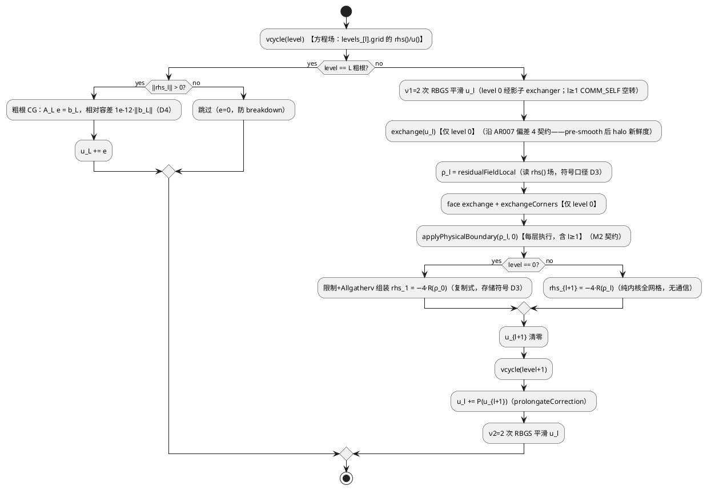

# [AR008] 详细设计文档

| 组件名称 | HyPoS 求解器层（src/solver） |
| --- | --- |
| AR系统流水号 | AR008 |
| AR描述 | B1b 多层 V-cycle（--solver mgv）+ MG-CG 预条件（--solver mgcg）：粗化链到 ≤8 每维粗根，MGHierarchy 引擎单点实现递归 V-cycle，两个薄驱动类组合；复用 AR007 R/P 内核与逐层 ×4 尺度补偿；粗根 CG 相对容差（修复 AR007 饥饿遗留） |

## 1. 设计目标（从 srs 追溯）

| srs 需求 | 设计目标 | 验收锚 |
| --- | --- | --- |
| R1 mgv | 多层 V-cycle 求解器，率 h 无关 | 256² vs 512² cycle 数相近（判据 D8） |
| R2 粗化链 | 逐层结构+尺度补偿，R/P 零修改 | AR007 38 条不变绿转；跨布局一致 |
| R3 mgcg | PCG，z=V-cycle(r) | mgcg 迭代数 < 裸 cg；np4=np1 |
| R4 性能入档 | §15 两组对比 | 记录式 |
| R5 测试矩阵 | 单测/np/e2e/回归 | 38+新增全绿双模式 |
| R6 文档 | 五处同步+GUIDE 补登 | --help 实跑一致 |

## 2. 功能点分解

| 序号 | 功能点名称 | 功能点描述 |
| --- | --- | --- |
| 1 | MGHierarchy 层级引擎 | 粗化链生成（逐层 owned Subgrid，level 0 影子镜像细网格/ l≥1 复制式 COMM_SELF——D9）、复制式组装表（**仅 level 0→1 需要 Allgatherv**，l≥1 已全网格冗余为纯内核）、`vcycle(level)` 递归核心（预平滑→[残差→限制→递归→延拓]×2→后平滑——W-cycle D11；粗根 CG 精解相对容差） |
| 2 | VCycleMGSolver | PoissonSolver 驱动：solve() 外层循环（每 cycle `solveCycle(b,u)`——复制进出影子场+真残差检查）、防御契约、iterate() |
| 3 | MGPreconditionedCGSolver | PCG 驱动：沿 CGSolver 骨架（kernels 经 FP4 抽取复用），预条件步 `applyPreconditioner(r,z)`（解 A z=r：复制 −r 入影子 rhs()——N1 符号契约）、Fletcher-Reeves β、真残差判据 |
| 4 | CG kernels 机械抽取 | CGSolver 四个私有内核（dotGlobal/matvec/axpyInterior/updatePInterior）抽为 solver 内部自由函数：前三个签名/浮点序不变，第四个（updatePInterior 成员 r_/p_ 访问）参数化为 (v, p)；CGSolver 调用处传 r_/p_ 保持位级不变，U6 golden 守护验证零变化 |
| 5 | CLI 接线与测试矩阵 | --solver mgv/mgcg 分派+前置校验；ctest 新条目（np1/np4/e2e×2）；main --help |
| 6 | bench 与文档 | bench_ar008.sh（mgcg vs cg、mgv vs mg2，256²/512²）→ PERFORMANCE §15；README/GUIDE（B1b 勾选+§3.4 完整突破+§5 补登 Neumann/3D-MG+记号澄清）/AGENT_SPEC/--help |

## 3. 影响范围（文件清单）

**新增：**
- `src/solver/mg_hierarchy.hpp/.cpp`（FP1 引擎：链生成+组装+vcycle 递归+粗根求解）
- `src/solver/mg_pcg.cpp`（FP3：MGPreconditionedCGSolver；VCycleMGSolver 亦置于此或 mg_hierarchy.cpp——见 §4.4）
- `tests/test_mg_vcycle.cpp`（FP5 测试）
- `scripts/bench_ar008.sh`

**修改（纯增量）：**
- `src/solver/solver.hpp`（+VCycleMGSolver/+MGPreconditionedCGSolver 类声明、+CG kernels 自由函数声明）
- `src/solver/cg_solver.cpp`（FP4 机械抽取：方法体改为调用自由函数，行为零变化）
- `src/main.cpp`（mgv/mgcg 分派+前置校验+help 两行）
- `CMakeLists.txt`（源表+测试表+条目）
- 文档五处（README/GUIDE/AGENT_SPEC/PERFORMANCE/--help 已含 main）

**不动（契约）：**
- `src/solver/mg_operators.hpp`（R/P 内核零修改）、`src/solver/mg_two_level_solver.cpp`（mg2 冻结参照系）、`red_black_gs_solver.cpp`（smooth 零变化）、三 exchanger、IO 栈、既有全部测试文件（38 条语义零变化）

## 4. 实现设计

### 4.0 方案对比：V-cycle 核心归属（决策 D1）

- **A（选定）MGHierarchy 引擎+两薄驱动**：vcycle 单点实现，mgv 外层与 mgcg 预条件步双消费；mg2 零触碰（冻结契约）；np1/np4 一致性天然共享数学路径
- B TwoLevelMGSolver 加 levels 参数：触碰已验收代码，违反「mg2 行为零变化」Must——排除
- C 双类各自内嵌 V-cycle 副本：~200 行冗余+双点维护——排除

### 4.1 FP1 MGHierarchy（决策 D2/D3/D4）

**D2 粗化链终止条件**：`while (nx_l 偶 && ny_l 偶 && (nx_l > 8 || ny_l > 8)) 粗化`。粗根 = 第一个不满足层：方网格正常负载落在每维 (4,8]（256²: 256→128→64→32→16→8，L=5）；奇维中途（如 34→17）以 17² 为粗根（CG 可解，289 未知数）——不视为错误（与 mg2「全局偶维」前置校验一致：只要 level 0 全局偶维即可启动，中途奇维自然截断）。**方网格下粗根每维 <5 不可达（正常链粗根每维 ∈[5,8]）；狭长网格反例 8×20 → 链 [8×20, 4×10, 2×5] 粗根每维 2<4——由链生成防御校验兜底（粗根任一维 <4 → HYPOS_ERROR + 0 迭代 + u 不动，沿 srs R1 异常口径），U7 补狭长网格防御单测**。
- 逐层规模/offset 枚举（单测对照表）：256² 链 [256,128,64,32,16,8]；64² 链 [64,32,16,8]；34² 链 [34,17]；12² 链 [12,6]（6≤8 截断，粗根 6²）

**D3 逐层尺度补偿**：限制时 `rhs_{l+1} = 4 × R(ρ_l)`（(H_{l+1}/H_l)²=4，逐层同因子，累积 4^l；与 AR007 mg2 粗方程同构，PERFORMANCE §14 推导）。实现置于 MGHierarchy 组装处（单点），mg2 不动。**存储符号约定（明示）**：全链沿 mg2 既有内核口径——residualFieldLocal 读 `rhs()` 场计算 ρ，粗层 `rhs()` 场实际存 **−4·R(ρ_l)**（CGSolver 以 b=−rhs() 求解、平滑内核同口径，mg_two_level_solver.cpp:329 同款）；U2 逐位对照隐式守护，此处明示防实现者按 +4 字面落盘。

**D4 粗根求解**：CGSolver 复用（COMM_SELF 上跑，零新算法代码）；**相对容差**：`tol_root = 1e-12 × ‖b_root‖₂`（‖b_root‖ 由限制后 rhs 场的本地平方和开方——COMM_SELF 上 dot 即全局）。1e-12 相对口径消除 AR007 绝对容差饥饿（mgv/mgcg 适用 tol 不受粗根精度限制；实测入 §15）。
- 粗根 rhs=0（外层已收敛的预条件步）时跳过 CG（e=0）——防 breakdown（沿 CGSolver pap≤0 防御惯例的调用方前置）。

**数据结构**（决策 D9：统一影子 level-0——所有权与工作场归属）：

```cpp
class MGHierarchy {
public:
    // 链生成：level 0 = 细网格的「影子镜像 Subgrid」（owned：同布局/同 offsets/同 communicator，
    // 沿 mg2 粗 Subgrid 构造惯例镜像构造）；l≥1 复制式 COMM_SELF。幂等（缓存键 nx/nyLocal）。
    // 链生成防御：粗根任一维 <4 → HYPOS_ERROR + false（D2 狭长兜底）。
    bool initialize(const Subgrid& fine);
    // 参数化 V-cycle 递归：在 level 层上近似求解 A_l·(u_l) = b_l——读写均为影子/粗层自有场
    // （Level::grid 的 u()/rhs()），与驱动字段完全解耦，mgv/mgcg 共用同一数据路径
    void vcycle(Index level) noexcept;
    // 求解入口（mgv 消费）：b = 驱动 rhs() 场内容（rhs-space，与影子同空间符号一致直传）——
    // 复制 b → 影子 rhs()、u → 影子 u()，vcycle(0)，影子 u() 复制回 u（首 cycle 后增量可省——
    // 实现期决策，契约不变）
    void solveCycle(const Real* b, Real* u) noexcept;
    // 预条件入口（mgcg 消费）：解 A z = r（r 为 PCG 递推残差，f-space）——内核约定 A·x = −rhs()
    // ⇒ 复制 **−r** → 影子 rhs()（N1 符号契约）、影子 u() 清零，vcycle(0)，影子 u() 复制 → z
    void applyPreconditioner(const Real* r, Real* z) noexcept;
    Index levels() const noexcept;
    void rootDims(Index& nx, Index& ny) const noexcept;    // 诊断（防御/日志）
    const std::vector<Index>& levelDims() const noexcept;  // 逐层规模表（U1 枚举断言消费）
private:
    struct Level {
        std::unique_ptr<Subgrid> grid;              // 全部 owned（消除借用/悬垂歧义）
        std::unique_ptr<PointToPointExchanger> ex;  // level 0 与细网格同拓扑邻居；l≥1 COMM_SELF 无邻居空转
        Index nxH, nyH;                             // 该层全局规模
        // 复制式组装表（l→l+1 限制用）：仅 level 0 需要（Allgatherv counts/displs，沿 mg2
        // ensureInitialized 模式）；l≥1 已是全网格冗余，限制为纯内核
    };
    std::vector<Level> levels_;
    // 工作缓冲：逐层残差场 ρ_l（AlignedBuffer，allocate 于 initialize；posix_memalign 不清零
    // → allocate 后立即清零（fill(0)），且每层限制前 applyPhysicalBoundary(ρ_l, 0)——见 §4.2 M2 契约）
    RedBlackGSSolver smoother_;   // smooth/residualFieldLocal 零修改复用
    CGSolver coarseRootSolver_;   // 粗根精解（D4；maxIter 沿 mg2 惯例取 nxH·nyH 量级上界）
};
```

**D9 影子 level-0 的理由**：复用内核（sweep/prolongate/residualFieldLocal）全部绑定 `Subgrid::u()/rhs()` 场——mgv 需要驱动的 u/b、mgcg 的预条件步 z/r 无宿主（驱动场被 PCG 状态占用）。统一影子镜像使两类驱动走同一数据路径（复制进出，2 次 memcpy/cycle，相对 cycle 成本可忽略），消除双模式分支与 save/restore 脆弱性；影子 Subgrid 为 owned 对象，无借用悬垂。

**关键复用**：level 0→1 的限制/组装与 mg2 cycleOnce 完全同构（Allgatherv + counts/displs + 逐 rank 矩形散布）——代码模式复用（非函数级复用，mg2 冻结所致）；l≥1→l+2 的限制为**纯内核全网格操作**（每 rank 已持全粗场，restrictResidual 全范围调用+本地 memcpy 语义，无通信）。

### 4.2 FP2/FP3 两个驱动类与递归流程

**vcycle(level) 递归（核心流程）**：



流程说明：①递归工作场全部落位 Level::grid 自有字段与预分配 ρ_l 缓冲（栈深=层数，无递归期分配）；②平滑用 RedBlackGSSolver::smooth（零修改复用）；③**u 的 halo 新鲜度**：预平滑后 residualFieldLocal 前的 exchange(u) 沿 AR007 偏差 4 同款契约（首 cycle u=0 时 exchange 为幂等空转，无害）；④**ρ_l 的物理 halo（M2 契约）**：restrictResidual 在物理边界邻域读 ρ_l 的 halo 带，而 AlignedBuffer::allocate（posix_memalign）不清零——**applyPhysicalBoundary(ρ_l, 0) 必须每层执行**（l≥1 层 face/corner 交换在 COMM_SELF 上空转可省，但物理带清零不可省）；x 场（u_l）的物理带由平滑内核与 applyPhysicalBoundary 既有维护覆盖；⑤限制后粗层 u_{l+1} 清零在递归前完成（粗根 rhs=0 跳过分支依赖）。

**VCycleMGSolver（FP2）**：`solve()` 外层循环（cycle: solveCycle(b, u) → 真残差检查+进度+tol 判定；residualCheckInterval 外层步计）+ `iterate()`（单 cycle+真残差）+ 防御（3D/Neumann/奇全局维/链生成失败含粗根 <4 → HYPOS_ERROR+0 迭代+u 不动，沿 mg2 D4 契约）+ 平滑步/粗根 CG 迭代计数入日志（沿 mg2 汇总行格式）。

**MGPreconditionedCGSolver（FP3）**：PCG 主循环（沿 CGSolver::solve 结构）：
- r₀ = b（u 初 0，driver 保证）；z₀ = applyPreconditioner(r₀)；ρ₀ = (z₀,r₀)；p₀ = z₀
- 迭代：α=ρ/(p,Ap)（matvec 经 FP4 kernels）→ u+=αp, r−=αAp → z'=applyPreconditioner(r') → β=(z',r')/ρ（Fletcher-Reeves）→ p=z'+βp
- 收敛判据：**真残差口径**——‖r‖ 为递推残差（CG 内积已精确维护），但退出前用 residualFieldLocal+globalTrueResidual 复核（沿 G3 修复惯例：lastResidual 报真残差）；tol 判定用递推 ‖r‖（PCG 中二者数值同阶，差仅为舍入漂移，confirm 扫描兜底）
- 预条件步成本：每迭代 1 个 V-cycle（ν=2+2 平滑 + 粗根 CG ~O(1) 迭代于小根）
- maxIter 语义=PCG 迭代数；防御契约同 FP2

**np4 一致性**：mgcg 的预条件 V-cycle 与 mgv 的 vcycle 共用 MGHierarchy——np1/np4 一致性由 R/P/平滑/组装的既有一致性保证（测试断言解与残差轨迹一致）。

### 4.3 接口描述（§5 同步细化）

新增公共接口（solver.hpp / mg_hierarchy.hpp）：

| 接口 | 签名 | 说明 |
| --- | --- | --- |
| MGHierarchy::initialize | `bool initialize(const Subgrid& fine)` | 链生成（影子 level-0+粗层链+组装表）；粗根任一维 <4 或布局镜像失败 → HYPOS_ERROR+false（防御契约，D2/D9） |
| MGHierarchy::vcycle | `void vcycle(Index level) noexcept` | 递归 W-cycle（每层 γ=2 粗修正，D11；工作场=Level 自有 u()/rhs()，D9） |
| MGHierarchy::solveCycle | `void solveCycle(const Real* b, Real* u) noexcept` | mgv 每 cycle 入口（b=驱动 rhs() 场内容，rhs-space 直传；复制进出影子场） |
| MGHierarchy::applyPreconditioner | `void applyPreconditioner(const Real* r, Real* z) noexcept` | mgcg 预条件步：解 A z = r（r 为 PCG 递推残差 f-space）→ 复制 **−r** 入影子 rhs()（内核 A·x=−rhs() 约定，N1 符号契约），影子 u() 初 0，产出 z |
| MGHierarchy::levels / rootDims / levelDims | `Index levels() / void rootDims(Index&, Index&) / const std::vector<Index>& levelDims()` | 诊断（测试/日志/防御） |
| VCycleMGSolver | PoissonSolver 四接口（solve/iterate/lastResidual/setResidualCheckInterval 沿基类） | `--solver mgv` |
| MGPreconditionedCGSolver | PoissonSolver 四接口 | `--solver mgcg` |
| CG kernels 自由函数（FP4） | `Real cgDotGlobal(...); void cgMatvec(...); void cgAxpyInterior(...); void cgUpdatePInterior(Subgrid&, const Real* v, Real* p, Real beta)`（solver 内部头；前三个与 CGSolver 现私有方法签名/浮点序一致，第四个将成员访问参数化——CGSolver 调用处传 r_/p_ 保持位级不变） | CGSolver 与 PCG 双消费：PCG 的 p = z + β·p 以 v=z 复用同一内核（浮点序与 CG 的 p = r + β·p 同构） |

CLI：`--solver mgv|mgcg` 两新值；前置校验（2D/Dirichlet/偶全局维——与 mg2 同三条+链生成兜底）；help solver 行同步列 mgv/mgcg，**help 的 residual-check-interval 行补列 mgv**（FP2 实际支持 interval，现仅列 jacobi/red_black_gs/mg2）。**residual-check-interval 语义注记（m4）**：mgcg 与 cg 同语义——PCG β 递推每迭代必须全局归约，忽略 interval 会破坏收敛——help 行不将 mgcg 列为可忽略对象，main.cpp 既有 WARN 分支（检测 solver 不支持 interval 时告警）扩至 mgcg。

### 4.4 代码设计

```
src/solver/
├── solver.hpp                 # +2 驱动类声明 +CG kernels 自由函数声明（PCG 需直接消费）
├── cg_solver.cpp              # FP4：私有方法体 → 调用自由函数（机械重构，行为零变化，U6 golden 守护）
├── mg_hierarchy.hpp           # MGHierarchy（引擎，FP1）
├── mg_hierarchy.cpp           # 链生成/组装/vcycle 递归/粗根求解 + VCycleMGSolver 实现（FP2 同置，强内聚）
├── mg_pcg.cpp                 # MGPreconditionedCGSolver（FP3）
└── mg_two_level_solver.cpp    # 不动（mg2 冻结参照系）
```

行数预算论证（D8 续）：mg_hierarchy ~350（含影子场构造/复制进出与 VCycleMGSolver ~90）+ mg_pcg ~180（含 cgUpdatePInterior 消费）+ solver.hpp 增量 ~80 + cg_solver.cpp 重构 0 净增 + main/cmake ~30 ≈ **~640 ≤ ~800** ✓（D9 影子场+第四内核参数化计入后仍有 ~160 行余量）；测试 ~600 行另计（沿 AR007 惯例）。

### 4.5 FP5 测试矩阵（ctest 条目）

沿 AR007 惯例：`mgv_np1`（单进程 gtest filter）、`mgv_np4`（mpirun np4+HYPOS_EXPECT_NP=4）、`mgv_e2e`/`mgcg_e2e`（直跑二进制）——38 → 42 条（mgv np1/np4/e2e + mgcg e2e；mgcg np1/np4 用例并入 test_mg_vcycle.cpp 的既有条目 filter，不单开——条目膨胀控制）。

### 4.6 FP6 bench 与文档

`scripts/bench_ar008.sh`：256²/512²、np=1/4、OMP=1、3 次中位；组：mgcg vs cg、mgv vs mg2（同 tol 绝对真残差口径；tol 取 1e-4/1e-6 两档防 512² 基线超时——裸 cg 512² 迭代数 O(n) 量级 ~500+，可控）。记录：迭代数/cycle 数/平滑步/粗根 CG 合计/墙钟/终残差。PERFORMANCE §15 + 文档五处（含 GUIDE §5 补登 Neumann-MG/3D-MG 与 ≤8³ 记号澄清——req 门控 V1/V4）。

## 5. 接口描述（对外）

见 §4.3 表。对外（README/AGENT_SPEC 层面）：`--solver mgv`（多层 V-cycle）、`--solver mgcg`（MG 预条件 CG）两 CLI 值；PoissonSolver 接口签名零变化（纯新增类）。

## 6. 测试设计（全表）与交付物映射

| 用例 | 断言要点 | 映射 |
| --- | --- | --- |
| U1 粗化链枚举（256²/64²/34²/12² 链） | 每层规模/层数/粗根与 §4.1 D2 表逐项相等 | R2 |
| U2 逐层尺度补偿（两层锚+l≥1 三层锚） | ①两层小网格（12²链[12,6]）对照 mg2 粗层方程：mgv level1 rhs 与 mg2 粗 rhs 逐位一致（同构造输入，含 −4 存储符号）；②三层小网格（48²链[48,24,12,6]）**l≥1→l+1 限制段**逐位手工对照（独立 R+×4 参考实现）——堵 M2 盲区（U2①只覆盖 level 0→1，U8 的 [34,17] 链无 l≥1 限制） | R2（D3/M2） |
| U3 mgv 制造解收敛 np1 | 64²/256² 收敛、二阶（解析 rhs 沿 AR007 惯例 32²/64² 误差比 ≈4） | R1 |
| U4 率 h 无关（V3 判据 D8） | 256² 与 512² cycle 数：`|cyc512−cyc256| ≤ 4` 且 `cyc512 ≤ 40`（tol 1e-6，绝对口径 ‖r₀‖ 规模效应已计入——mg2 实测每 4× 规模 +1~2 cycle，4 为工程容差上限） | R1 |
| U5 mgcg vs cg 迭代数 | 256² 同 tol：mgcg 迭代 < 裸 cg（严格不等式；记录实际倍数） | R1/R3 |
| U6 CG kernels 抽取零变化 | 既有 cg golden 位级测试不变绿转（重构守护）+ 既有 38 条全绿 | FP4/R3 回归 |
| U7 防御（含狭长网格） | 3D/Neumann/奇全局维/狭长网格（8×20 触发粗根 <4）× mgv/mgcg：HYPOS_ERROR+0 迭代+u 不动（沿 AR007 expectRejected 模式；狭长为 D2 链生成兜底） | R1/R2 |
| U8 跨布局一致性 np4 | {15,19} 布局 mgv 1-cycle vs 串行参考逐元素一致（沿 AR007 CrossLayout 模式；链 [34,17] 粗根 17²） | R2 |
| U9 mgcg np4=np1 | 同负载解 L2 差 ≤ 1e-10·‖u‖、残差轨迹一致（采样点） | R3 |
| U10 粗根容差修复验证 | mgv 在 tol=1e-10（mg2 饥饿区内）仍收敛（256²，cycle 上限宽松断言） | R1（饥饿修复） |
| M1 mgv/mgcg 制造解 np4 | e2e 直跑+输出完整 | R5 |
| B1 bench | §15 数据+口径，无失实 | R4 |
| D1 文档走查 | --help 实跑一致、五处同步、GUIDE 补登 | R6 |

## 7. 决策记录

| ID | 决策 | 理由 |
| --- | --- | --- |
| D1 | MGHierarchy 引擎+两薄驱动（方案 A） | vcycle 单点双消费；mg2 冻结契约；拒绝 B（触碰守护对象）/C（双份维护） |
| D2 | 粗化终止「双维偶 && 任一维 >8」；方网格粗根每维 ∈(4,8] 或奇维截断层；狭长网格粗根 <4 走防御 | 34→17 类奇维自然截断不报错（CG 可解）；8×20 类狭长由链生成防御兜底（HYPOS_ERROR，srs R1 异常口径）+U7 单测 |
| D3 | 逐层 ×4 尺度补偿置于 MGHierarchy 组装单点；粗层 rhs() 存 **−4·R(ρ)**（b=−rhs() 口径明示） | 与 mg2 粗方程同构（PERFORMANCE §14 推导）；mg2 不动；符号明示防 +4 字面落盘 |
| D4 | 粗根 CG 复用+相对容差 1e-12·‖rhs‖ | 零新算法代码；消除 AR007 绝对容差饥饿（遗留 Minor 收口） |
| D5 | PCG 骨架经 FP4 四内核抽取复用 CGSolver（含 updatePInterior 参数化为 v/p，PCG 传 v=z） | 避免 ~120 行复制；CGSolver 调用处位级不变由 U6 golden 守护（「机械」限定于前三个内核+第四个的调用方等价性） |
| D6 | l≥1 层复制式 COMM_SELF（沿 AR007 复制式推广） | 粗层场递减、np4 小规模开销可接受（srs §5 假设实测验证）；粗层间无新通信模式 |
| D7 | 平滑/预条件均 ν=2+2 固定（沿 AR007 默认） | 参数面最小化（srs 约束） |
| D8 | 率 h 无关数值判据：`|cyc512−cyc256| ≤ 4 且 cyc512 ≤ 40`（tol 1e-6） | req 门控 V3 收口；mg2 实测每 4× 规模 +1~2 cycle 的外推上限 |
| D9 | 统一影子 level-0（owned 镜像 Subgrid+专属同拓扑 exchanger，mgv/mgcg 同一数据路径复制进出） | 复用内核绑定 Subgrid::u()/rhs()——mgcg 预条件步 z/r 无宿主；统一影子消除双模式与 save/restore 脆弱性、消除借用悬垂；复制成本 2 memcpy/cycle 可忽略 |
| D10 | 接受 RBGS 定序非伴随 ⇒ V-cycle 预条件子**近似对称**（不引入反色序后平滑/FCG） | 红→黑定序前后平滑非伴随对，FR-PCG 收敛保证不严格成立（诚实记录）；实践中 RBGS-V(2,2) 预条件 Poisson 收敛良好，工程兜底=pap≤0 防御+U5/U9 实测；RBGS 零修改契约优先（反色序需改 RedBlackGSSolver，违反 Must） |
| D11 | **递归核心改 W-cycle**（每层 γ=2 次粗修正：pre-smooth → [残差→限制→递归→延拓]×2 → post-smooth；D3 的逐层 ×4 补偿与 ν=2+2 不变） | **T002 实证发散修复**：单 V 下 ×4 补偿只对纯光滑模态精确；第一轮修正携带的插值杂散（~2% 形状失真）经 A 放大成残差主体，满权重 R 把杂散泄漏回粗层 [1,1]（相对污染 ~30%），×4 对杂散中频过补偿，递归逐层放大——实测齐次 [1,1] 稳态放大率 256²(6 层)=2.01、512²(7 层)=2.69（mgv 跑满 200 cycles 残差 7e62）；层数 ≤3 时杂散可容忍（mg2 两层 0.30 良好即此）。W 的第二次粗修正基于刷新残差，清洗杂散污染——实测 256²/512² 稳态率均 ~1e-4/cycle（每 cycle 消 99.9%），层数无关（恢复教科书 W-cycle 均匀收敛性）；Galerkin RAP 不发散即因对杂散自动正确缩放，rediscretize+×4 丧失该变分性，γ=2 是等效补救。代价：粗层工作量翻倍（占比 1/4² 递减，总成本 ~1.5×V），换收敛率从 >1 到 ~0.1。备选已实证排除：V+scale=2 仅 0.95/cycle 且层数恶化；V+ω 阻尼同病；V+scale=1 低频不动（教科书 rediscretize 欠校正退化） |
| D12 | N1 符号契约与 U2 位级锚放宽为**机器精度级**（z≡−solveCycle(b) 与 driver-vs-参考对比：相对 ≤1e-12/1e-13） | W-cycle（D11）第二次粗修正复用层级缓冲，其 halo 残值携带上轮浮点余渣；applyPreconditioner 的逐元素取反把 +0.0 halo 变 −0.0——同 hierarchy 复用路径与全量套件进程内（堆内存复用改变 fresh 场景的 halo 残值）位级不可复现（实测 1-2 ulp 漂移；V 单修正恰好稳定是巧合而非保证）。检出力保持：漏负号=O(2·max) 相对差、错 scale=O(0.25..4)，均高于阈值 6 个量级 |

## 8. 风险与缓解

| 风险 | 缓解 |
| --- | --- |
| **V-cycle 多层递归发散（×4 补偿对杂散模态过补偿，D11 根因）** | **已实证修复**：γ=2 W-cycle（D11）；U4 率无关判据（256/512 双跑 ≤40 cycles）+U10 深容差（1e-10 ≤200）持续守护；探针数据（放大率-链长、scale/ω/γ 扫描网格）归档于 AR008 提交记录 |
| 逐层尺度补偿累积错误（4^l，含 −4 符号） | U2 双锚（两层 vs mg2 + 三层 l≥1 段独立参考，机器精度级 D12）；跨布局 U8 兜底 |
| 多层递归缓冲栈深分配/生命周期 | initialize 按链预分配；ASan/UBSan 全量验证 |
| PCG 预条件子近似对称（RBGS 定序非伴随，D10）致收敛劣化或发散 | 诚实记录：FR-PCG 保证不严格成立；工程兜底=pap≤0 防御+U5/U9 实测监控；若实测发散，备选路径=FCG 兜底（后续 AR，不引入本 AR） |
| l≥1 残差场 halo 带为未初始化内存（posix_memalign 不清零） | M2 契约：applyPhysicalBoundary(ρ_l,0) 每层执行；U2 三层锚+ASan 直接覆盖（读垃圾在 ASan 下不报——靠数值锚捕获） |
| 512² 裸 cg 基线过慢 | bench tol 两档（1e-4/1e-6）；超 60s 项如实注明（srs §5 假设） |
| 复制式组装（level 0→1 Allgatherv）与粗层冗余存储 np4 开销反直觉 | 记录式入档（D6 惯例）；mgv vs mg2 耗时对比天然暴露 |
| mg2 冻结被误触碰 | 影响范围清单+U6 回归+review 门控 D3 维度核对 |
