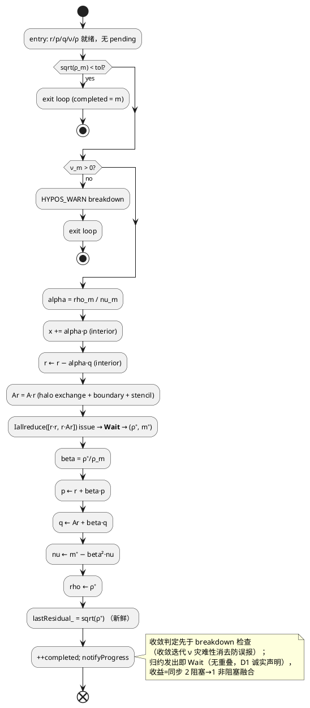

# [AR009] 详细设计文档

| 字段 | 内容 |
|------|------|
| AR 编号 | AR009 |
| 主题 | pipelined CG（`--solver pcg`）+ 残差历史输出（E2） |
| 关联 srs | ./srs.md |
| 日期 | 2026-10-10 |

## 1. 设计目标（从 srs 追溯）

| srs 需求 | 设计目标 | 验收锚 |
|---------|---------|--------|
| R1 pcg 求解器 | Chronopoulos-Gear 单步管线 CG（CG-1）：每迭代 1 次打包 `MPI_Iallreduce`（2 标量）与 p/q 更新重叠，阻塞 Allreduce 0 次 | P1 迭代数 ±5%、P3 归约 0 断言+阳性对照 |
| R2 残差历史 | `--residual-history <file>` 经组合 progressCallback 统一出口（六 solver） | E2/E3 CSV 契约 |
| R3 绘图脚本 | matplotlib 脚本资产（沿 plot_scaling.py 惯例） | 语法自检+代偿口径（W3 实测在案） |
| R4 性能对照 | bench_ar009.sh → PERFORMANCE §16 | 记录式 |
| R5 测试与文档 | ctest 42→4x+；四处文档+--help | 全绿+走查 |

## 2. 功能点分解

| 序号 | 功能点 | 描述 | 溯源 |
|-----|--------|------|------|
| FP1 | `PipelinedCGSolver` 类 | CG-1 递推（mu/nu 打包 Iallreduce、延迟 beta、q=A p 免 matvec 递推、breakdown 防御、G3 复核、iterate 续态） | R1 |
| FP2 | cgDotGlobal 拆分+插桩 | 拆 `cgDotLocal`（纯内核）+ `cgBlockingAllreduce`（带 `cg_blocking_allreduce` profiler region）；cg 浮点序位级不变 | R1（W1 探针） |
| FP3 | pcg 打包 Iallreduce helper | `cgIallreduce2Start/Wait` 自由函数（cg_kernels.hpp；`pcg_iallreduce` region） | R1 |
| FP4 | 残差历史 CSV 出口 | main.cpp 组合 progressCallback（saveInterval 写解 + history 写 CSV）+ rank0 单写 + 不可写防御 | R2 |
| FP5 | CLI `--residual-history` | parser 读取 + help 行 + 目录存在性检查 | R2 |
| FP6 | 绘图脚本 | scripts/plot_residual_history.py（matplotlib，多 CSV 叠加对数曲线 PNG） | R3 |
| FP7 | bench + 文档 | bench_ar009.sh、PERFORMANCE §16、GUIDE B2b/E2 勾选+口径修正、README/AGENT_SPEC/--help | R4/R5 |

## 3. 影响范围（文件清单）

| 文件 | 动作 | 说明 |
|------|------|------|
| src/solver/solver.hpp | 修改（+~20 行） | `PipelinedCGSolver` 类声明（含 u_/q_ 向量、mu_/nu_/beta_ 状态、request 句柄；沿 CGSolver 结构） |
| src/solver/cg_solver.cpp | 修改（~±15 行净增） | cgDotGlobal 拆为 cgDotLocal+cgBlockingAllreduce 转发（FP2）；**浮点序不变，U6 golden 守护** |
| src/solver/cg_kernels.hpp | 修改（+~15 行） | 声明 cgDotLocal/cgBlockingAllreduce/cgIallreduce2Start/cgIallreduce2Wait |
| src/solver/pipelined_cg_solver.cpp | 新增（~200 行） | FP1/FP3 实现 |
| src/main.cpp | 修改（+~45 行） | FP4/FP5：CLI、组合回调、help 行、pcg 分派 |
| src/solver/mg_pcg.cpp / mg_hierarchy.cpp / 其余 | **零修改** | 残差历史出口在 driver 侧，六 solver 不改签名 |
| scripts/plot_residual_history.py | 新增（~80 行） | FP6 |
| scripts/bench_ar009.sh | 新增（~70 行） | FP7 |
| tests/test_pipelined_cg.cpp | 新增（~450 行） | P 系单测 |
| tests/CMakeLists.txt（源表+ctest） | 修改 | +源文件、+4-6 条 ctest |
| docs/PERFORMANCE.md / OPTIMIZATION_GUIDE.md / README.md / AGENT_SPEC.md | 修改 | FP7 |

净新增生产代码预算：~350 行 ≤ srs ~500 ✓。

## 4. 实现设计

### 4.1 功能实现思路

**pcg 算法（CG-1，Chronopoulos–Gear 1989 单步形式 + 融合非阻塞归约）**——精确算术下与标准 CG 同 Krylov 空间、同迭代数（α 经 ν-递推等价，见下）；差异仅在浮点舍入路径。

**关键恒等式（设计自审推导验证两遍一致）**：`p_m·A p_m ≠ r_m·A r_m`（m≥1 时差 −β²ν 项）——CG-1 不能直接用 `r·Ar` 作 α 分母，必须维护 ν-递推：
`ν_m = p_m·q_m = m_m − β_{m−1}²·ν_{m−1}`，其中 `m_m = r_m·u_m`（u=A r，融合归约第二标量）、`β_{m−1} = ρ_m/ρ_{m−1}`。推导要点：`r_m·q_{m−1} = p_{m−1}·u_m = −ρ_m/α_{m−1}`（CG 正交性+对称性），代入 `p_m·q_m` 展开式交叉项相消得 −β²ν。

向量组（5，vs 裸 CG 3）：`u`（解，subgrid.u() 宿主）、`r`、`p`、`q`（=A p 递推免 matvec）、`Ar`（matvec 输出）。

递推定式（x₀=0 由 driver 保证，r₀=b=−rhs）。**时序定案（门控问题 1 修复）：归约「发出→立即 Wait」，循环 entry 无 pending、退出无悬空 request；lastResidual_/notifyProgress 均用新鲜 ρ**：

```
初始化：r₀ = −rhs（interior）；p₀ = r₀
        Ar₀ = A r₀（matvec）；q₀ = Ar₀
        发出 Iallreduce([ρ₀, m₀] = [r₀·r₀, r₀·Ar₀]) → Wait → (ρ₀, m₀)
        ν₀ = m₀；lastResidual_ = sqrt(ρ₀)；stateReady_ = true；completed = 0
        （初始即收敛 → 沿 cg :220 惯例跳过循环体）
迭代体 m = 0, 1, ...（entry：r/p/q/ν/ρ 全就绪、无 pending；循环条件 `completed < maxIter` 沿 cg :221 惯例）：
  ① 收敛判定：sqrt(ρ_m) < tol → break
     【顺序强制：①在②前——收敛迭代上 ν-递推发生灾难性消去（m−β²ν 微量相减），
       若先查 ν≤0 会误报 breakdown；门控审查数值实验证实】
  ② breakdown 防御：ν_m ≤ 0 → HYPOS_WARN + break
  ③ α_m = ρ_m / ν_m
  ④ x_{m+1} = x_m + α_m·p_m；r_{m+1} = r_m − α_m·q_m（axpy interior）
  ⑤ Ar_{m+1} = A r_{m+1}（唯一 matvec）
  ⑥ 发出 Iallreduce([r_{m+1}·r_{m+1}, r_{m+1}·Ar_{m+1}]) → Wait → (ρ⁺, m⁺)
     【无重叠（D1 诚实声明）——非阻塞语义的价值=同步次数与消息数减半】
  ⑦ β_m = ρ⁺/ρ_m；p ← r⁺+β·p；q ← Ar⁺+β·q；ν ← m⁺−β²·ν；ρ ← ρ⁺
  ⑧ lastResidual_ = sqrt(ρ⁺)（新鲜，无滞后）；
     ++completed；notifyProgress(completed)
循环退出后：globalTrueResidual(u) 真残差复核（G3）→ lastResidual_ 最终值
            （复核值与末次递推 ρ 的浮点差由 E2 容差口径覆盖）；
            applyPhysicalBoundary；HYPOS_INFO finish 行
```

**代数等价要点**（P1 ±5% 判据的理论基础）：①α_m = ρ_m/ν_m 经 ν-递推与 CG 的 ρ/(p·Ap) 精确相等（恒等式见上）；②q_{m+1} = A p_{m+1} 由 A 线性性递推；③β = ρ⁺/ρ（FR 形式）。

**每迭代 MPI 调用**：halo exchange 1（matvec）+ `MPI_Iallreduce` 1 次（count=2 打包 [ρ, m]）+ `MPI_Wait` 1 次；**`MPI_Allreduce` 0 次**（P3 断言口径）。

**重叠结构诚实声明（D1 修正）**：p/q 的 axpy 与 ν 标量更新发生在 Wait **之后**（它们依赖新鲜 ρ_m 算 β）——本结构下归约延迟与向量内核**无真实计算重叠**；本 AR 实际收益=**同步次数减半**（2 阻塞 → 1 非阻塞融合，消息数同减半）+ 非阻塞语义（MPI 进度引擎不被长时间独占）。真正的归约-计算重叠需两步前瞻（CG-2/monomial 基，数值稳定性劣化需残差替换技术）——**明确列为后续工作，不在本 AR**。§16 与 GUIDE 修正文案按此口径，不做「延迟被隐藏」的过度宣称。

**W2 口径定案**：GUIDE B2b「3 归约/iter → 1 归约/iter」修正叙事为——裸 cg 实测每迭代 **2 次阻塞** Allreduce（GUIDE 原文 3 系把一次性初始化 rho 计入）；pcg 每迭代 **1 次非阻塞**（2 标量打包）且与向量内核重叠。GUIDE 勾选文案按此口径更新。

**W1 探针定案（FP2）**：`cgDotGlobal` 拆为 `cgDotLocal`（并行局部累积，纯内核）+ `cgBlockingAllreduce`（单 Allreduce + `HYPOS_PROFILE("cg_blocking_allreduce")`）。cg 路径位级不变（局部累积循环体逐字搬移、Allreduce 参数相同——U6 golden 回归守护）。P3 断言双向：pcg 跑同负载 `stats("cg_blocking_allreduce").callCount == 0` **且** cg 阳性对照 `callCount == 2·iters+1`（非空洞自证）。pcg 的 Iallreduce 在 `cgIallreduce2Start/Wait` 内带 `pcg_iallreduce` region（计数=iters，可选断言）。

**残差历史（FP4）**：main.cpp 现状为一次性 `solver->solve(...)`（main.cpp:343），进度回调 `progressCallback_` 是**单槽**（solver.hpp:30）——saveInterval 写解回调已占用（main.cpp:326）。设计：构造**组合 lambda**（saveInterval>0 时写解 + historyPath 非空时 `fprintf(csv, "%d,%.17g\n", iteration, solver->lastResidual())`），单次 setProgressCallback 安装。时序保证：六 solver 均先更新 lastResidual_ 再 notifyProgress（cg_solver.cpp:236-237 已核，jacobi/rbgs/mg_hierarchy/mg2/mg_pcg 同构，P/E2 测试守护）。采样对齐：写行条件 `iteration % residualCheckInterval == 0`（与真实残差更新时刻一致；k=1 时每迭代一行=CSV 行数−header 等于迭代数）。np>1：仅 rank0 安装回调写文件（残差为全局归约值，各 rank 一致；回调内无 MPI 调用）。文件打开失败 → HYPOS_ERROR 明示退出；`--residual-history` 与 `--output-dir` 无耦合（相对路径按 CWD 解析，帮助文本注明）。

### 4.2 功能实现设计

#### 4.2.1 流程图

pcg 单迭代状态机（PlantUML）：



残差历史 driver 侧接线（PlantUML 时序）：

```plantuml
@startuml
participant CLI as main(parser)
participant Driver as main(loop)
participant Solver as PoissonSolver
participant CSV as residual_history.csv
CLI -> Driver: --residual-history path (rank0)
Driver -> CSV: fopen(path) 失败 → HYPOS_ERROR
Driver -> Solver: setProgressCallback(组合 lambda:\n saveInterval 写解 + history 写行)
Solver -> CSV: 每迭代 notifyProgress(k|iteration%k==0)\n → fprintf(iter, lastResidual)
Solver -> Driver: solve() 返回
Driver -> CSV: fclose
@enduml
```

#### 4.2.2 流程说明

pcg 迭代内无任何阻塞集合调用；每迭代同步点从 2 个减为 1 个（融合 [ρ, m] 单请求）——单机共享内存下收益=同步/消息次数减半（延迟 µs 级 vs 每迭代计算 ~100µs 级，占比小）；真正的归约-计算重叠（两步前瞻 CG-2）与跨节点收益叙事列为后续工作（D1）。WSL np4 实测如实入 §16（srs R4 记录式已声明，含「单机下界」注记）。

`iterate()` 续态：状态成员 `rho_`/`m_`（最近 Wait 值）、`nu_`（ν-递推值）、`p_/q_/r_/ar_` 向量（u 宿主 subgrid.u()）。iterate 单步=迭代体①-⑧整段（entry 无 pending，自含发出+Wait）；`stateReady_` 守护（未 solve 先 iterate → WARN 返回 0，沿 CGSolver 惯例，P7 用例）。循环 entry 无 pending ⇒ 收敛/防御退出路径**天然无悬空 request**（资源 NFR 由结构保证，沿门控问题 1 修复）。

### 4.3 接口描述

| 接口 | 签名 | 说明 |
|------|------|------|
| PipelinedCGSolver::solve | `Index solve(Subgrid&, HaloExchanger&, Index maxIter, Real tolerance) override` | 完整求解；返回 completed；finish 日志行沿 cg 惯例（"PipelinedCG finished in N iterations, ..."） |
| PipelinedCGSolver::iterate | `Real iterate(Subgrid&, HaloExchanger&) override` | 单步续态；返回 lastResidual_ |
| cgDotLocal | `Real cgDotLocal(const Subgrid&, const Real* a, const Real* b)`（cg_kernels.hpp） | 并行局部 dot（无归约）；循环体逐字自 cgDotGlobal 搬移 |
| cgBlockingAllreduce | `Real cgBlockingAllreduce(const Subgrid&, Real local)`（cg_kernels.hpp） | 单 MPI_Allreduce + `cg_blocking_allreduce` region；cgDotGlobal 新组合=二者串联 |
| cgIallreduce2Start | `void cgIallreduce2Start(const Subgrid&, const Real local[2], Real global[2], MPI_Request* req)` | count=2 打包 Iallreduce + `pcg_iallreduce` region；**授权偏离（T002 在案）**：较原设计增 `Real global[2]` recvbuf 参数——MPI 禁止 send/recv buffer alias 且 MPI_Request 无法携带缓冲指针，原签名不可实现 |
| cgIallreduce2Wait | `void cgIallreduce2Wait(MPI_Request* req)` | MPI_Wait；归约结果落在 Start 侧 recvbuf（Wait 无 out-param——见下方 recvbuf 授权偏离注记）；错误码检查沿 MPI_ENV 惯例 |
| CLI `--residual-history` | `parser.get<std::string>("residual-history", "")` | 空缺省=不写；非空且 rank0 打开失败 → HYPOS_ERROR |
| --help 行 | solver 行加 `pcg`；新增 `--residual-history <string>` 行 | pcg 措辞明示 "pipelined conjugate gradient (single packed Iallreduce per iteration; not preconditioned CG — see mgcg)" |

PoissonSolver 基类接口零改动（新增 override 属纯增量）；cg_kernels 既有四内核签名零改动（FP4 契约延续）。

### 4.4 代码设计

- `PipelinedCGSolver` 声明入 **solver.hpp**（沿 CGSolver 归属；无 include 环——不持有 MGHierarchy，与 AR008 驱动位置裁决不冲突）
- 实现入新文件 `pipelined_cg_solver.cpp`（沿 jacobi/red_black/cg 一文件一 solver 惯例）
- 复用 FP4 内核：cgMatvec（A·r）、cgAxpyInterior（x/r/p/q 四处 axpy）、cgDotLocal（三处局部 dot）；p/q 更新复用 cgAxpyInterior(y += alpha·x) 参数化（beta 可负？beta=mu 比值恒正 ✓，p = r + beta·p 与 cgUpdatePInterior(v,p) 同构——直接复用 cgUpdatePInterior(r→p) 与 (Ar→q)）
- main.cpp 组合回调区紧邻既有 saveInterval 回调（:325-331），一处内聚
- ctest 新条目：`pcg_np1`/`pcg_np4`（单测，P 系 filter）、`pcg_e2e`、`residual_history_e2e`（--solver cg+CSV 检查）、`residual_history_interval_e2e`（k=10 行数=ceil(N/10)）；np4 条目带 HYPOS_EXPECT_NP=4

## 5. 接口描述（对外）

见 4.3 表。对外契约变化：CLI 新增 1 solver 值 + 1 选项；无库接口签名变化。

## 6. 测试设计（全表）与交付物映射

| 用例 | 内容 | 断言 | 溯源 srs 验收 |
|------|------|------|--------------|
| P1 PipelinedMatchesCgIterations | 256² 多模式制造解，cg 与 pcg 各自求解同 tol | \|iters(pcg)−iters(cg)\|/iters(cg) ≤ 0.05；两解 L2 差 ≤ 1e-8·‖u‖ | R1① |
| P2 PipelinedSolutionAccuracy | 64²/256² 制造解 | 解二阶收敛惯例锚（L2 ≤ 期望二阶阈值，沿 AR007/008 惯例） | R1① |
| P3 NoBlockingAllreduce+阳性对照 | profiler stats 断言：pcg 后 `cg_blocking_allreduce`.callCount==0；cg 同负载后 ==2·iters+1（init rho+每迭代 pap/rhoNew）；pcg `pcg_iallreduce`.callCount==**iters+1**（init 发出 1+每迭代体 1） | 计数断言（非空洞：cg 阳性对照） | R1④ |
| P4 PipelinedNp4Consistency | np4 vs np1 同负载 | 解 L2 差 ≤ 1e-10·‖u‖（沿 U9 口径；CG-1 归约分块序不同，非位级） | R1② |
| P5 PipelinedBreakdownDefense | ν≤0 构造：不可稳定构造（正定负载恒 ν>0；且收敛迭代 ν 灾难性消去——①②顺序已防御误报）→ 防御代码沿 cg 惯例，**不设触发用例，记录在案** | —（记录式） | R1 异常（部分代偿） |
| P6 ExistingBehaviorUnchanged | 全量既有 42 条回归 + cg golden 位级 | 全绿（FP2 拆分位级守护） | R1③ |
| P7 IterateGuardAndResume | 未 solve 先 iterate（前置违反）+ solve 后 iterate 正常续态一步 | 前置：WARN 日志+返回 0；续态：返回值≈该步后真残差（接口正常路径覆盖） | R1 异常/接口前置+正常续态 |
| P8 ZeroRhsImmediateConvergence | rhs 全 0（ρ₀=0 < tol） | 0 迭代直接完成（沿 cg :220 惯例）；`pcg_iallreduce`.callCount==1（iters+1 边界）；lastResidual==0 | R1 边界（iters=0 退出路径） |
| P9 MaxIterTruncation | maxIter=3 强制截断（tol 极小） | completed==3 返回（沿 cg :221 惯例）；CSV/轨迹连续 | R1 边界（maxIter 退出路径） |
| E1 residual_history_e2e | 直跑 `--solver cg --residual-history f.csv`（np1） | header=`iteration,residual`；数据行数=iterations；**无单调断言（开发期修订）——CG 残差 2-范数理论上非单调（单调的是误差 A-范数），实测轨迹 45-47 行 0.153→0.204→0.246 升后骤降（2026-10-10 evidence；门控第 2 轮补的单调断言前提错误，删除）**；末行与 performance_report.json 的 final_residual **打印精度内一致**（reporter 实际精度=setprecision(4)+scientific=**%.4e（5 位有效）**——门控第 3 轮「4 位」定性差一（其实测样本 3.1416e-07 即 %.4e），CSV 末行按 %.4e 重格式化后与 stod(JSON) 相同；design 注明 reporter 精度限制，不改生产输出） | R2① |
| E2 residual_history_all_solvers | 六 solver 值 e2e 循环（**6 条 ctest**，np1 小规模 64²）。**判据 per-solver 对照表 + 打印精度口径**（门控 C1 修复：对照源=performance_report.json final_residual（4 位有效数字）与各自日志语义行（6 位）——**全部断言在打印精度内比较，不做位级**）：①**jacobi**：首数据行==初始残差（**相对 1e-12**——omp simd/parallel 归约分道累加序测试侧不可复刻，位级必差 ulp 级；1e-12 对「=初始」vs「差一个收缩量 ~0.2%」判别力富余 10 个量级；「初始残差」口径=测试内解析 ‖b‖）；末行与日志「Converged at iteration」行残差**打印精度内一致**（CSV 末行按 6 位 %g 重格式化比较）；确认扫描 vs 检查值差一个收缩量——**不断言**，evidence 注明差异语义。②**rbgs/mg2/mgv**：末行与 JSON final_residual 打印精度内一致（%.4e 重格式化（reporter 实际精度，见 E1）；确认扫描对同一末态重算）。③**cg**：同 E1。④**pcg/mgcg**：末行=新鲜递推 ρ/复核值经 JSON final_residual 对照（**打印精度内**，pcg finish 行沿 cg 惯例无残差值——C1-P4 更正；mgcg finish 行含复核残差但仅 6 位，对照容差 ≥5e-6 相对） | R2② |
| E3 residual_history_np4 | np4 e2e | 输出目录仅一份 CSV（rank0）；**判据（开发期修订，同门控修复协议）：np4 工件内部一致性**——header 契约+行数==report iterations+末行 %.4e==JSON final_residual；原「np1 轨迹对照（1e-6 相对+±1 行漂移）」前提实测不成立：np1 fixture OMP=4 线程 vs np4 每 rank 1 线程（CI 防超订既有约定）→归约分块序不同→cg 轨迹真实分岔、迭代数差 >±1（2026-10-10 全量首跑 evidence）；跨配置对照降级 evidence-only（np1/np4 行数经 RecordProperty 记录） | R2③ |
| E4 residual_history_interval | `--solver jacobi --residual-check-interval 10` e2e（jacobi：interval 生效 solver；推导前提——jacobi 收敛于检查迭代（M%k==0，jacobi_solver.cpp:175-199 节奏已核）⟹ ceil=floor） | 数据行数 = iterations/10（整除前提下列出公式；非整除时=floor(M/k)+1 若收敛行恰为采样行——实测值与公式一致性在测试内注明） | R2（interval 语义） |
| E5 pcg_e2e | 直跑 `--solver pcg` | 退出码 0；finish 行存在；真残差 ≤ tol 口径（**R1①「最终真残差 ≤ tol」子句承接**——driver 侧 globalTrueResidual 复核值入 performance_report；判读加 (1+5e-4) 保护带抵消 JSON 4 位打印舍入，近阈不脆弱） | R5+R1①（真残差子句） |
| E6 residual_history_badpath | `--residual-history /nonexistent_dir/f.csv`（非法路径与目录不存在两变体） | 退出码 ≠ 0 + HYPOS_ERROR 行（不产出失实结果） | R2 异常 |
| E7 residual_history_save_combo | `--save-interval k --residual-history f` 组合（both 分支，单槽回调组合 lambda） | CSV 合法且解文件按 k 落盘——两通道共存互不覆盖（§8 风险表声称的抽查落位） | R2（组合回调分支） |
| S1 plot 脚本 | py_compile 语法自检（可行时）+ --help 文本输出 | 本环境无 python3（W3 实测在案）：脚本资产交付+代偿记录 | R3（代偿口径） |
| W2 文档走查/--help | `hypos --help` 实跑 + 四文档走查 | solver 行含 pcg（明示 pipelined 非 preconditioned）；`--residual-history` 行；README/GUIDE/AGENT_SPEC/§16 无失实宣称 | R5 |
| B1 bench §16 | bench_ar009.sh：pcg vs cg 256²/512²×np1/4×3 中位 | 数据入 §16；迭代数 ±5% 印证（256²+512² 双规模，**R1① 的 512² 半项由本行记录式代偿**）；无失实宣称 | R4+R1①（512² 半项） |

单元测试文件 tests/test_pipelined_cg.cpp（P1-P6 沿 AR008 测试组织惯例：探针 fixture、制造解 helper 复用 test_mg_vcycle 的 multiMode 模式）。

## 7. 决策记录

| ID | 决策 | 理由与权衡 |
|----|------|-----------|
| D1 | pcg 算法=CG-1（Chronopoulos–Gear）+ **ν-递推** + 融合单 Iallreduce（2 标量 [ρ, m] 打包）；**无真实计算重叠**（诚实修正：srs R1 原文的「2 次 Iallreduce 与向量运算重叠」为文献口径的乐观转述——设计自审推导证明 1 步结构下 p/q 依赖新鲜 ρ 算 β，归约窗口内无可用向量工作；真正重叠需两步前瞻 CG-2，数值稳定性劣化需残差替换技术，列为后续工作）。实际收益=每迭代同步 2 阻塞→1 非阻塞融合（次数与消息数减半）+ q=A p 递推免第二次 matvec 的既有 CG-1 优点 | ν-递推恒等式（ν_m = m_m − β²ν_{m−1}）经设计自审两遍独立推导验证（直接展开+交叉项 −ρ_m/α_{m−1} 相消），修正了初稿「α=ρ/(r·Ar)」的错误（p·Ap≠r·Ar，m≥1 差 −β²ν 项——若未察觉将偏离 CG 且 ±5% 判据必挂）；1 次打包归约与 GUIDE「→1」叙事对齐（W2）；代价=+2 向量内存（5/3）与 ν-递推累积舍入漂移（srs 诚实注记已有） |
| D2 | W1 探针=cgDotGlobal 拆分+`cg_blocking_allreduce` region+**阳性对照断言**（而非 PMPI link-time 插桩） | PMPI 需 CMake 链接改造与测试基建大改；region 方案 3 行生产代码、cg 阳性对照（callCount==2·iters+1）使「0 断言」非空洞自证；拆分对 cg 位级不变（循环体逐字搬移+同参 Allreduce，U6 golden 守护）——违反 srs「cg_solver.cpp 零净改动」措辞之处：拆分净增 ~15 行，属 W1 最小代价，记录在案 |
| D3 | 残差历史=main.cpp 组合 progressCallback（而非 PoissonSolver 接口扩展） | progressCallback 是既有单槽通道（saveInterval 先例 main.cpp:326）；六 solver 零签名改动即统一出口；时序（lastResidual 先于 notifyProgress）经六处源码核实+测试守护 |
| D4 | 绘图脚本=matplotlib 版（沿 plot_scaling.py 惯例）+ 本环境代偿口径 | W3 实测：本机 WSL 无 python3、CI 无 python job、库内 PNG 系历史他机产物（7d9991f）；纯 stdlib SVG 变体引入第二套绘图栈违背仓库一致性；CSV 契约测试（E1-E4）是验收主体，PNG 生成留待有 python 环境（evidence 如实注明） |
| D5 | pcg 收敛判据=sqrt(ρ)（r·r 归约值，天然同步于迭代头 Wait）+ 退出前 globalTrueResidual 真残差复核（G3） | ρ 即当前 r 范数（融合归约第一标量），判据无额外成本；递推 r 浮点漂移由真残差复核兜底（沿 mgcg 惯例），不产出失实收敛宣称 |
| D6 | breakdown 防御=ν≤0 → WARN+停止（沿 cg pap≤0 口径；ν 经递推=p·q 等价量） | ν 即 p·A p（D1 恒等式）；正定负载不可稳定构造触发（P5 记录式，沿 AR008 breakdown 无触发先例） |
| D7 | interval 采样=写行条件 iteration%k==0（与残差更新时刻对齐） | k>1 时 lastResidual 在非检查迭代为旧值，只写真实更新时刻避免重复行失真；E4 断言行数=ceil(N/k) |
| D8 | 行数预算 ~350 ≤ ~500（**实测 410，超 ~17% 在 500 硬帽内**） | 分项实测：solver.hpp 42+cg 拆分 29+新 cpp 202+cg_kernels 35+main 53 = 357+53=410；超因（T005 核对在案）：①Iallreduce 内核签名增 `Real global[2]` recvbuf 参数（send/recv alias 禁令）；②组合回调四变量提升到回调块外（悬空引用修复）；③E2 六求解器接入+help 双行；无功能蔓延，验收判据全覆盖 |

## 8. 风险与缓解

| 风险 | 缓解 |
|------|------|
| CG-1 舍入漂移超 ±5%（长链 512² O(10³) 迭代，ν-递推累积） | P1 双规模锚 + srs 诚实注记；若实测超限：如实入档（记录式）+ 备选回落（阻塞双归约 CG-1 变体，不预设） |
| WSL 单机 np4 收益微小（同步次数减半但延迟 µs 级、占比小；共享内存归约本就快） | srs R4 已声明记录式；§16 明写「单机下界」+ D1 无真实重叠的诚实声明，防过度宣称 |
| FP2 拆分引入 cg 位级回归 | U6 cg golden 全量回归 + P6；循环体逐字搬移纪律 |
| 悬空 MPI_Request（退出时归约进行中） | **结构保证**：门控问题 1 修复后循环 entry 无 pending、归约发出即 Wait——退出路径天然无悬空 request（4.2.2）；ASan/UBSan 全测覆盖兜底 |
| 收敛迭代 ν-递推灾难性消去（m−β²ν 微量相减→ν≤0 误报 breakdown） | 判定顺序强制：①收敛判定先于②breakdown 检查（4.1 伪码已钉死；门控审查数值实验证实该顺序必要）；P1/P2 全绿即证无误报 |
| 单槽回调组合遗漏 saveInterval 分支 | 组合 lambda 单点构造（:325-331 紧邻），四分支（save/history/both/none）e2e 覆盖（E 系含 saveInterval 组合场景抽查一条） |
| P3 阳性对照计数脆弱（cg 实现变化） | 断言用 `>0 && ==2·iters+1` 双条件；cg 改动会先被 golden 守护拦下 |
