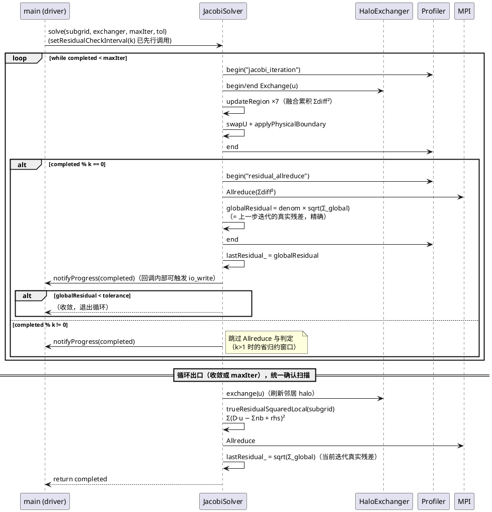
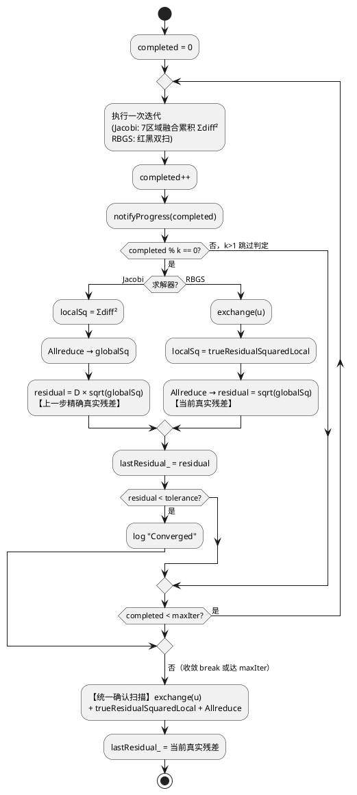

# 1 AR概述

| 组件名称 | HyPoS（hybrid Poisson solver，C++17 + MPI + OpenMP） |
| --- | --- |
| AR系统流水号 | AR004 |
| AR描述 | 诚实性修复 + CG 并行化：A1 first-touch 真实现、A2 真实残差收敛语义 + `--residual-check-interval`（Jacobi/RBGS）、A3 拓扑一致性（消除双重 Cart_create）、A4 观测自愈（profiler 线程安全 + 区名修复）、B2a CG 向量循环并行化，以及配套文档同步 |

**需求来源：** srs.md（本目录）；OPTIMIZATION_GUIDE.md §4 条目 A1/A2/A3/A4/B2a、§5 路线 ★1。

**方案总选型（Step 3 已定，方案 B）：** Jacobi 融合累积 ×denom 精确换算 + 循环出口统一确认扫描；RBGS 每 k 步专用残差扫描；interval 经 PoissonSolver 基类 setter 注入；A3 用 `SubgridInfo.cartComm` 带出拓扑；A4 profiler per-thread 注册表（热路径无锁）。

# 2 动态行为

## 交互时序图

以 Jacobi `solve()`（interval=k）为例，说明 driver、solver、exchanger、profiler、MPI 的交互（RBGS 将「换算」换为「扫描」，交互结构相同）：



# 3 功能点分解

| 序号 | 功能点名称 | 功能点描述 | srs 追溯 |
| --- | --- | --- | --- |
| 1 | 共享真实残差 helper | `trueResidualSquaredLocal(const Subgrid&)`：内部 Σ(D·u − Σnb + rhs)²，OpenMP 并行，2D/3D 分支 | §3.1 R1 支撑 |
| 2 | Jacobi 真实残差换算 | iterate() 返回 denom×‖diff‖（上一步迭代精确真实残差）；solve() 判据用换算值 | §3.1 R1 |
| 3 | 循环出口确认扫描 | Jacobi solve() 收敛/maxIter 出口统一 exchange+扫描+Allreduce，lastResidual_ = 当前真实残差 | §3.1 R1 |
| 4 | RBGS 真实残差扫描 | 每 k 步扫描；iterate() 保持「每调用必扫描」契约 | §3.1 R1 |
| 5 | 残差检查频率 | `--residual-check-interval k`（默认 1）：基类 setter 注入；k 非法 → 退出码 1；CG 传入 → WARN 忽略 | §3.1 R1 |
| 6 | CG 向量循环并行化 | p 更新/初始化循环 OpenMP+SIMD；抽 `updatePInterior` 消除 solve/iterate 重复 | §3.2 R2 |
| 7 | First-touch 初始化 | zeroInitialize() 按外层维度（2D:j / 3D:k）并行覆盖全缓冲；applyDirichletBC 决策记录 | §3.3 R3 |
| 8 | 拓扑单一来源 | SubgridInfo 带 cartComm；partition 内改用 cart rank 查 coords；main 删除二次 Cart_create | §3.4 R4 |
| 9 | Profiler 线程安全 | per-thread ThreadData 注册表，热路径无锁，report 聚合 | §3.5 R5 |
| 10 | 剖面区名修复 | RBGS→`rbgs_iteration`、CG→`cg_iteration`；test_performance.cpp 同步 | §3.5 R5 |
| 11 | 文档同步 | README/AGENT_SPEC/PERFORMANCE/OPTIMIZATION_GUIDE 勾选回填 | §3.6 R6 |

# 4 实现设计

## 4.1 功能实现思路

- **代数基础（Jacobi 零开销换算）：** 更新式 `uNew = (Σnb − rhs)/D`（D=4/6，无松弛，jacobi_solver.cpp:37/52）⇒ `diff = uNew − u = −(D·u − Σnb + rhs)/D = −r/D`。故迭代 t+1 累积的 `Σdiff²` 满足 `D·‖diff‖ = ‖r_t‖`——**上一步迭代**的精确真实残差。浮点上二者由同一批加法/乘法导出，差异仅来自 `invDenom` 乘法舍入，确认扫描兜底。
- **RBGS 无此关系：** 红半扫就地写回（red_black_gs_solver.cpp:36）改变黑点输入，diff² 混合两半 sweep 输入态，无常数换算 ⇒ 专用扫描是唯一诚实方案。
- **统一出口确认：** 收敛与 maxIter 两条出口都做一次确认扫描（exchange + helper + Allreduce），保证 `lastResidual_`（→ metrics.finalResidual）恒为当前迭代真实残差；开销每 run 一次，可忽略。
- **CG 不动判据：** r 递推满足理论恒等 r ≡ b − Ax（cg_solver.cpp:141 初始 r=−rhs=x₀=0 的 b；:176 递推），beta 依赖每步 dot(r,r)（:192），interval 不适用；本 AR 仅并行化其逐元素循环 + 修区名。
- **拓扑一致性：** `reorder=1` 下 `MPI_Cart_coords(cartComm, rank)` 传原始 comm 的 rank 是潜在错位（MPI 标准允许重排）；顺带修复——partition 内先 `MPI_Comm_rank(cartComm, &cartRank)` 再查 coords。

## 4.2 功能实现设计

### 4.2.1 流程图

Jacobi/RBGS solve() 统一残差判定流程（分支核心）：



注：RBGS 的确认扫描与末次判定扫描可能背靠背重复一次（k 整除 maxIter 或恰在末次判定后收敛）——为换取「出口必为当前精确残差」的强不变量，接受这一次冗余扫描（每 run 一次，开销可忽略）；开发时以最简结构实现，不做合并优化。

### 4.2.2 流程说明

1. **T001 Jacobi：** `updateRegion` 返回值语义不变（Σdiff²）；`iterate()` 返回 `denom × sqrt(Σdiff²)`（换算真实残差，solver.hpp:48 契约「L2 residual after this iteration」→ 注释更新为「真实残差（上一步迭代的精确值，经换算）」）。solve() 内：每迭代完成后 `if (completed % k == 0)` 才进入 Allreduce 块（`residual_allreduce` 区名保留）；判据用换算值；两条出口后统一确认扫描——**区名定为 `residual_confirm`**（规范性定名，I1/I5/E4 断言依赖；不再使用「建议」表述）。2D/3D 的 denom 取 4.0/6.0。
2. **T002 RBGS：** `sweep()` 的 diff² 累积保留（供日志/调试），不再参与判据。`iterate()`：双扫 + applyPhysicalBoundary 后 **总是** exchange(u) + 扫描 + Allreduce，返回当前真实残差（单调用语义完整）。solve()：`completed % k == 0` 时用 `iterate()` 的真实残差判定；非检查迭代调用轻量路径（双扫 + applyPhysicalBoundary，不扫描）——实现上把 iterate() 拆为 `iterateCore()`（双扫）与 `iterate()`（core + 扫描），solve() 按需选择。出口统一确认扫描同 Jacobi。
3. **T003 CLI：** main.cpp 解析 `--residual-check-interval`（默认 1）；`k < 1` → `HYPOS_ERROR` + `return 1`（对齐 :202-211 校验块风格）；非整数文本经 `std::stoi` 抛异常 → main catch → 退出码 1（既有路径，无需新码）。`solverName == "cg" && k != 1` → rank0 `HYPOS_WARN`（对齐 :198-200 overlap-comm 先例）。所有求解器统一 `solver->setResidualCheckInterval(k)`。RunConfig 增加 `residualCheckInterval` 字段并写入 json/csv 报告（additive，数据解读需知 k）。
4. **T004 CG：** 新私有 `updatePInterior(const Subgrid&, Real beta)`（`pp = rp + beta*pp`，2D/3D 分支，`omp parallel for` + `omp simd`，schedule(static)，与 axpyInterior 同范式）；solve() :194-216 与 iterate() :251-273 两处重复循环替换为该 helper。初始化（:125-129 清零、:133-156 r=−rhs/p=r）改 `omp parallel for`。区名 :167 → `cg_iteration`。逐元素运算无归约 ⇒ 位级不变 ⇒ 收敛迭代数不变。
5. **T005 A1：** `zeroInitialize()`：2D `omp parallel for` over `j∈[0,nyTotal)`、内层 `i∈[0,nxTotal)`；3D 外层 `k∈[0,nzTotal)`、内层 j、i 全范围；循环体内对 u/uNext/rhs 三场同一 (i,j,k) 清零（单次遍历，缓存友好）；`schedule(static)` 与计算循环一致。覆盖全缓冲（含 halo），fill 语义不变。noexcept 保持（循环体无异常路径）。**applyDirichletBC 决策：保持串行**——setup 期单次执行、仅操作 halo 带（体积 ≪ 内部）、无迭代期收益；README/GUIDE 记录该决策（G1 勾选依据为 zeroInitialize 对齐 + applyDirichletBC 决策说明）。
6. **T006 A3：** `SubgridInfo` 增加 `MPI_Comm cartComm = MPI_COMM_NULL;`（注释注明所有权移交调用方，须 MPI_Comm_free）。partition()：Cart_create 后 `MPI_Comm_rank(cartComm, &cartRank)` + `MPI_Cart_coords(cartComm, cartRank, ...)`（修复 reorder 潜在错位）；**不再** `MPI_Comm_free`（删除 :71）。main.cpp：删除 :165-168 的二次 Cart_create，改用 `info.cartComm` 做 Cart_shift（:171-173）、Subgrid 构造（:176）、收尾 free（:386 原样保留，free 的是 info.cartComm）。`info.rank` 字段保持调用方语义（原 comm rank）。
7. **T007 A4：** Profiler 重构：`struct ThreadData { std::vector<std::pair<std::string,Timer>> active; std::unordered_map<std::string,RegionStats> stats; }`；单例持有 `std::vector<ThreadData*> registry_` + `std::mutex registryMutex_`；`beginRegion/endRegion` 经 `thread_local ThreadData&` 操作本线程数据——**热路径零锁**。**生命周期约定：ThreadData 堆分配（`new`），注册进 registry 后进程内永不释放**——线程退出时其 ThreadData 仍存活（避免 registry 悬垂指针；U8 的 join-后断言路径依赖此约定；单例随进程终止回收，无泄漏关切——教学样板口径在 design 记录该取舍）。首次访问时注册：`thread_local ThreadData& td = *new ThreadData()` + 持锁 `registry_.push_back(&td)`。`stats(name)`/`report()` 持 registryMutex_ 聚合全部 ThreadData：total/calls 取跨线程和，min/max 取跨线程极值。`reset()` 语义定为「持锁遍历 registry，清空各 ThreadData 的 stats 与 active，**registry 本身保留**」（长寿命线程的注册关系不失效，后续统计继续累积）。JSON 输出格式与字段名完全不变（performance_report.json、run_scaling_tests.py 兼容）。hpp:11-14 注释改写为实际机制（per-thread 无锁累积 + 聚合时加锁 + 堆分配永不释放）。区名修复：red_black_gs_solver.cpp:101 → `rbgs_iteration`；cg_solver.cpp:167 → `cg_iteration`；tests/test_performance.cpp:83 依 solver 类型断言对应区名（开发时读上下文定具体改法）。
8. **T008：** 全量回归 + 基准 + 文档（见 §6.5 与 tasks.md）。

## 4.3 接口描述

### 4.3.1 新增/修改接口清单

**库内接口（全部 additive，无签名破坏）：**

| 接口 | 签名 | 变更类型 | 说明 |
| --- | --- | --- | --- |
| 真实残差 helper | `namespace hypo { Real trueResidualSquaredLocal(const Subgrid& subgrid); }`（新文件 `src/solver/residual.hpp/cpp`） | 新增 | 内部点 Σ(D·u − Σnb + rhs)²，OpenMP 归约；调用方须先 exchange + applyPhysicalBoundary |
| 全局真实残差 | `namespace hypo { Real globalTrueResidual(Subgrid& subgrid, HaloExchanger& exchanger); }`（同文件） | 新增（T002 实现期补充：4 处调用点复用——Jacobi/RBGS 出口确认 + RBGS 检查扫描/iterate） | exchange(u) + trueResidualSquaredLocal + MPI_Allreduce，返回全局 ‖r‖；内部无 profiler 区名，由调用方包裹（residual_confirm / residual_allreduce） |
| 残差检查频率 | `void PoissonSolver::setResidualCheckInterval(Index interval)`（基类，默认实现存 `residualCheckInterval_ = max(1, interval)`；protected 成员 `Index residualCheckInterval_ = 1`） | 新增 | Jacobi/RBGS 读取；CG 不读取（main 层 WARN 拦截） |
| CG p 更新 | `void CGSolver::updatePInterior(const Subgrid& subgrid, Real beta) const`（private） | 新增 | `pp = rp + beta*pp`，solve/iterate 复用 |
| RBGS 迭代拆分 | `Real RedBlackGSSolver::iterateCore(Subgrid&, HaloExchanger&) const`（private，双扫 + applyPhysicalBoundary，返回 Σdiff²） | 新增 | solve() 非检查迭代走此路径 |
| 拓扑带出 | `SubgridInfo::cartComm`（新字段，`MPI_Comm`，默认 `MPI_COMM_NULL`） | 修改（additive 字段） | 所有权移交调用方 |
| 报告配置 | `RunConfig::residualCheckInterval`（新字段，`Index`，默认 1）+ reporter 序列化 | 修改（additive 字段） | json/csv 报告透出 k |

**CLI：**

| 参数 | 形式 | 默认 | 非法处理 |
| --- | --- | --- | --- |
| `--residual-check-interval` | `--residual-check-interval <int>` 或 `=<int>` | 1 | `<1`（`=` 形式）→ HYPOS_ERROR + 退出码 1；非整数文本 → stoi 抛异常 → main catch 退出码 1；空格形式 `-1` 被解析器判为独立 flag，取值 "true" → 同走 stoi 异常路径（错误消息 "Fatal: stoi"，可读性弱但退出码正确，I2 断言按「退出码 1 + stderr 含 Fatal」口径）；CG 且 ≠1 → rank0 WARN 后按 1 处理 |

**接口变更授权记录（AGENT_SPEC「接口变更须审批」）：** 上述 6 项均为 additive（新方法/新字段/新文件），无既有签名修改；授权依据 = 用户对 OPTIMIZATION_GUIDE §5 ★1 路线与本 AR 范围的批准 + 本 design 门控。`PoissonSolver::solve/iterate/lastResidual` 签名不变。

### 4.3.2 参数与返回值

- `trueResidualSquaredLocal`：入参只读；返回本 rank 内部和（**未** Allreduce）——归约责任留给调用方（与既有 dotGlobal 分工一致的逆方向：helper 不含通信，便于测试独立断言）。**noexcept**：纯内存遍历，无异常路径（对齐 AGENT_SPEC 库代码错误处理约定）。
- `setResidualCheckInterval`：`interval == 0` 或负数 → 钳为 1（防御库内误用）；main 层负责对用户报错。文档注明钳制行为。**noexcept**（纯赋值）。
- `updatePInterior`：无返回；越界无（循环界即内部界）。**noexcept**（纯内存遍历）。
- `iterateCore`：返回 Σdiff²（**非**范数）——与 updateRegion 口径一致，仅供日志。**noexcept**（沿 sweep 既有路径，内部 HYPOS_PROFILE 亦无异常）。

## 4.4 代码设计

```
src/
├── solver/
│   ├── residual.hpp / residual.cpp      [新增] 真实残差 helper（功能点 1）
│   ├── solver.hpp                        [修改] +setResidualCheckInterval/+residualCheckInterval_；
│   │                                              JacobiSolver/CGSolver 注释更新；RBGS +iterateCore 声明；
│   │                                              CGSolver +updatePInterior 声明
│   ├── jacobi_solver.cpp                 [修改] 换算 + interval + 确认扫描（功能点 2/3/5 消费端）
│   ├── red_black_gs_solver.cpp           [修改] 扫描 + iterateCore 拆分 + 区名（功能点 4/10）
│   └── cg_solver.cpp                     [修改] 并行化 + updatePInterior + 区名（功能点 6/10）
├── grid/
│   ├── partition.hpp / partition.cpp     [修改] SubgridInfo +cartComm；coords 用 cart rank（功能点 8）
│   └── subgrid.cpp                       [修改] zeroInitialize 并行（功能点 7）
├── perf/
│   ├── profiler.hpp / profiler.cpp       [修改] per-thread 重构 + 注释（功能点 9）
│   └── reporter.hpp / reporter.cpp       [修改] RunConfig +residualCheckInterval + json/csv 序列化（reporter.cpp:41-71）（功能点 5）
├── main.cpp                              [修改] CLI 解析/校验/WARN；删除二次 Cart_create；setter 注入
tests/
├── test_solver.cpp                       [修改] 期望迭代数更新 + 真实残差断言（Jacobi 单机）
├── test_alt_solvers.cpp                  [修改] RBGS/CG 期望值 + 真实残差断言 + CG golden 迭代数
├── test_solver_mpi.cpp                   [修改] np>1 残差一致性（功能点 2/4 的 MPI 面）
├── test_performance.cpp                  [修改] 区名断言 + residual_allreduce 计数断言 + profiler 多线程
├── test_grid.cpp                         [修改] np=4 拓扑 tiling/邻居对称（功能点 8）
└── （新增用例全部落在上述既有文件，按既有 gtest+MPI fixture 范式）
```

无多仓；无 MVP 耦合。模块边界不变（solver 不含 MPI 拓扑决策，grid 不含求解逻辑，profiler 无求解器依赖）。

# 5 重构设计

- CG `updatePInterior` 消除 solve/iterate 两处 ~60 行复制粘贴（G6 同源问题，随 B2a 顺带修复，行为不变）。
- RBGS `iterateCore` 拆分：iterate() 契约「返回本迭代后真实残差」首次成立（此前返回 diff 范数，与文档不符）。
- profiler per-thread 重构属 A4 本体，非顺带重构。

# 6 测试设计

覆盖率目标：新增/修改行为点用例覆盖率 100%；全量 ctest Debug/Release 双模式绿 + ASan 零报告。

## 6.1 单元测试（UT）

| ID | 覆盖功能点 | 用例 | 输入/前置 | 预期断言 | srs 验收追溯 |
| --- | --- | --- | --- | --- | --- |
| U1 | 1 | trueResidualSquaredLocal 正确性（2D 与 3D 各一组） | 2D 3×3 内部、3D 3×3×3 内部小网格，u/rhs 手工赋值（含非对称值） | 两组均与测试内独立重算 Σ(D·u−Σnb+rhs)² 逐位相等（2D D=4 / 3D D=6 两分支均覆盖） | §3.1-R1 支撑；兼覆盖 §6.4-E4 的 2D/3D 分支 |
| U2 | 2/3 | Jacobi 收敛残差真实性 | 制造解 32²（sin 问题）tol=1e-6 求解 | `lastResidual() ≤ 1e-6` **且** 测试内独立重算当前 ‖Au−f‖₂ 与 lastResidual() 相对误差 < 1e-12（同一运算序，应逐位一致） | §3.1 验收① |
| U3 | 2 | Jacobi 换算值即上步真实残差 | 单迭代后对比 iterate() 返回值 vs 独立重算上一步残差 | 相对误差 < 1e-12 | §3.1-R1 |
| U4 | 4 | RBGS 真实残差 | 制造解 32² RBGS 求解 | lastResidual() ≤ tol 且独立重算一致（< 1e-12） | §3.1 验收① |
| U5 | 4 | RBGS iterate() 单调用契约 | 任意态调用 iterate() | 返回值 = 独立重算当前真实残差（每次调用必扫描） | §3.1-R1 |
| U6 | 6 | CG 并行化数值不变 | 64² CG 求解，OMP=1 与 OMP=4 两档 | **按档分别**断言：各档收敛迭代数等于该档基线 golden 值（开发时先跑基线固化两档各自 golden——dotGlobal 归约顺序随线程数变化，跨档不要求相等，既有行为）；同档下 u 逐位不变 | §3.2 验收② |
| U7 | 7 | zeroInitialize 全覆盖 | 构造含 halo 子域（含 2D 与 3D） | u/uNext/rhs 全缓冲（含 halo 带）逐元素 == 0.0 | §3.3 验收② |
| U8 | 9 | Profiler 多线程聚合 | std::thread×4 各 begin/end 同名区 N 次 | stats().callCount == 4N；total_sec ≥ 0；进程正常退出（无数据竞争崩溃）；单线程场景数值与旧口径同构 | §3.5 验收①③ |
| U9 | 5 | interval setter 防御 | setResidualCheckInterval(0) 与 (-5) 两组 | 均钳为 1（行为断言：两组归约次数相同且与默认 1 相同） | §4.3 |
| U10 | 3 | maxIter 出口确认 | tol 极小 + maxIter=5 跑满 | lastResidual() = 独立重算第 5 步后真实残差（非缓存旧值） | §3.1-R1 |
| U11 | 10 | 剖面区名修复 | RBGS 与 CG 各小网格求解一次（默认参数） | `stats("rbgs_iteration")` 与 `stats("cg_iteration")` 各自 callCount == 迭代数且 > 0；`stats("jacobi_iteration")`.callCount == 0（两求解器运行后均不得出现旧区名）；Jacobi 求解后 `stats("jacobi_iteration")`.callCount == 迭代数（保留验证） | §3.5 验收② |

## 6.2 接口测试

| ID | 接口 | 用例 | 断言 | 追溯 |
| --- | --- | --- | --- | --- |
| I1 | `--residual-check-interval 10` | e2e 跑 128² Jacobi（子进程跑 hypos 二进制，沿 test_mpiio e2e 范式） | 退出码 0；profiler `residual_allreduce`.callCount == ⌊iterations/10⌋（**精确相等**——确认扫描走独立区名 `residual_confirm`，不计入本计数）；`residual_confirm`.callCount == 1；json 报告含 `residualCheckInterval: 10` | §3.1 验收② |
| I2 | `--residual-check-interval=0` / `--residual-check-interval=-1` / `--residual-check-interval abc` / `--residual-check-interval -1`（空格形式） | e2e 四组 | 退出码 1；stderr 含 "Fatal"（前两组走 k<1 校验出可读消息；后两组走 stoi 异常路径） | §3.1 异常处理 |
| I3 | CG + interval=5 | e2e `--solver cg --residual-check-interval 5` | 退出码 0；日志含 WARN「ignored」；行为与 k=1 一致（迭代数相同） | §3.1 异常处理 |
| I4 | `--help` | e2e | 帮助文本含 `--residual-check-interval` 行 | §3.6 |
| I5 | k=1 默认路径 | e2e 不传 interval | 每步判定：`residual_allreduce`.callCount == iterations（**精确相等**，确认扫描独立计数）；`residual_confirm`.callCount == 1 | §3.1 验收③ |
| I6 | RunConfig 序列化 | json/csv 输出 | 新字段存在且默认 1 | §4.3 |

## 6.3 业务场景测试

| ID | 场景 | 断言 | 追溯 |
| --- | --- | --- | --- |
| B1 | 三求解器制造解收敛（2D 128²，np=1/4 两档） | 全部收敛（iterations < maxIter）；final_residual ≤ tol（真实口径）；可断言的相对关系：同规模下 CG 迭代数 < Jacobi 迭代数（谱半径差异的定性体现， ratios 不设硬值） | §3.1/§3.2 验收 |
| B2 | Jacobi overlap on/off 位级一致 | u 逐位相同（既有 test_overlap 保持绿，**期望迭代数按真实残差口径更新**） | §3.1 验收④、§4 NFR |
| B3 | np=4 拓扑一致性 | Σ nxLocal==nx（各维）；offset 链连续；Cart_shift 邻居互指（我的 right 的 left == 我）；coords 与 offset 对应 | §3.4 验收① |
| B4 | 3D 冒烟（16³ np=1） | 收敛 + final_residual ≤ tol（换算 D=6 路径） | §3.1-R1 |
| B5 | RBGS interval=1/5/10 e2e | 三档均收敛；k=5/10 允许多迭代 ≤k 步（迭代数 ≥ k=1 档，差值 < k） | §3.1 期望行为 |

## 6.4 异常场景测试

| ID | 场景 | 断言 | 追溯 |
| --- | --- | --- | --- |
| E1 | interval 非法值（0/-1/abc/溢出字符串） | 退出码 1 + 可读错误（abc 走 stoi 异常路径） | §3.1 异常处理 |
| E2 | CG breakdown 既有路径回归 | `pap ≤ 0` 时 WARN + 优雅退出（既有行为，重构后保持） | §4 NFR 兼容性 |
| E3 | 单 rank 退化子域（nLocal ≤ 2hw） | 残差换算/扫描在退化分区下不越界（既有 test_solver 边界用例保持绿） | §4 NFR |
| E4 | k ≥ maxIter 边界（interval 上界） | Jacobi maxIter=5 + interval=100 | 循环内零判定：`residual_allreduce`.callCount == 0；`residual_confirm`.callCount == 1；lastResidual() = 独立重算第 5 步后真实残差（出口确认兜底） | §3.1 期望行为、§4.3 参数边界 |
| E5 | helper 前置条件违反（未 exchange 即调用 trueResidualSquaredLocal） | 走查口径：调用方契约「先 exchange + applyPhysicalBoundary」由 code review 走查覆盖（运行时无法可靠构造确定性断言——halo 为陈旧值时结果仅偏大不崩溃）；在 residual.hpp 接口注释中显式声明前置条件 | §6.5-1 走查 evidence |

## 6.5 回归与基准（T008）

1. 全量 ctest：Debug + Release 双模式全绿；ASan（含 UBSan）零报告；TSan 编译跑 U8/B1 记录走查 evidence（WSL 环境如 TSan+OpenMPI 不可用，以代码走查 + U8 稳定性佐证并在 evidence 注明）。**走查类 evidence 项**（srs 走查验收的落档处）：①first-touch 分区一致性（zeroInitialize 循环分区 vs stencil 计算循环分区，srs §3.3 验收①）；②`MPI_Cart_create` 进程生命周期内单次调用（partition.cpp 创建 + main.cpp 消费，srs §3.4 验收②）；③trueResidualSquaredLocal 前置条件（E5）。三项走查结论写入 review/ST evidence。
2. 既有固定期望值测试逐一更新：真实残差口径迭代数变化（Jacobi 判据从 ‖diff‖ 变 4·‖diff‖ → 迭代数**增加**；RBGS 尺度全变）——每个改动数字附口径换算说明，禁止「跑到多少改成多少」。
3. 基准（OMP=1、256²/256³、np=1/4、≥3 次中位数，沿 bench_t007.sh 范式新增 scripts/bench_ar004.sh）：
   - Jacobi：iter_time_ms 前后对比（门槛 ±5%）+ 收敛总时间对比（预期略增：迭代数变多，如实记录）
   - RBGS：k=1/5/10 三档 iter_time_ms 与迭代数
   - CG：并行化前后 iter_time_ms（门槛：不劣于现状）
4. 文档：README（first-touch 宣称、CLI 帮助、SCALING_REPORT 口径注记——历史迭代数基于递推残差口径）、AGENT_SPEC（SubgridInfo/PoissonSolver additive 接口）、PERFORMANCE（§11 AR004 数据）、OPTIMIZATION_GUIDE（G1/G3/G5/G6、P1/P4/P6 勾选 + 实测回填）。

# 7 决策记录

| # | 决策 | 理由 | 备选与否决原因 |
| --- | --- | --- | --- |
| D1 | Jacobi 判据用换算值（上一步精确残差），出口统一确认扫描 | 零迭代内开销换取诚实判据；出口强不变量「lastResidual_ 恒为当前真实残差」 | 每步独立扫描：Jacobi 多付 ~2× 迭代成本，浪费精确代数关系 |
| D2 | RBGS 每 k 步扫描 + iterate() 每调用必扫描 | 就地更新无换算关系；iterate() 单调用语义完整；solve() 内 k>1 走 iterateCore 轻量路径省扫描 | 每步都扫（k=1 已是此行为）；仅末步扫描（判据失真） |
| D3 | 确认扫描与末次判定可能重复一次 | 换「出口必精确」的简单强不变量；每 run 一次开销可忽略 | 合并优化：分支复杂化，收益一次扫描 |
| D4 | interval 经基类 setter 而非 solve() 签名 | additive、零调用方破坏 | 签名扩展：破坏全部实现/调用方/测试 |
| D5 | SubgridInfo 带出 cartComm（所有权移交） | 单一拓扑来源；additive 字段 | 独立 createCartComm 工厂：多一次接口面，无额外收益 |
| D6 | partition 内用 cart rank 查 coords | 修复 reorder=1 潜在错位（标准允许重排，当前靠实现不重排侥幸正确） | 维持现状：留下 P6 同类隐患 |
| D7 | profiler per-thread 注册表 + 聚合时加锁 | 热路径零锁；JSON 兼容 | 细粒度 mutex：仍有序列化竞争；atomic 分桶：min/max 聚合复杂 |
| D8 | applyDirichletBC 保持串行 | setup 期单次、仅 halo 带、体积≪内部 | 并行化：无收益添噪 |
| D9 | RunConfig 透出 residualCheckInterval | 数据解读必需（k 直接影响迭代数） | 不透出：SCALING 数据口径含混 |
| D10 | RBGS 不设 ±5% 回归门槛（srs §4 已随本设计修订） | 真实残差 k=1 成本 ~1 pass + 1 exchange/迭代，门槛与诚实性物理上不可兼得；诚实优先 | 维持门槛：逼迫 k 默认值造假 |
