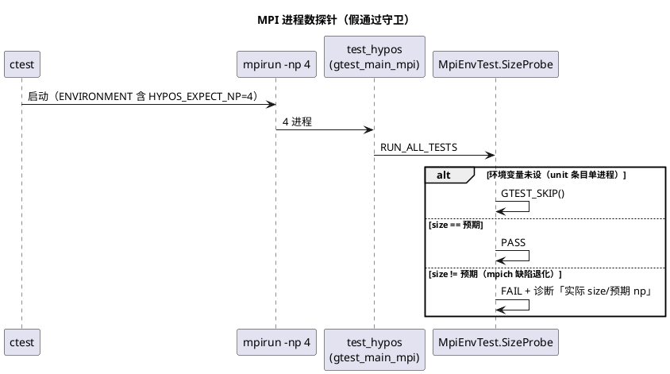
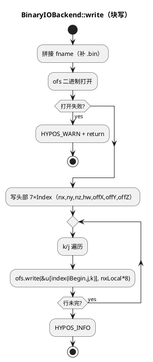

# 1 AR概述

| 组件名称 | hy-po-s（HyPoS Poisson 求解器）/ src/io + tests + CI |
| --- | --- |
| AR系统流水号 | AR005 |
| AR描述 | I/O 快赢 + CI 可信度：`.vti` 改 VTK appended raw binary、`BinaryIOBackend` 改块写（修复 GUIDE P5）；ctest 增加进程数探针修复 CI mpich「多 rank 假通过」风险（F1 紧急项）；CI MPICH job 脱离缺陷平台（F1 修复） |

# 2 动态行为

## 交互时序图

```plantuml
@startuml
title vtk appended binary 写出 + np=4 拼装
participant Main as "main.cpp\n(rank r)"
participant "VTKIOBackend" as VTK
participant "Subgrid" as SG
participant "FS" as "文件系统"

Main -> VTK : write(subgrid, "out_r<i>")
VTK -> SG : u().data(), index()/extent 查询
VTK -> FS : 写 XML 头（header_type="UInt64",\nformat="appended" offset="0"）
VTK -> FS : 写 <AppendedData encoding="raw">_ + UInt64(nBytes)
loop 每个 (k, j) 行
  VTK -> FS : ofs.write(&u[k,j,iBegin], nxLocal*8)
end
VTK -> FS : 收尾标签
Main -> VTK : rank0: writeParallelIndex(grid, base, pieces)
VTK -> FS : 写 .pvti（ASCII，引用 _r<i>.vti）
@enduml
```



# 3 功能点分解

| 序号 | 功能点名称 | 功能点描述 | 追溯 |
| --- | --- | --- | --- |
| 1 | MPI 进程数探针 | `MpiEnvTest.SizeProbe` gtest 用例 + `HYPOS_EXPECT_NP` 环境变量契约 + ctest np>1 条目 ENVIRONMENT 注入与 filter 激活 + 独立 `mpi_size_probe` 条目 | srs §3.3 R3 |
| 2 | BinaryIOBackend 块写 | 数据区逐行（i 连续段）一次 `ofs.write`，头部不变，输出逐位一致 | srs §3.2 R2 |
| 3 | VTK `.vti` appended binary | XML 头 + appended raw 数据流（UInt64 长度头 + 行主序镜像），offset 固定 0 | srs §3.1 R1（D1-a） |
| 4 | `.pvti` 一致性确认 | pvti 保持 ASCII 无数据负载，结构不变；回归断言 | srs §3.1 R1（D1-b） |
| 5 | CI MPICH 平台修复 | ci.yml 单 job 整体迁移 `runs-on: ubuntu-22.04` + 注记 | srs §3.4 R4 |
| 6 | 基准与文档 | ASCII vs binary 体积/耗时对比 → PERFORMANCE；README/GUIDE 勾选同步 | srs §3.5 R5、srs §4 |

# 4 实现设计

## 4.1 功能实现思路

- **功能点 1（探针）**：探针作为普通 gtest 用例驻留 `tests/gtest_main_mpi.cpp`（同文件新增 TEST 块；该文件仅 11 行，main 保持不动）。语义：`getenv("HYPOS_EXPECT_NP")` 未设 → `GTEST_SKIP()`（unit 条目单进程直跑 test_hypos，必须兼容）；已设 → `MPI_Comm_size` 比对，不符或**值非法（非数字，解析失败按不匹配处理，fail-safe）** FAIL 并输出「实际 size / 预期 np / 该 MPI 实现可能静默退化单进程」诊断。**激活机制（两层）**：① 7 个 np>1 gtest 条目（halo_2d_mpi/halo_3d_mpi/solver_mpi/overlap_consistency/solver_alt_mpi/topology_consistency/mpiio_np4）的 `--gtest_filter` 追加 `:MpiEnvTest.*`（冒号分隔符，如 `HaloExchangeTest.MpiNonUniform4RanksHalos:MpiEnvTest.*`）——探针随每个条目实际运行，注入的 `HYPOS_EXPECT_NP` 由测试体消费；② 4 个 hypos 直跑条目（collective_mpi/ranks3_smoke/mpiio_e2e/mpiio_e2e_final）无 gtest 测试体，生产二进制不感知测试探针（架构洁净），其守卫由**环境级探针**提供——mpirun 退化是 launch 环境的全有/全无属性，同 suite 中 `mpi_size_probe` 独立条目 + 7 条 gtest 内嵌探针运行在相同 mpirun 之下，任一暴露退化即全 suite 不可信（决策 D7；4 条 hypos 条目的 ENV 注入为声明性自文档，hypos 二进制不读取该变量，无直接消费方）。CMake 端：`set_tests_properties` 为全部 np>1 条目（gtest 7 个 + hypos 4 个 = 11 个）追加 `HYPOS_EXPECT_NP=<n>`（np3/4/8 各自对应；mpiio_np1 不注入——np=1 无退化语义）；新增独立条目 `mpi_size_probe`（np=4，仅跑 `--gtest_filter=MpiEnvTest.*`，探针显式可见）。**Red 验证**：`HYPOS_EXPECT_NP=4` 下不带 mpirun 直跑探针 → FAIL（咬缺陷证据落 evidence）。
- **功能点 2（binary 块写）**：Subgrid row-major `(k*nyT+j)*nxT+i`（subgrid.hpp:46）+ AlignedBuffer 无 padding（posix_memalign 连续分配，aligned_buffer.hpp:57）→ i 行 interior 段 `[index(iBegin,j,k), index(iEnd-1,j,k)]` 连续。每 (k,j) 行一次 `ofs.write(rowPtr, nxLocal*sizeof(Real))`。头部 7×Index 写法不变。零拷贝（不引入紧凑缓冲，避免双内存与 memcpy）。
- **功能点 3（vtk appended）**：单 DataArray（u）场景 offset 恒为 0（appended 流首数组）→ **无需两遍写或 seek**。XML 头文本写出（含 `header_type="UInt64"`、`byte_order="LittleEndian"`、`format="appended" offset="0"`），随后 `<AppendedData encoding="raw">` + `_` 标记 + `UInt64(nBytes)` 小端二进制 + 按功能点 2 同款逐行写出 + 收尾标签。遍历序 k→j→i 与旧 ASCII 一致。错误处理沿用 WARN+return。
- **功能点 4（pvti）**：pvti 无数据负载，格式语义由 piece 自声明；`<PDataArray type="Float64" Name="u"/>` 与 piece 的 DataArray 类型/名称已一致，**结构零变更**。测试补断言：piece 文件为二进制负载（非 ASCII 数值文本）。
- **功能点 5（CI）**：ci.yml 为**单 job**（`build-and-test`，含 Release(OpenMPI) 与 Debug(MPICH) 两段构建）——`runs-on: ubuntu-latest` → `ubuntu-22.04` 为**整 job 迁移**：mpich 段获益（4.0.x 早于 4.2.0 的 PMIx/hydra 变更窗口），OpenMPI 段随之迁移（22.04 为 OpenMPI 4.1.x，既有 CLI flag 兼容性预期成立，注记记录）。**注记**：本仓库主远程为 gitee（不跑 Actions），修复以配置文件交付；22.04 + mpich 4.0.2 未经本地实测，恢复 Actions 运行时以 `mpi_size_probe` 首跑结果为准——探针存在的意义正是把「未验证平台」从假绿变为诚实的红/绿。
- **功能点 6**：`scripts/bench_ar005.sh`（沿 bench_ar004.sh 范式）：改动前先跑 ASCII 基线（当前代码）落 evidence，改动后跑 binary 对比（256²/512²，体积 + 写耗时，≥3 次中位数，OMP=1）。**性能底线（req 门控 G9 建议）**：binary 写耗时不劣于 ASCII 同场耗时（判据 = median_bin ≤ median_ascii；实际预期显著更优，如实记录）。ParaView 加载验证：本地无 ParaView，以 U3 解析器测试 + 规范合规走查替代（srs §4 既定口径），evidence 记录。

## 4.2 功能实现设计

### 4.2.1 流程图

```plantuml
@startuml
title VTKIOBackend::write（appended binary）
start
:拼接 fname（补 .vti）;
:ofs 打开;
if (打开失败?) then (yes)
  :HYPOS_WARN + return;
  stop
endif
:写 XML 头（VTKFile/ImageData/Piece/
PointData，header_type="UInt64"）;
:写 DataArray format="appended" offset="0";
:写 <AppendedData encoding="raw">\n_;
nBytes := nxLocal*nyLocal*nzLocal*sizeof(Real);
:写 UInt64(nBytes) 小端;
repeat
  :k = kBegin..kEnd-1\nj = jBegin..jEnd-1;
  :rowPtr = &u[index(iBegin,j,k)];
  :ofs.write(rowPtr, nxLocal*8);
repeat while (行未完?) is (yes)
-> no;
:写收尾标签（</AppendedData></VTKFile>）;
:HYPOS_INFO;
stop
@enduml
```



### 4.2.2 流程说明

- 两后端的行遍历共用同一 (k,j) 外层结构；vtk 版在行循环前多写 XML 头 + 长度头，行循环后写收尾标签。行指针计算 `&u[index(iBegin, j, k)]` 与既有求解循环索引方式一致（AGENT_SPEC row-major）。
- `nBytes` 用 `Index`（size_t）承载，`ofs.write(reinterpret_cast<const char*>(&nBytes), 8)`——依赖 little-endian 宿主（与 mpibin 后端 README 口径一致）。
- 写出期间 ofs 保持默认文本模式打开（Linux 语义下与二进制无差，WSL 环境成立）；binary 后端维持 `std::ios::binary` 不变。

## 4.3 接口描述

**本 AR 无库内公共接口变更**（两后端 `write` 签名不变、CLI 不变、无新 flag）。变更清单：

| 接口/组件 | 签名/形态 | 变更类型 | 说明 |
| --- | --- | --- | --- |
| 探针用例 | `TEST(MpiEnvTest, SizeProbeMatchesExpected)`（tests/gtest_main_mpi.cpp） | 新增（测试侧） | 环境变量 `HYPOS_EXPECT_NP` 未设 → SKIP；已设 → size 断言（不匹配或非法值 FAIL） |
| ctest 条目 | `add_test(NAME mpi_size_probe ...)`（np=4，`--gtest_filter=MpiEnvTest.*`） | 新增 | 探针显式可见；ENVIRONMENT 含 HYPOS_EXPECT_NP=4 |
| ctest 属性 | np>1 全部 11 条目 ENVIRONMENT 追加 `HYPOS_EXPECT_NP=<n>` | 修改 | gtest 条目 7 个：halo_2d_mpi(4)/halo_3d_mpi(8)/solver_mpi(4)/overlap_consistency(4)/solver_alt_mpi(4)/topology_consistency(4)/mpiio_np4(4)——**filter 同时追加 `:MpiEnvTest.*`**（消费方）；hypos 直跑条目 4 个：collective_mpi(4)/ranks3_smoke(3)/mpiio_e2e(4)/mpiio_e2e_final(4)——注入为声明性自文档（hypos 二进制不读取该变量），实际守卫由环境级探针承担（D7）；mpiio_np1(1) 不注入（np=1 无退化语义） |
| VTKIOBackend::write | 签名不变 | 内部重写 | ASCII → appended raw |
| BinaryIOBackend::write | 签名不变 | 内部重写 | 逐元素 → 逐行块写 |
| ci.yml | `runs-on: ubuntu-22.04`（单 job 整体迁移） | 修改 | + 缺陷平台注记 + OpenMPI 段随迁说明 |

## 4.4 代码设计

```
src/io/            vtk_io.cpp（重写 write 数据段）、binary_io.cpp（重写数据段）
tests/             gtest_main_mpi.cpp（新增 MpiEnvTest）、test_alt_solvers.cpp（更新 VtkPiece 测试 + 新增解析器用例）
CMakeLists.txt     mpi_size_probe 条目 + ENVIRONMENT 注入 + filter 追加
.github/workflows/ci.yml  ubuntu-22.04
scripts/bench_ar005.sh     新增（基线先行）
docs/PERFORMANCE.md §12、README、OPTIMIZATION_GUIDE 勾选
```

模块边界：IO 后端自包含（无跨模块依赖变化）；探针仅测试侧；符合既有分层（main → solver/io → grid/core）。

# 5 重构设计

无独立重构。BinaryIOBackend/VTKIOBackend 内部实现替换属本 AR 功能范围，非独立重构项。

# 6 测试设计

**覆盖率口径：** 本 AR 不设量化覆盖率门槛（沿 GUIDE F2 政策与 AR003/AR004 惯例），以功能覆盖点（§6.1 表逐行）+ 全量回归（§6.5）为验收口径。

## 6.1 单元测试（UT）

| ID | 用例 | 覆盖点 | 通过/失败判据 |
| --- | --- | --- | --- |
| U1 | `MpiEnvTest.SizeProbeMatchesExpected`（探针） | 功能点 1 | 四态：env 未设 → SKIP；env=4 + np4 → PASS；env=4 + 单进程直跑 → FAIL（Red 证据，evidence 记录非常驻）；env=abc → FAIL（fail-safe，解析失败按不匹配） |
| U2 | `BinaryOutputBitIdenticalToExpectedBytes` | 功能点 2 | 已知 4×4 u 场（含 halo 毒化值）→ 期望字节序列（56B 头部 + 16×8B 镜像）vector 逐位 memcmp；行间隔 halo 字节不得混入 |
| U3 | `VtkAppendedBinaryParsesBack` | 功能点 3 | 写 .vti 后：XML 结构断言（`header_type="UInt64"`、`format="appended"`、`offset="0"`、`<AppendedData encoding="raw">`）+ 定位 `_` 读 UInt64 长度 + 镜像字节逐位还原 + 数值序列与 u 场一致 |
| U4 | `VtkParallelIndexRemainsAsciiConsistent`（更新既有 VtkPieceAndParallelIndexFiles） | 功能点 4 | pvti 既有断言全保持（PImageData/Piece 引用/空列表拒绝/超界拒绝）+ piece 文件不含 ASCII 数值文本（`format="ascii"` 不出现） |
| U5 | `IoWarnPathNoCrash` | §6.4-E1 | 向不存在目录写 vtk/binary → WARN + 不抛不崩（回归既有语义） |

## 6.2 接口测试

`write` 签名不变，经 U2-U5 行为级覆盖；CLI `--output-format vtk/binary` e2e 见 B1。无独立接口测试新增。

## 6.3 业务场景测试

| ID | 场景 | 断言 | 追溯 |
| --- | --- | --- | --- |
| B1 | e2e：`hypos --output-format vtk --nx 32 --ny 32 --max-iter 5`（np=1）+ binary 同理 | 退出码 0；.vti/.bin 存在；.vti 经 U3 同款解析器外部核验（测试内复用） | srs §3.1/§3.2 验收 |
| B2 | `mpi_size_probe` ctest 条目（np=4） | 探针 PASS；既有 11 条 np>1 条目全绿（WSL OpenMPI 正常路径） | srs §3.3 验收① |
| B3 | 探针咬缺陷验证（一次性，evidence） | `HYPOS_EXPECT_NP=4` 不带 mpirun 直跑 → 探针 FAIL 且诊断含实际 size | srs §3.3 验收②（Red 语义） |
| B4 | 基准对比（T006） | 256²/512²：binary 体积 < ASCII 体积；median(binary 耗时) ≤ median(ASCII 耗时)（req 门控 G9 底线）；binary 块写前后耗时对比 | srs §3.1/§3.2 验收③、srs §4 |

## 6.4 异常场景测试

| ID | 场景 | 断言 | 追溯 |
| --- | --- | --- | --- |
| E1 | 输出目录不存在/不可写 | WARN + return（不抛异常、不崩）——U5 覆盖 | srs §3.1 异常处理 |
| E2 | mpich 退化环境（模拟） | 探针 FAIL（B3 口径；真实 mpich 环境不可本地复现，模拟 = 单进程 + env） | srs §3.3 期望行为 |
| E3 | CI 平台变更后首次运行 | mpi_size_probe 在 CI 日志可见（配置交付注记；本地等价命令记录 evidence） | srs §3.4 验收 |

## 6.5 回归与基准（T006）

1. 全量 ctest：Debug（ASan+UBSan）+ Release 双模式全绿。测试总数：25 + 1（新增 mpi_size_probe）= **26**（ENV 注入与 filter 追加不新增条目）。
2. 既有 VTK/binary 相关断言全部按新格式更新（禁止「跑到多少改成多少」：每处期望值变更附口径说明）。
3. 基准流程：**改动前**先跑 `scripts/bench_ar005.sh` 的 ASCII 基线段（当前 HEAD）落 evidence → 实现 T002/T003 → 跑 binary 段对比 → PERFORMANCE §12。
4. 文档：README（mpich 记录更新为「CI 已换 22.04 + 探针守卫」、P5 宣称对齐）、GUIDE（P5/D1 勾选 + F1 紧急项勾选，附 AR005 与证据）、AGENT_SPEC（无接口变更，预期仅「宣称 vs 实现」核对）。

# 7 决策记录

| # | 决策 | 理由 | 备选与否决原因 |
| --- | --- | --- | --- |
| D1 | 探针用环境变量 `HYPOS_EXPECT_NP` + gtest SKIP 语义 | unit 条目单进程直跑同一二进制——必须缺省跳过；ctest ENVIRONMENT 机制已存在（OMP_NUM_THREADS 先例），零侵入 | 编译期硬编码 np：破坏二进制复用；独立探针可执行文件：多一个构建目标，收益不抵 |
| D2 | vtk appended offset 固定 0，免两遍写/seek | 单 DataArray（u），offset 数学上恒 0 | 通用多数组 offset 计算：YAGNI，D2 单文件 MPI-IO 时再引入 |
| D3 | 块写选逐行 write（零拷贝） | i 行连续已核验（row-major + 无 padding）；行数 ≤ 数千，syscall 开销可忽略；逐元素版是每元素一次 write（百万次），数量级差距 | 紧凑缓冲整场单次 write：双倍内存 + memcpy，收益（行数→1 次 syscall）微小 |
| D4 | CI MPICH job 换 ubuntu-22.04（保留覆盖） | mpich 4.0.x 早于 4.2.0 PMIx/hydra 变更窗口；探针在，若 22.04 也有缺陷则 CI 诚实变红（探针的使命）——「宁可红不可假绿」 | 回退 Debug(OpenMPI)：最安全但丢 MPICH 覆盖，且探针价值减半；源码装修复版：CI 复杂度不值 |
| D5 | pvti 结构零变更 | pvti 无数据负载，格式语义由 piece 自声明；ParaView 读 pvti 只取 piece 引用 | 加 header_type/format 到 pvti：无数据语义，徒增噪声 |
| D6 | 性能底线：median(binary 耗时) ≤ median(ASCII 耗时)（req 门控 G9 建议） | 使「如实记录」可判定——变慢即 FAIL 回查 | 预设倍数门槛（如 ≥10×）：无实测背书，违背诚实原则 |
| D7 | hypos 直跑条目（collective_mpi/ranks3_smoke/mpiio_e2e/mpiio_e2e_final）不内嵌探针，由环境级探针守卫 | mpirun 退化是 launch 环境的全有/全无属性（mpich 4.2.0 PMI/PMIx 缺陷为确定性 launch 行为，同环境同行为）；同 suite 7 条 gtest 内嵌探针 + mpi_size_probe 独立条目运行在相同 mpirun 下，任一暴露退化即全 suite 不可信；生产二进制不感知测试探针（架构洁净）；4 条 hypos 条目的 ENV 注入为声明性一致性（自文档预期 np），无直接消费方 | hypos 二进制加 np 校验 flag：污染生产代码；CMake -P 前置校验脚本：每条目多一次 mpirun 启动开销，收益为零（环境属性已守卫） |
